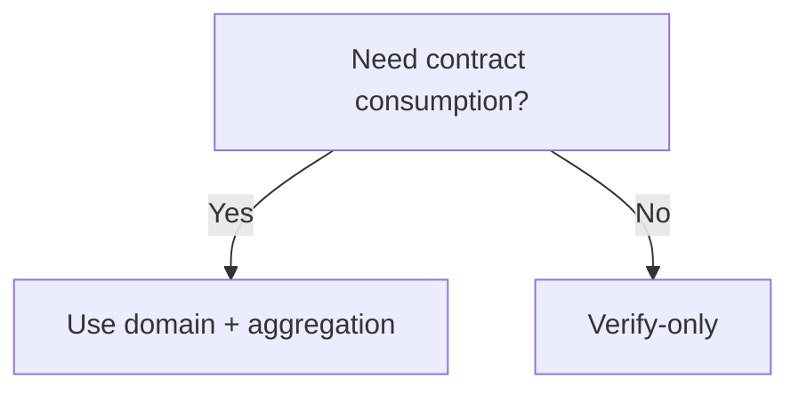

This page answers the four most frequently asked questions. It is not an encyclopedia, but engineering answers that help you avoid detours. Each question is structured as “scenario → choice → consequence” to keep you out of the weeds.

---

## 1) When do I need a domain? When do I use the mainchain API?

**Scenario judgment**: domain is the boundary for “entering aggregation.” If you want on-chain consumption, you must aggregate, which means you must provide domainId. If you only consume results in the application, you can omit the domain.

**Choice guidance**:

- **verify-only**: no domain needed; Kurier is the fastest path.
- **verify + aggregate**: domain required; use the mainchain interface or ensure Kurier includes domainId.

**Consequence**: without a domain, the proof does not enter aggregation and no receipt is produced. If you later need on-chain consumption, you must add this layer.

---

## 2) Who can create domains? Who publishes aggregation results?

**Creation permissions**: normal users can only register `Destination::None` domains. Domains with destinations require Manager permissions and a storage deposit.

**Publisher role**: aggregation is permissionless; any user can call `aggregate(domainId, aggregationId)` to generate a receipt and collect fees. This means the “publisher” is not a fixed role; it can be any participant.

**Consequence**: if you assume “the system will publish automatically,” you may never see a receipt. Either publish yourself or ensure someone else will.

---

## 3) Why do some tutorials not mention domains?

**Reason**: these tutorials are usually verify-only, aiming for the shortest verification loop. Verify-only does not need a domain, so the tutorials intentionally omit it.

**Consequence**: when you copy these tutorials into an “on-chain consumption” scenario, you find no receipt. The tutorial is not wrong; the scenario changed.

---

## 4) Does contract consumption always require aggregation?

**Answer**: yes. Contracts verify the receipt (Merkle root) and Merkle path, not the proof itself. Without aggregation there is no receipt, so contracts cannot verify.

**Consequence**: if you skip aggregation, you only get `ProofVerified`, which has no direct meaning for contracts.

---

> 💡 Tip: If you move from verify-only to on-chain consumption, run the domain and receipt flow first, then change business logic. Reversing the order leads to rework.

> ⚠️ Warning: Treating `CannotAggregate` as a verification failure is the most common misdiagnosis. It only means “did not enter aggregation,” not that the proof failed.

This page is not meant to give “complete answers,” but to help you make fast engineering judgments. The next chapter is Reference, where you can quickly look up interfaces.
