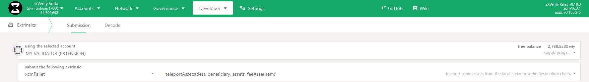
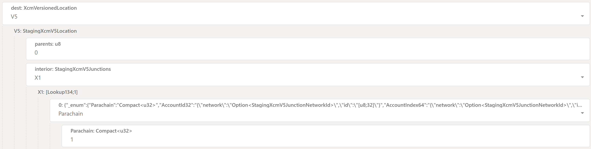
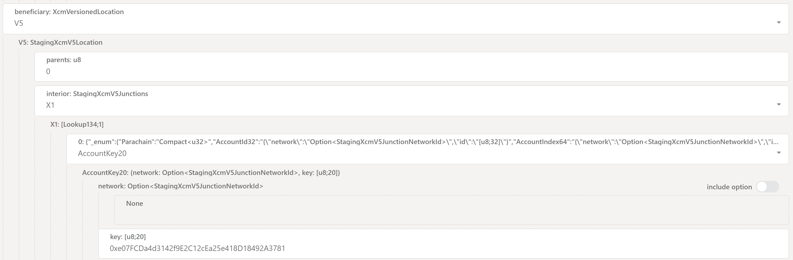
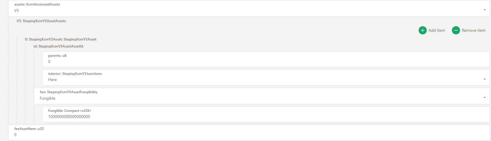
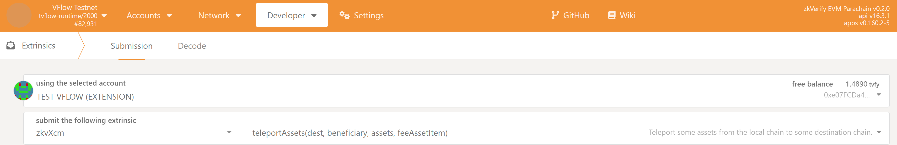
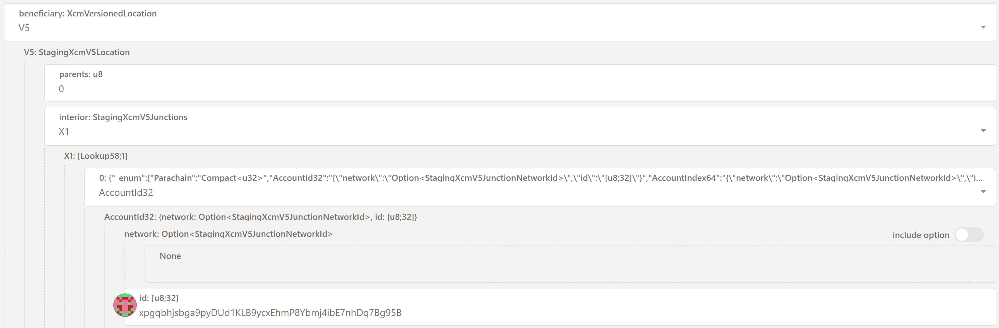

## XCM Teleport

A **teleport** is a powerful Cross-Consensus Message (XCM) instruction that facilitates the movement of assets between zkVerify Relay Chain and its System Parachains.

A teleport of an asset (VFY token) is an operation performed in two stages by an XCM executor: one part is executed on the Relay chain (burns the asset) and the other part on the Parachain (minting of the asset).

[Image Source](https://www.google.com/url?sa=i&url=https%3A%2F%2Fwiki.polkadot.network%2Flearn%2Flearn-xcm-usecases%2F&psig=AOvVaw21L2fcOzDMDt-zhRvkjJuv&ust=1752589475818000&source=images&cd=vfe&opi=89978449&ved=0CBQQjRxqFwoTCMip9OHGvI4DFQAAAAAdAAAAABA8)

In this guide, we will be using teleport to move VFY tokens from zkVerify to VFlow and viceversa.

You can find more information on XCM [here](https://polkadot.com/blog/xcm-the-cross-consensus-message-format/).

### From zkVerify to VFlow

From [PolkadotJS](https://polkadot.js.org/apps/?rpc=wss%3A%2F%2Fvolta-rpc.zkverify.io#/explorer) navigate to `Developer-> Extrinsics` and select the `xcmPallet` pallet and the `teleportAssets` extrinsic:

You can see that we need to supply 4 parameters: `dest`, `beneficiary`, `assets` and `feeAssetItem`. Let's start with the `dest` parameter:

#### Destination

This parameter specifies the target chain where the assets are being teleported. Let's select:

- `v5` as `dest: XcmVersionedLocation` from the scroll-down menu. New fields will pop-up. Let's set:
    - `parents` as `0`
    - `interior` as `X1` from the scroll-down menu. Then new fields will appear. Let's set:
        - `Parachain` as `0` field, from the scroll-down menu
        - We need finally to insert the ID of the `Parachain` we want to send the assets to, in the example is `1599`, but in case of VFlow it will be `1`.

Let's provide a brief explanation here:
- `dest` provides details about the destination of the message (we need to select the XCM version currently being used. V5 is the most-up-to-date at the time of writing).
    - `parents` tells the Relay Chain XCM executor the destination location of the teleport. 

    - `interior` describes the rest of the path, the specific, step-by-step directions to the final destination. It defines a sequence of "hops" or _Junctions_. Each junction is a specific location or entity within a consensus system.
        - The interior is structured as a container, usually X1, X2, X3, etc. where X stands for the number of Junctions (hops) in the path.
            - Here: Equivalent to X0, no junctions.
            - X1: A path with one junction.
            - X2: A path with two junctions.
            - ...and so on, up to X8.

You could think of it like a File System where: 
- The root directory is the Relay Chain
- There are as many sub-directories as Parachains.
- In each directory there is a list of consensus entities (accounts, pallets, etc.) living in that Relay Chain/Parachain.

So setting `parents = 0` means it's the current location (in bash it would be `.`) while `parents = 1` means it's the parent location (in bash it would be `..`).

Setting `interior = X1 { Parachain: 3 }` means essentially specifying `./parachain_3`;
Instead setting `interior = X2 { Parachain: 3, AccountKey20: 0x111 }` means essentially specifying `./parachain_3/account_111`

Putting it all together, we are initiating the teleport from the Relay Chain (so `parents` is 0, since we are already on the Relay Chain) to the Parachain with id `1599`, which is *one hop* away from the parent (so `interior` is `X1` with `Parachain` set to `1599`).

#### Beneficiary

This specifies the account that will receive the assets on the destination chain. Let's set:

- `v5` as `beneficiary: XcmVersionedMultiLocation` from the scroll-down menu. New fields will pop-up. Let's set:
    - `parents` as `0`
    - `interior` as `X1` from the scroll-down menu. Then new fields will appear. Let's set:
        - `AccountKey20` as `0` field, from the scroll-down menu
        - We need finally to insert the address of the Ethereum account we want to receive the assets on VFlow. 

Note the usage of:
- `parents = 0`: the instruction for minting the funds and depositing them into the beneficiary's account **is executed by VFlow**. From VFlow perspective, the beneficiary account is right there on-chain. It doesn't need to go up to the Relay Chain to find it (we are already in the `parachain_1599` directory)
- `interior = X1`: We need to do "one hop" from the Parachain to the beneficiary account on the Parachain itself (like accessing `./beneficiary_account`)

#### Assets

This defines the actual asset(s) and the amount(s) you are sending. Let's set:

- `v5` as `assets: XcmVersionedMultiAsset` from the scroll-down menu. Click on the `Add Item` button. New fields will pop-up. Let's set:
    - `parents` as `0`
    - `interior` as `Here` from the scroll-down menu. Then new fields will appear. Let's set:
        - `Fungible` as `fun` field, from the scroll-down menu
        - We need finally to insert the amount of assets we want to send in the `Fungible` field. In this case we are sending 1 VFY so, remembering that the token has 18 decimals, this will be a 1 followed by 18 zeros: `1000000000000000000`.

Note the usage of `parents = 0` and `interior = Here`: the asset VFY is native on the Relay Chain, from which we are building the XCM teleport and from which the XCM executor will burn funds.

#### Fee Asset Item

This is simply the index of the asset in the `assets` array that will be used to pay for the XCM teleport fee. We only have a single asset (VFY) and we are using that one, so we set it to `0`.

#### Submitting the extrinsic

Finally, let's click on `submitTransaction` and then `sign And Submit` on the new window that will appear to conclude our teleport.

If you don't want to construct this complex extrinsic by yourself, you can go to `Developer -> Extrinsics -> Decode` and copy/paste the following hex:

`0x6d028400486b90dbf0cb9bfe92b6ba7d4942019a17ada772ab5fa9258ac3df821daca54d01f83f47f9aea563b9c1ab8edb2bd2a2aa3b8ed0d3ae60b3f7ed79e937f789002b7e12ce1f9be511750c9f9b3f47339700360773cb857322c2f956b1afff7fba8475006400008c0105000100fd180500010300e07fcda4d3142f9e2c12cea25e418d18492a3781050400000013000064a7b3b6e00d00000000`

Then click on the `Submission` tab and change the values you need (like the Parachain ID, amount, destination address, etc.). 

### From VFlow to zkVerify

The process here is exactly a mirror of what we did on zkVerify side.
Let's navigate to `Developer-> Extrinsics` and select the `zkvXcm` pallet and the `teleportAssets` extrinsic.

Like before we need to supply 4 parameters: `dest`, `beneficiary`, `assets` and `feeAssetItem`. 

#### Destination

Let's start with the `dest` parameter:

- `v5` as `dest: XcmVersionedLocation` from the scroll-down menu. New fields will pop-up. Let's set:
    - `parents` as `1`
    - `interior` as `Here` from the scroll-down menu. Then new fields will appear. Let's set:

The destination is the Relay Chain so `parents` is `1` (we are in a Parachain, a sub-directory of the Relay Chain root directory, so we need to move one directory up), the `interior` is `Here` (once moving up, we are in the root directory, which is the Relay Chain directory, so we have already arrived in the correct location).

#### Beneficiary

Let's set the `beneficiary` parameter as follows:

- `v5` as `beneficiary: XcmVersionedMultiLocation` from the scroll-down menu. New fields will pop-up. Let's set:
    - `parents` as `0`
    - `interior` as `X1` from the scroll-down menu. Then new fields will appear. Let's set:
        - `AccountId32` as `0` field, from the scroll-down menu
        - We need finally to insert the address of the zkVerify account we want to receive the assets on zkVerify.

Note that:

- The instruction for minting the funds and depositing them into the beneficiary's account is always executed on the destination chain (in this case, the Relay Chain): as such, `parents = 0` (from the point of view of zkVerify)
- `interior = X1`: We need to do "one hop" from the Relay Chain to the beneficiary account on the Relay Chain itself (like accessing `./beneficiary_account`)

#### Assets

Let's set the `assets` parameter as follows:

- `v5` as `assets: XcmVersionedMultiAsset` from the scroll-down menu. Click on the `Add Item` button. New fields will pop-up. Let's set:
    - `parents` as `1`
    - `interior` as `Here` from the scroll-down menu. Then new fields will appear. Let's set:
        - `Fungible` as `fun` field, from the scroll-down menu
        - We need finally to insert the amount of assets we want to send in the `Fungible` field. In this case we are sending 1 VFY so, remembering that the token has 18 decimals, this will be a 1 followed by 18 zeros: `1000000000000000000`.

Note that the `parents` is `1`, as the VFY asset is native of the Relay Chain (so one directory up from the point of view of the Parachain).

#### Fee Asset Item

This is simply the index of the asset in the `assets` array that will be used to pay for the XCM teleport fee. We only have a single asset (VFY) and we are using that one, so we set it to `0`.

#### Submitting the extrinsic

Finally, let's click on `submitTransaction` and then `sign And Submit` on the new window that will appear to conclude our teleport.

If you don't want to construct this complex extrinsic by yourself, you can go to `Developer -> Extrinsics -> Decode` and copy/paste the following hex:

`0x5d0284e07fcda4d3142f9e2c12cea25e418d18492a3781db9a6d3e84d2331a3b02c371f782180d79c4ed54bebac862cdae663527e47b4405dde8273edde4ec218e4f2fd4300df9ca09ec35be66137cad5ad1c3fe16004b0025010800001f010501000500010100486b90dbf0cb9bfe92b6ba7d4942019a17ada772ab5fa9258ac3df821daca54d050401000013000064a7b3b6e00d00000000`

Then click on the `Submission` tab and change the values you need (like the amount, destination address, etc.).

### A Note on XCM Teleport Fees

Since an XCM message is executed both on the Relay Chain and Parachain side, both sender and receiver need to pay for execution fees. However:
- The fees charged to the sender **are deducted directly from its main balance**. This happens immediately when the transaction is included in a block, **before the teleport's burn logic is even executed**.
- The fees charged to the receiver **are deducted from the amount being teleported**. This happens when the XCM message is executed on the Parachain side.