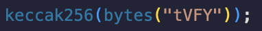

## Native token tVFY bridging

Token bridging is a component offered by Hyperbridge.
Currently native token tVFY can be teleported to Ethereum Sepolia and back as well.

### From zkVerify to Sepolia ETH

`teleport` is an extrinsic of the pallet token gateway.
From PolkadotJS navigate to `Developer-> Extrinsics` and select the `tokenGateway` pallet and the `teleport` extrinsic.

This call is used to initialize a cross-chain asset transfer. Any provided assets are custodied by the pallet and a cross-chain request is dispatched to the destination supported chain.

The extrinsic can be called by any account and expects the following input params

- `assetId`: the local asset Id registered on Hyperbridge and that should be transferred, for the native token (tVFY) this is 0
- `destination`: Destination state machine that should receive the funds, defined by its chain type and chain id. For now select `Evm` and in the subsection of `Evm:u32` enter `11155111` as we will be bridging to Ethereum Sepolia.
- `recipient`: The beneficiary account for the funds on the destination. (For EVM chains, the address should be left padded with zeros to fit into the required 32 bytes.)
- `amount`: The amount that should be transferred (Note: decimals must be specified, tVFY token has 18 decimals)
- `timeout`:The request timeout, this is the time after which the request cannot be delivered to the destination. It should represent the cumulative time for finalization on the source chain and hyperbridge with some additional buffer. If 0, it means it never times out.
- `tokengateway`: The address of the token gateway module on the destination chain. Addresses can be found here (currently only Ethereum Sepolia is supported) https://docs.hyperbridge.network/developers/evm/contracts/testnet
https://docs.hyperbridge.network/developers/evm/contracts/mainnet
- `relayer_fee`: The amount to be paid to relayers for delivering the request, a value of zero means the dispatcher is responsible for relaying the request. For now it's okay to leave it to 0.
- `redeem`: Always false, we will not deploy ERC20 on our own.

### From Sepolia ETH to zkVerify

First find the TokenGateway contract deployed on the EVM of interest (in this case zkVerify)

The contract addresses can be found here

https://docs.hyperbridge.network/developers/evm/contracts/mainnet
https://docs.hyperbridge.network/developers/evm/contracts/testnet

So this is the Tokegateway sepolia ETH contract

https://sepolia.etherscan.io/address/0xFcDa26cA021d5535C3059547390E6cCd8De7acA6#writeContract

The method of interest is `teleport`

- `amount`: amount to be sent, in wei or whatever the decimals used for the source token. For example, for tVFY, 18 decimals.
- `relayerFee`: The amount to be paid to relayers for delivering the request
- `assetId`: this is the bytes32 representation of the token symbol of the token you want to send. In this case, the symbol is tVFY and the assetID is the result of the following operation in solidity
  

Which in this case is 0xbce67a4632d733ff3d4599502fc9c8812688ce39220e4304bd7b43c22ae5c77c

- `redeem`: Always false, we will not deploy ERC20 on our own.
- `to` ->  This is the destination address receiving the tokens. It has to be given in public key hex format. You can use the subkey command line tool to get your zkverify address in the right format
  

  

- `dest`: This is the bytes representation of the destination chain, in this case zkverify. In practice, it’s the result of the following operation in solidity
  

- `timeout`: The request timeout, this is the time after which the request cannot be delivered to the destination. It should represent the cumulative time for finalization on the source chain and hyperbridge with some additional buffer. If 0, it means it never times out.
- `nativeCost`: Amount of native token to pay for dispatching the request. if 0 will use the `IIsmpHost.feeToken`
- `data`: destination contract call data

When the tx succeeds, the transaction from EVM side looks like following https://sepolia.etherscan.io/tx/0x3112a43a76019ae77fee56d7721a3fface395ae70d014affe3d17792d16ed3f1

And then from zkverify side, these are the extrinsics and events
https://polkadot.js.org/apps/#/explorer/query/0x3637c0ac9b082396a62232e24412aa492f75da71d66bd19fd5d62c7d6e66c374