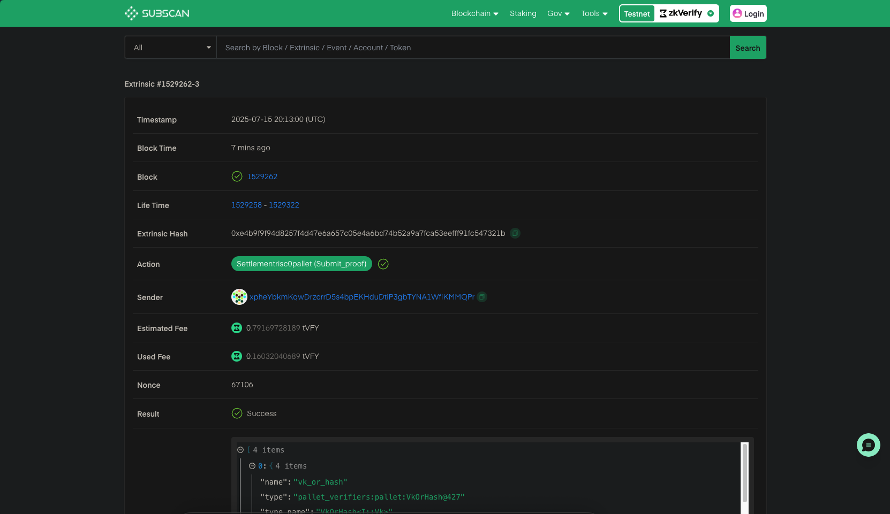

:::info
All the codebase used in the tutorial can be explored [here](https://github.com/zkVerify/explorations/tree/main/tee-r0-verifier)
:::

This guide will walk you through the process of verifying TEE proofs on zkVerify by wrapping them with [Risc Zero](https://risczero.com/). As per the current standards, most of the TEE proofs are first wrapped into a zkVM to generate a STARK proof, and then again wrapped into a groth16 proof to verify it onchain. But with zkVerify we don't need to wrap it to groth16 as zkVerify supports native Risc Zero STARK verification.

To start with we will create a new cargo project using the follwing command:

```bash
cargo new zkverify-tee-r0
```

After creating the project, open it with IDE of your choice. We will be importing all the required modules for our project. We will be using [Automata's DCAP CLI](https://github.com/automata-network/automata-dcap-zkvm-cli) project for all the required TEE verification functions. We will also use `risc0-zkvm` to create a client and generate a proof with the Bonsai proving service.

Next, open the `cargo.toml` file and replace it with the following:

```toml
[package]
name = "zkverify-tee-r0"
version = "0.1.0"
edition = "2024"

[dependencies]
reqwest = { version = "0.11", features = ["json", "rustls-tls"] }
tokio = { version = "1", features = ["full"] }
serde = { version = "1", features = ["derive"] }
serde_json = "1"
dotenv = "0.15"
anyhow = "1"
hex = "0.4"
risc0-zkvm = "=2.1.0"
ciborium = "0.2.2"
dcap-rs = { git = "https://github.com/automata-network/dcap-rs.git" }
dcap-bonsai-cli = { git="https://github.com/automata-network/automata-dcap-zkvm-cli", rev="268b4115ad592d46c02f4ef7d49a6bae066d1592" }
```

:::info
You can apply for a Bonsai API Key [here](https://docs.google.com/forms/d/e/1FAIpQLSf9mu18V65862GS4PLYd7tFTEKrl90J5GTyzw_d14ASxrruFQ/viewform) and for Kurier, users can obtain an API key by creating an account at [kurier.xyz](https://kurier.xyz) and generating a key from the user dashboard.
:::

After adding all the required modules to the project, we will create a `.env` file in which we will store our Bonsai API details and [Horizen's Kurier](../02-getting-started/05-kurier.md) API key. Paste the following snippet and add your API details:

```bash
BONSAI_API_URL="<BONSAI_API_URL>"
BONSAI_API_KEY="<BONSAI_API_KEY>"
RISC0_PROVER="bonsai"
API_KEY="<KURIER_API_KEY>"
```

Then create a new file named `utils.rs` inside the `src` folder. In this file we will define the `verify_proof` function which will call Kurier for proof verification. First we will import all the required modules. You can paste the following code snippet:

```rust
use std::{env, fs, thread, time::Duration};
use anyhow::{Ok, Result};
use dotenv::dotenv;
use reqwest::Client;
use risc0_zkvm::Receipt;
use serde::Deserialize;
```

Now we will define a constant `API_URL` which will hold our Kurier API URL. And the the `verify_proof` function, which will be an async function and will take the `ZK receipt` and `image_id` as the inputs.
We will read the `API_KEY` from the `env` and then convert the Risc Zero proof receipt into the required hex format which zkVerify supports.

Then we will create the `submit_params` object with all the proof details required for verification. Next, we make a `POST` request to `submit-proof` endpoint which will return the `job-id` and `optimistic-verification` status. If the `optimistic-verification` status is `success` then we will start polling the `job-id` till it's status is `Finalized`, which means that the ZK proof has been finalized on zkVerify chain.

```rust
pub async fn verify_proof(receipt: Receipt, image_id: String) -> Result<()>{

    dotenv().ok();
    let api_key = env::var("API_KEY")?;

    let mut bin_receipt = Vec::new();
    ciborium::into_writer(&receipt, &mut bin_receipt).unwrap();
    let proof_hex = hex::encode(&bin_receipt);
    let public_inputs_hex = hex::encode(&receipt.journal.bytes);

    let client = Client::new();

    let submit_params = serde_json::json!({
        "proofType": "risc0",
        "vkRegistered": false,
        "chainId": 11155111,
        "proofOptions": {
            "version": "V2_1"
        },
        "proofData": {
            "proof": "0x".to_string() + &proof_hex,
            "publicSignals": "0x".to_string() + &public_inputs_hex,
            "vk": image_id
        }
    });

    let response = client
        .post(format!("{}/submit-proof/{}", API_URL, api_key))
        .json(&submit_params)
        .send()
        .await?;

    let submit_response: serde_json::Value = response.json().await?;
    println!("{:#?}", submit_response);

    if submit_response["optimisticVerify"] != "success" {
        eprintln!("Proof verification failed.");
        return Ok(());
    }

    let job_id = submit_response["jobId"].as_str().unwrap();

    loop {
        let job_status = client
            .get(format!("{}/job-status/{}/{}", API_URL, api_key, job_id))
            .send()
            .await?
            .json::<serde_json::Value>()
            .await?;

        let status = job_status["status"].as_str().unwrap_or("Unknown");

        if status == "Finalized" || status == "Aggregated" || status == "AggregationPending"{
            println!("Job Finalized successfully");
            println!("{:?}", job_status);
            break;
        } else {
            println!("Job status: {}", status);
            println!("Waiting for job to finalized...");
            thread::sleep(Duration::from_secs(5));
        }
    }

    Ok(())
}
```

Now let's dive to create the main logic for our application. We don't need to write a zkVM program, because we will be using [Automata's DCAP CLI](https://github.com/automata-network/automata-dcap-zkvm-cli) project which already contains all the zkVM programs needed for the wrapping of the TEE attestation.

Open the `main.rs` file, and import alll the following modules:

```rust
use std::{fs::read_to_string, path::PathBuf};
use anyhow::Result;
use dcap_bonsai_cli::chain::{
    pccs::{
        enclave_id::{get_enclave_identity, EnclaveIdType},
        fmspc_tcb::get_tcb_info,
        pcs::{get_certificate_by_id, IPCSDao::CA},
    },
};
use dcap_bonsai_cli::code::DCAP_GUEST_ELF;
use dcap_bonsai_cli::collaterals::Collaterals;
use dcap_bonsai_cli::constants::*;
use dcap_bonsai_cli::parser::get_pck_fmspc_and_issuer;
use dcap_bonsai_cli::remove_prefix_if_found;
use dotenv::dotenv;
use risc0_zkvm::{compute_image_id, default_prover, ExecutorEnv, ProverOpts};
```

Next we will create some utility functions to verify our TEE attestation. These functions will be to read the hex quote from a file, serialize the collaterals, and to generate the input for our zkVM program. You can paste the following code snippet:

```rust
fn get_quote() -> Result<Vec<u8>> {

    let mut default_path = PathBuf::from(env!("CARGO_MANIFEST_DIR"));
    default_path.push("data/quote.hex");
    let quote_string = read_to_string(default_path).expect("Wrong data !!!");
    let processed = remove_prefix_if_found(&quote_string);
    let quote_hex = hex::decode(processed)?;
    Ok(quote_hex)

}


fn serialize_collaterals(collaterals: &Collaterals, pck_type: CA) -> Vec<u8> {
    // get the total length
    let total_length = 4 * 8
        + collaterals.tcb_info.len()
        + collaterals.qe_identity.len()
        + collaterals.root_ca.len()
        + collaterals.tcb_signing_ca.len()
        + collaterals.root_ca_crl.len()
        + collaterals.pck_crl.len();

    // create the vec and copy the data
    let mut data = Vec::with_capacity(total_length);
    data.extend_from_slice(&(collaterals.tcb_info.len() as u32).to_le_bytes());
    data.extend_from_slice(&(collaterals.qe_identity.len() as u32).to_le_bytes());
    data.extend_from_slice(&(collaterals.root_ca.len() as u32).to_le_bytes());
    data.extend_from_slice(&(collaterals.tcb_signing_ca.len() as u32).to_le_bytes());
    data.extend_from_slice(&(0 as u32).to_le_bytes()); // pck_certchain_len == 0
    data.extend_from_slice(&(collaterals.root_ca_crl.len() as u32).to_le_bytes());

    match pck_type {
        CA::PLATFORM => {
            data.extend_from_slice(&(0 as u32).to_le_bytes());
            data.extend_from_slice(&(collaterals.pck_crl.len() as u32).to_le_bytes());
        }
        CA::PROCESSOR => {
            data.extend_from_slice(&(collaterals.pck_crl.len() as u32).to_le_bytes());
            data.extend_from_slice(&(0 as u32).to_le_bytes());
        }
        _ => unreachable!(),
    }

    // collateral should only hold one PCK CRL

    data.extend_from_slice(&collaterals.tcb_info);
    data.extend_from_slice(&collaterals.qe_identity);
    data.extend_from_slice(&collaterals.root_ca);
    data.extend_from_slice(&collaterals.tcb_signing_ca);
    data.extend_from_slice(&collaterals.root_ca_crl);
    data.extend_from_slice(&collaterals.pck_crl);

    data
}

fn generate_input(quote: &[u8], collaterals: &[u8]) -> Vec<u8> {
    // get current time in seconds since epoch
    let current_time = std::time::SystemTime::now()
        .duration_since(std::time::UNIX_EPOCH)
        .unwrap()
        .as_secs();
    let current_time_bytes = current_time.to_le_bytes();

    let quote_len = quote.len() as u32;
    let intel_collaterals_bytes_len = collaterals.len() as u32;
    let total_len = 8 + 4 + 4 + quote_len + intel_collaterals_bytes_len;

    let mut input = Vec::with_capacity(total_len as usize);
    input.extend_from_slice(&current_time_bytes);
    input.extend_from_slice(&quote_len.to_le_bytes());
    input.extend_from_slice(&intel_collaterals_bytes_len.to_le_bytes());
    input.extend_from_slice(&quote);
    input.extend_from_slice(&collaterals);

    input.to_owned()
}
```

Finally, we will create our `main` function which will use all the utils functions to generate a Risc Zero proof for our TEE attestaion and verify it on zkVerify using Kurier. This function will be a async function as there will be multiple async API calls involved in this process.

We will start by reading the quote from a file, then checking all the collaterals, serializing these collaterals and generating the zkVM input using the utility function we defined previously. After generating the input, we will create a `DefaultProver` which will connect to the Bonsai server to generate our ZK proof.

We will also define the required proof type as `&ProverOpts::succinct()`. After generating the proof, we will use the `verify_proof` function we made previously to send our Risc Zero proof for verification to zkVerify. You can just copy this code snippet for your main function:

```rust
#[tokio::main]
async fn main() -> Result<()>{
    dotenv().ok();

    let quote = get_quote().expect("Failed to read quote");

    // Step 1: Determine quote version and TEE type
    let quote_version = u16::from_le_bytes([quote[0], quote[1]]);
    let tee_type = u32::from_le_bytes([quote[4], quote[5], quote[6], quote[7]]);

    println!("Quote version: {}", quote_version);
    println!("TEE Type: {}", tee_type);

    if quote_version < 3 || quote_version > 4 {
        panic!("Unsupported quote version");
    }

    if tee_type != SGX_TEE_TYPE && tee_type != TDX_TEE_TYPE {
        panic!("Unsupported tee type");
    }

    // Step 2: Load collaterals
    println!("Quote read successfully. Begin fetching collaterals from the on-chain PCCS");

    let (root_ca, root_ca_crl) = get_certificate_by_id(CA::ROOT).await?;
    if root_ca.is_empty() || root_ca_crl.is_empty() {
        panic!("Intel SGX Root CA is missing");
    } else {
        println!("Fetched Intel SGX RootCA and CRL");
    }

    let (fmspc, pck_type, pck_issuer) =
        get_pck_fmspc_and_issuer(&quote, quote_version, tee_type);

    let tcb_type: u8;
    if tee_type == TDX_TEE_TYPE {
        tcb_type = 1;
    } else {
        tcb_type = 0;
    }
    let tcb_version: u32;
    if quote_version < 4 {
        tcb_version = 2
    } else {
        tcb_version = 3
    }
    let tcb_info = get_tcb_info(tcb_type, fmspc.as_str(), tcb_version).await?;

    println!("Fetched TCBInfo JSON for FMSPC: {}", fmspc);

    let qe_id_type: EnclaveIdType;
    if tee_type == TDX_TEE_TYPE {
        qe_id_type = EnclaveIdType::TDQE
    } else {
        qe_id_type = EnclaveIdType::QE
    }
    let qe_identity = get_enclave_identity(qe_id_type, quote_version as u32).await?;
    println!("Fetched QEIdentity JSON");

    let (signing_ca, _) = get_certificate_by_id(CA::SIGNING).await?;
    if signing_ca.is_empty() {
        panic!("Intel TCB Signing CA is missing");
    } else {
        println!("Fetched Intel TCB Signing CA");
    }

    let (_, pck_crl) = get_certificate_by_id(pck_type).await?;
    if pck_crl.is_empty() {
        panic!("CRL for {} is missing", pck_issuer);
    } else {
        println!("Fetched Intel PCK CRL for {}", pck_issuer);
    }

    let collaterals = Collaterals::new(
        tcb_info,
        qe_identity,
        root_ca,
        signing_ca,
        root_ca_crl,
        pck_crl,
    );
    let serialized_collaterals = serialize_collaterals(&collaterals, pck_type);

    // Step 3: Generate the input to upload to Bonsai
    let image_id = compute_image_id(DCAP_GUEST_ELF)?;
    println!("Image ID: {}", image_id.to_string());

    let input = generate_input(&quote, &serialized_collaterals);
    println!("All collaterals found! Begin uploading input to Bonsai...");

    // Sending proof request to Bonsai
    let env = ExecutorEnv::builder().write_slice(&input).build()?;
    let receipt = default_prover()
        .prove_with_opts(env, DCAP_GUEST_ELF, &ProverOpts::succinct())?
        .receipt;
    receipt.verify(image_id)?;

    utils::verify_proof(receipt, "0x".to_string()+&image_id.to_string()).await?;

    Ok(())
}
```

Now we will compile our project with release tag. Use the following command to build your project:

```bash
cargo build --release
```

To generate a ZK proof, you would need to pass the TEE quote as an input. Create a new folder named `data` and the a new file named `quote.hex` inside this folder. And then copy paste the data in this [file](https://github.com/automata-network/automata-dcap-zkvm-cli/blob/268b4115ad592d46c02f4ef7d49a6bae066d1592/data/quote.hex) to the `quote.hex` file you created.

Next load your `.env` file and run the project to generate ZK proofs. Use the following command to start your project:

```bash
source .env
```

```bash
./target/release/zkverify-tee-r0
```

After running the program, you will get an output similar to:

```bash
Quote version: 4
TEE Type: 129
Quote read successfully. Begin fetching collaterals from the on-chain PCCS
Fetched Intel SGX RootCA and CRL
Fetched TCBInfo JSON for FMSPC: 90c06f000000
Fetched QEIdentity JSON
Fetched Intel TCB Signing CA
Fetched Intel PCK CRL for Intel SGX PCK Platform CA
Image ID: 4cf071b3cc25d73e77f430b65f5700dd53522dacc21c1bfc0862b2e46fda3584
All collaterals found! Begin uploading input to Bonsai...
Object {
    "jobId": String("186823a1-61b8-11f0-8eb5-b2e0eb476089"),
    "optimisticVerify": String("success"),
}
Job status: Submitted
Waiting for job to finalized...
Job status: IncludedInBlock
Waiting for job to finalized...
Job Finalized successfully
Object {"aggregationId": Number(49713), "blockHash": String("0x495ee5f44fa64d39d115c182445c0afe350d0a79be4ec65ddba80a4dcd6d747e"), "chainId": Number(11155111), "createdAt": String("2025-07-15T20:12:56.000Z"), "jobId": String("186823a1-61b8-11f0-8eb5-b2e0eb476089"), "proofType": String("risc0"), "statement": String("0x73c324655562aa1b748cfddff41b172c34d9369cf44f14dc2860d2e5b453c3c1"), "status": String("AggregationPending"), "statusId": Number(5), "txHash": String("0xe4b9f9f94d8257f4d47e6a657c05e4a6bd74b52a9a7fca53eefff91fc547321b"), "updatedAt": String("2025-07-15T20:13:15.000Z")}
```

Using the txHash logged, you can check your verified proof on our [zkVerify Explorer](https://zkverify-testnet.subscan.io/).


