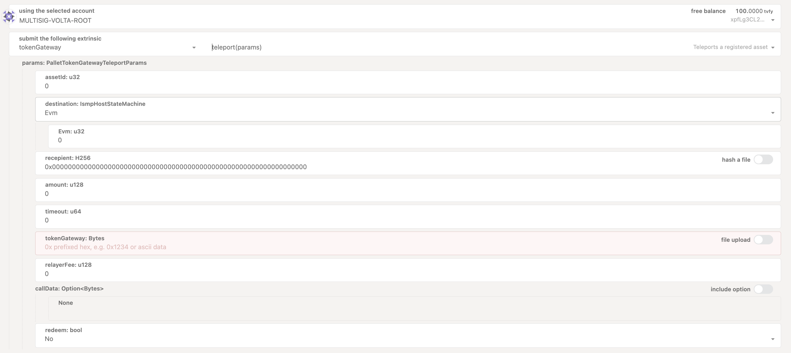

## Native token tVFY bridging

Token bridging is a component offered by Hyperbridge.
Currently native token tVFY can be teleported to Ethereum Sepolia.

`teleport` is an extrinsic of the pallet token gateway.
From PolkadotJS navigate to `Developer-> Extrinsics` and select the `tokenGateway` pallet and the `teleport` extrinsic.

This call is used to initialize a cross-chain asset transfer. Any provided assets are custodied by the pallet and a cross-chain request is dispatched to the destination supported chain.

The extrinsic can be called by any account and expects the following input params

- `assetId`: the local asset Id registered on Hyperbridge and that should be transferred, for the native token (tVFY) this is 0
- `destination`: Destination state machine that should receive the funds, defined by its chain type and chain id. For now select `Evm` 
- `recipient`: The beneficiary account for the funds on the destination. (For EVM chains, the address should be left padded with zeros to fit into the required 32 bytes.)
- `amount`: The amount that should be transferred (Note: decimals must be specified, tVFY token has 18 decimals)
- `timeout`:The request timeout, this is the time after which the request cannot be delivered to the destination. It should represent the cumulative time for finalization on the source chain and hyperbridge with some additional buffer. If 0, it means it never times out.
- `tokengateway`: The address of the token gateway module on the destination chain. Addresses can be found here (currently only Ethereum Sepolia is supported) https://docs.hyperbridge.network/developers/evm/contracts/testnet
https://docs.hyperbridge.network/developers/evm/contracts/mainnet
- `relayer_fee`: The amount to be paid to relayers for delivering the request, a value of zero means the dispatcher is responsible for relaying the request. For now it's okay to leave it to 0.
- `redeem`: Always false, we will not deploy ERC20 on our own.

