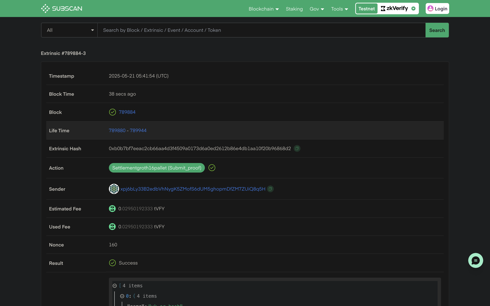

This guide will walk you through the process of verifying zkEmail proofs with zkVerify. We will be using the [zkEmail SDK](https://docs.zk.email/zk-email-sdk/setup) to generate remote proofs, and then we will be using [zkVerifyJS](../04-zkverifyjs.md) to verify the zkEmail proofs(Groth16).

To start with, we will create a new directory, initialize npm, and install required packages(@zk-email/sdk and zkVerifyJS). Use the following commands:- 
```bash
# This will create a new directory for our project
mkdir zkEmail-zkVerify

# Moving inside our directory
cd zkEmail-zkVerify

# Initializing our project
npm init -y && npm pkg set type=module

# Installing required packages
npm i @zk-email/sdk zkverifyjs
```

After installing all the required packages, we can create ``index.js`` file. We can start by importing all the required packages.

```js
import { zkVerifySession, Library, CurveType, ZkVerifyEvents } from "zkverifyjs";
import zkeSDK, { Proof } from "@zk-email/sdk";
import fs from "fs/promises";
```

Next steps would be to choose a blueprint from the [ZKEmail registry](https://registry.zk.email/) and generate ZK proofs for supported email. We can start by importing the blueprint using the zkeSDK(). While importing the blueprint let’s also get the verification key which will be later used during verification.

```js
// Initialize the SDK
const sdk = zkeSDK();
  
// Get blueprint from the registry
const blueprint = await sdk.getBlueprint("Bisht13/SuccinctZKResidencyInvite@v3");

// Download the vkey
const vkey = await blueprint.getVkey();
const prover = blueprint.createProver();
```

After this, we need to get a compatible email file to generate the ZK proof. For this example, we will use the example email provided by ZKEmail. You can download it from [here](https://docs.zk.email/files/residency.eml). We will use the ``generateProof`` function to generate the proof remotely on zkEmail’s server for fast proving.

```js
// Read email file
const eml = await fs.readFile("residency.EML", "utf-8");
  
// Generate the proof
const proof = await prover.generateProof(eml);
```

Now, we have successfully generated a Groth16 zkEmail proof. We will try to verify this proof using zkVerifyJS. Let’s create a ``session`` using our seed phrase.

```js
const session = await zkVerifySession.start().Volta().withAccount("seed-phrase");
```

After creating a session, we can directly call the ``verify`` function to verify the ``groth16`` proof. Also, we will listen to ``IncludedInBlock`` event for our transaction, log the transaction details and close our session.

```js
const {events} = await session.verify()
    .groth16({library: Library.snarkjs, curve: CurveType.bn128})
    .execute({proofData: {
        vk: JSON.parse(vkey),
        proof: proof.props.proofData,
        publicSignals: proof.props.publicOutputs
    }});

events.on(ZkVerifyEvents.IncludedInBlock, (eventData) => {
    console.log("Included in block", eventData);
    session.close().then(r => process.exit(0));
})
```

Now you can run this script by running ``node index.js`` and you will get an output in the following structure :- 

```json
Included in block {
  blockHash: '0x8186277ac5600c2bba79a595f72f4fd5c8b01f957f52161277f5bba02f4a2832',
  status: 'inBlock',
  txHash: '0x973e090cf4df6f7497daf752f5a2ed48137b3218840d38311ef21b2d2ea51c37',
  proofType: 'groth16',
  domainId: undefined,
  aggregationId: undefined,
  statement: '0xc5a8389b231522aad8360d940eb3ce275f0446bba1a9bd188b31d1c7dd37f136',
  extrinsicIndex: 2,
  feeInfo: {
    payer: 'xpj6bLy33B2edbVhNygK5ZMofS6dUM5ghopmDfZM7ZUiQ8q5H',
    actualFee: '28878053310000000',
    tip: '0',
    paysFee: 'Yes'
  },
  weightInfo: { refTime: '5775608971', proofSize: '0' },
  txClass: 'Normal'
}
```

You can check your verified proof on our [zkVerify Explorer](https://zkverify-testnet.subscan.io/) using the txHash logged.



### Next Steps

You can check our more detailed [tutorials](../02-getting-started/06-zkverify-js.md) to aggregate proofs and verify the aggregations on other connected chains like Ethereum, Arbitrum etc.