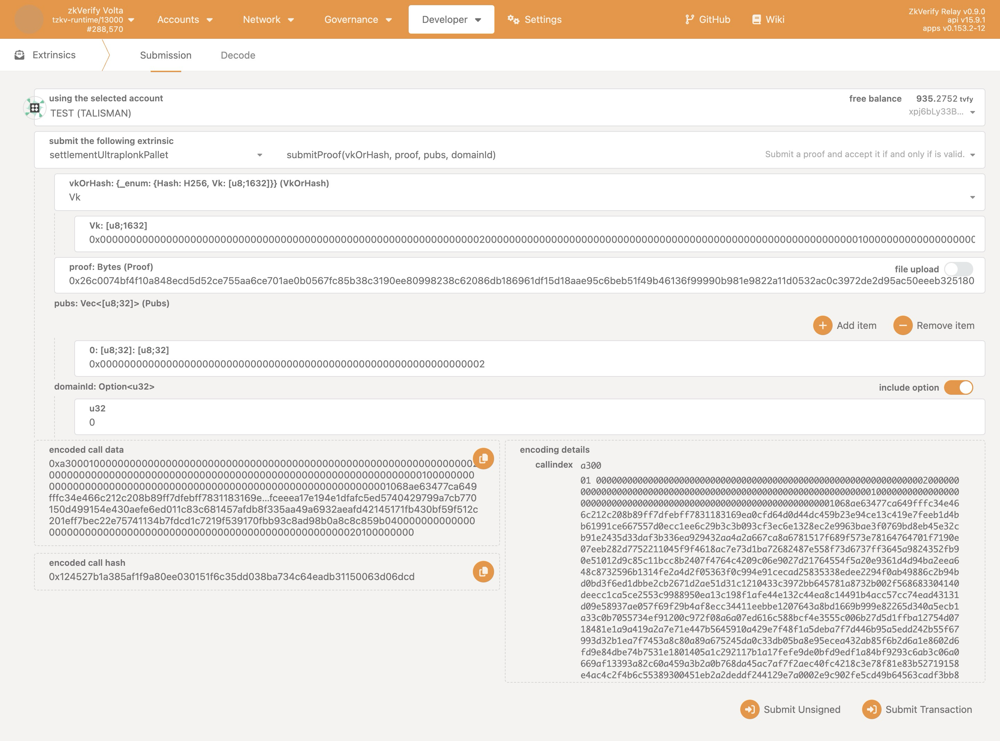

In this tutorial, we will walk through the process of submitting a Ultraplonk proof generated by [Noir](https://noir-lang.org/docs).

> **Note:** Recursive proofs are not supported.

## Requirements

Before starting, ensure you have the [`noir-cli`](https://github.com/zkVerify/ultraplonk_verifier/tree/main/src/bin/noir_cli) tool installed.

  ```bash
    git clone https://github.com/zkVerify/ultraplonk_verifier
    cargo install --features bins --path .
  ```

## Generate a Ultraplonk proof with Noir toolchain

Please, follow the [official Noir documentation](https://noir-lang.org/docs/getting_started/quick_start) to generate a sample proof. At the end of the process you should have two binary files generated by `bb`, namely the proof and vk.

## Convert `proof` and `vk` into zkVerify format
After you obtain the proof and vk from `bb` (let's call them `bb_proof`, and `bb_vk`, respectively), you should convert them using `noir-cli`.

Let's start from the proof (which also contains public inputs). Run the command

```bash
noir-cli proof-data -n <num_public_inputs> --input-proof <bb_proof path> --output-proof <zkv_proof path> --output-pubs <zkv_pubs path>
```

This command will provide the `zkv_proof` and `zkv_pubs` files in binary format. Also the hexadecimal files `zkv_proof.hex`, and `zkv_pubs.hex`are generated, for ease of submission to `zkVerify`.

Then, we convert the vk by running the command

```bash
noir-cli key --input <bb_vk path> --output <zkv_vk path>
```

Also in this case, you should get the `zkv_vk`, and `zkv_vk.hex` files.

To make sure that everything works correctly, run the `noir-cli verify` command by providing the vk, proof, and pubs in binary format:

```bash
noir-cli verify --key <zkv_vk path> --proof <zkv_proof path> --pubs <zkv_pubs path>
```

## Submitting the Proof

Submit the proof by using `polkadot.js.org` frontend like on the image below:


