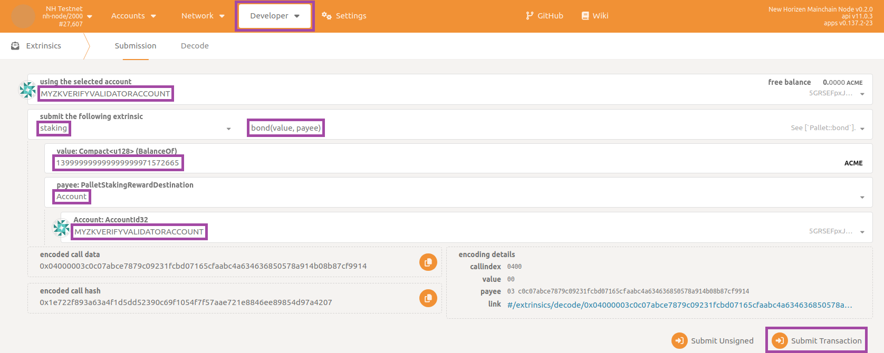
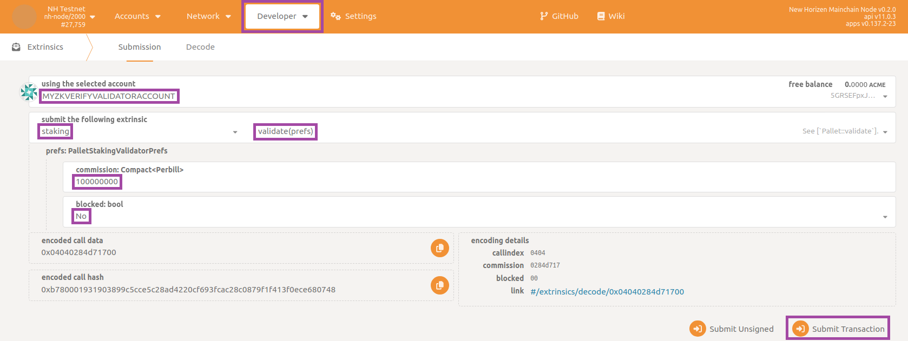
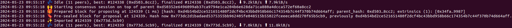

## Who are Validators ?

zkVerify is a blockchain developed using the Substrate framework, operating on the Nominated Proof-of-Stake (NPoS) consensus mechanism. This system involves two key entities: Validators and Nominators.

1. Validators are responsible for running the validator software on their machines, participating in block production on zkVerify, and earning rewards in return.
2. Nominators, on the other hand, delegate their stake to a selected group of reliable validators and receive a portion of the rewards earned by those validators. Unlike validators, nominators do not need to run any software.

## Steps Involved
- Bootstrapping the validator node
- Register your node with the network
- Stake tVFY
- Start validating

## Bootstrapping the validator node

We have created a comprehensive bash script to help you with bootstrapping up your validator nodes. You will just need to run the bash script to start the process. Follow this [tutorial](../02-run_using_docker/01-getting_started_docker.md) to have all the prerequisites installed. After that you can run the scripts using the following commands:  

```bash
cd compose-zkverify-simplified

scripts/init.sh
```

You will be asked a few questions, regarding your node details. Choose as described:
- Node Type - Validator
- Network - Testnet
- Node Name - any custom name you want
- Node Key - let the script randomly generate a new key
- Secret Phrase - you can import your existing wallet or create a new one(preferably create a new one, to have distinctions)


At the end of the session the script will populate directory `deployments/validator-node/`*`network`* with the proper files and you will get the following message:

```bash
=== Run the compose project with the following command:

========================
docker compose -f /home/your_user/compose-zkverify-simplified/deployments/validator-node/testnet/docker-compose.yml up -d
========================
```

Run the given command to start your validator node,
```bash
docker compose -f /home/your_user/compose-zkverify-simplified/deployments/validator-node/testnet/docker-compose.yml up -d
```

After running this command, you can check if the container is running successfully, by running
```bash
docker ls
```

You should get an output similar to this:

```bash
CONTAINER ID   IMAGE                            COMMAND                CREATED              STATUS              NAMES
ca4bdf2c6f05   horizenlabs/zkverify:0.2.0-rc1   "/app/entrypoint.sh"   About a minute ago   Up About a minute   validator-node
```

## Register your node with the network

In this section you can learn how to register a new validator on the blockchain. The operations described below must be performed just once.  They consist of the submission of some extrinsics (transactions, in Substrate terminology) resulting in your node being able to author new blocks and consequently earn new tokens through staking mechanism. We will require the public keys for your validator to register it with the network. We need three keys: Babe, Grandpa, and ImOnline public keys. Babe and ImOnline keys can be generated with the sr25519 scheme while the Grandpa key can be generated using the ed25519 scheme.


:::note
Since you are going to submit extrinsics which change the blockchain state, you need sufficient funds in the account (uniquely identified by your secret phrase) associated with your validator so that you can pay transaction fees.  
:::


Run the following command to generate the Babe and ImOnline keys:
```bash
docker run --rm -ti --entrypoint zkv-node horizenlabs/zkverify:latest key inspect --scheme sr25519
```

and provide your validator secret phrase when prompted for (`URI:`), then hit enter.  You should get the following response:

```bash
Secret phrase:       demise trumpet minor soup worth airport minor height sauce legend flag timber
  Network ID:        substrate
  Secret seed:       0x9b6a3ec8063e64e9d896ed8dbcd895d7fd0d7a3a982ed9b6839e2b55c49b9e15
  Public key (hex):  0xc0c07abce7879c09231fcbd07165cfaabc4a634636850578a914b08b87cf9914
  Account ID:        0xc0c07abce7879c09231fcbd07165cfaabc4a634636850578a914b08b87cf9914
  Public key (SS58): 5GRSEFpxJ8rU4LLiGrsnvkk7s1hdJXFZzx1T41KhECzTn7ot
  SS58 Address:      5GRSEFpxJ8rU4LLiGrsnvkk7s1hdJXFZzx1T41KhECzTn7ot
```

The public key(hex) field is the required Babe and ImOnline keys. We will execute the same command but this time with ed25519 scheme.

```bash
docker run --rm -ti --entrypoint zkv-node horizenlabs/zkverify:latest key inspect --scheme ed25519
```

and provide same secret phrase when prompted for (`URI:`), then hit enter. You should get the following response:

```bash
Secret phrase:       demise trumpet minor soup worth airport minor height sauce legend flag timber
  Network ID:        substrate
  Secret seed:       0x9b6a3ec8063e64e9d896ed8dbcd895d7fd0d7a3a982ed9b6839e2b55c49b9e15
  Public key (hex):  0x0dbccabf681188116e642c1dbc9332a2bbec7fbef1792196879a3cba6c52464b
  Account ID:        0x0dbccabf681188116e642c1dbc9332a2bbec7fbef1792196879a3cba6c52464b
  Public key (SS58): 5CNiZaphDhE8gT7cCDNZrXkd6vFfsuPjNQqdS8eEEw8mroHp
  SS58 Address:      5CNiZaphDhE8gT7cCDNZrXkd6vFfsuPjNQqdS8eEEw8mroHp
```

The public key(hex) field is the required Grandpa key. Once we have these three keys, we are ready to register our node. Next you need to visit [PolkadotJS](https://polkadot.js.org/apps/?rpc=wss%3A%2F%2Ftestnet-rpc.zkverify.io#/explorer) and call the ``setKeys`` extrinsic under ``sessions`` module. Use the public keys we have generated in the previous step in their required fields, set proof field as ``0x`` and sign the transaction.


In few seconds you should receive a green pop-up message on the top-right corner confirming the extrinsic has been succesfully submitted.

## Staking tVFY

Next step would be to stake tVFY for our registered validator node. In the current zkVerify implementation you need be in the top 10 stakers to be a part of active validators set. So, we will check how much tVFY we need to stake to be in the top 10 and then we will proceed to stake our tVFY tokens. 

We can check the active validators set in the current era in the same PolkadotJS, we used before for registering our validator. Navigate to ``Developers`` > ``ChainState``, and choose the ``staking`` module. Select the ``currentEra`` extrinsic and click on the ``+`` button to get the current era number. We will be using this number to get the active set of validators. Select the ``eraStakersOverview`` extrinsic and give the era number we got previously. Disable the include option button and click on ``+`` to get the information about active validators set.


The response you get should have a payload similar to this:

```json
[
  [
    [
      0
      5ETuZEyLnfVzQCaDM8aQCcsNnz6xjPKvQCtqynCLqwng8QLd
    ]
    {
      total: 279,999,999,999,999,999,995,132,984
      own: 279,999,999,999,999,999,995,132,984
      nominatorCount: 0
      pageCount: 0
    }
  ]
  [
    [
      0
      5D29UEzgStCBTnjKNdkurDNvd3FHePHgTkPEUvjXYvg3brJj
    ]
    {
      total: 279,999,999,999,999,999,995,132,984
      own: 279,999,999,999,999,999,995,132,984
      nominatorCount: 0
      pageCount: 0
    }
  ]
  [
    [
      0
      5DiMVAp8WmFyWAwaTwAr7sU4K3brXcgNCBDbHoBWj3M46PiP
    ]
    {
      total: 139,999,999,999,999,999,971,572,664
      own: 139,999,999,999,999,999,971,572,664
      nominatorCount: 0
      pageCount: 0
    }
  ]
]
```
In this particular structure, each of the validator’s information like address, total tVFY staked and total nominations can be found. As per the example shared above, the third active validator (sorting them from highest to lowest stake) has staked `139,999,999,999,999,999,971,572,664` (unit of measure is `tVFY*10^18`) so you are required to stake at least that amount for participating actively.

Now your take would be to stake more than the lowest in the top 10 validators list. Next visit to ``Developer`` > ``Extrinsics`` section and choose the ``staking`` module. Now, choose the ``bond`` extrinsic and fill in the value field with the amount of tVFY you would like to stake. Finally, choose the account type in payee option and sign your transaction. 




## Start validating

Once we have staked tVFY, now we are ready to start validating on the zkVerify network. We need to execute an extrinsic called as ``validate(prefs)`` under ``staking`` module which takes an input of how much commission your validator would take from the nominations.(If you are not sure, you can put ``100000000`` as the default value). Also set the ``blocked`` field to ``no`` and sign the transaction.



Wait for a green pop-up message confirming successful submission. As an additional double check you can navigate to the section `Network` then to the subsection `Staking`, click on `Active` tab and verify that your validator is within the list.

## Conclusion

That's it! You just need to wait for the completion of the current era and the next one (since an era lasts for 6 hours, in the worst case this would be 12 hours).  After that your node will start authoring new blocks. You can check this by navigating to the section `Network` then to the subsection `Explorer` for a summarized view of the list of recently authored blocks, or to the section `Network` then to the subsection `Staking` for an advanced console specifically designed for staking. On the Docker side you can check the logs and expect messages like the following one:



reporting your validator node is not only syncing the blockchain but also contributing by authoring new blocks (`Starting consensus session...` and `Pre-sealed block for proposal...`).

If you are interested in how to claim the new tokens you deserve as an active validator, navigate to the section `Developer` then to the subsection `Extrinsics` and select `staking`, `payoutStakers`.  Remember to select your validator account as `using the selected account`, then choose your validator account as `validatorStash: AccountId32` and insert target era in the textbox `era: u32 (EraIndex)`.  Finally click on `Submit Transaction` button:


the era index being retrievable from section `Developer` then to the subsection `Chain state`, state `staking`, `erasRewardPoints`, then filtering with respect to your validator account.

:::warning
You will want to periodically repeat this claim operation (even better to automate it in some way) as the blockchain progresses.  You can only claim rewards for the **previous 30 eras** (approximately one week).
:::
