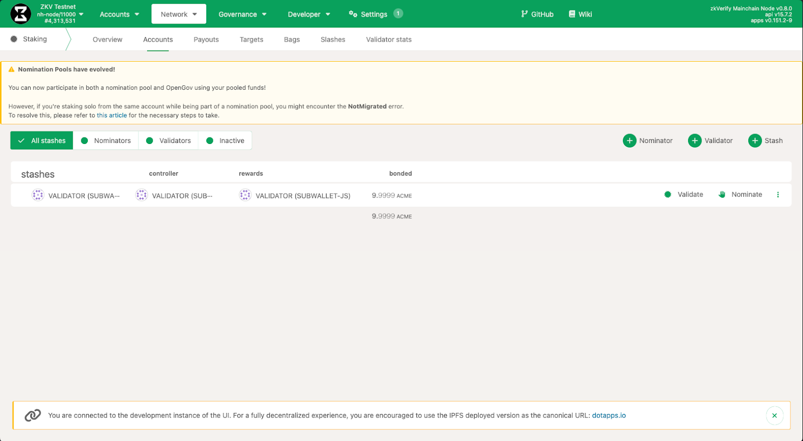
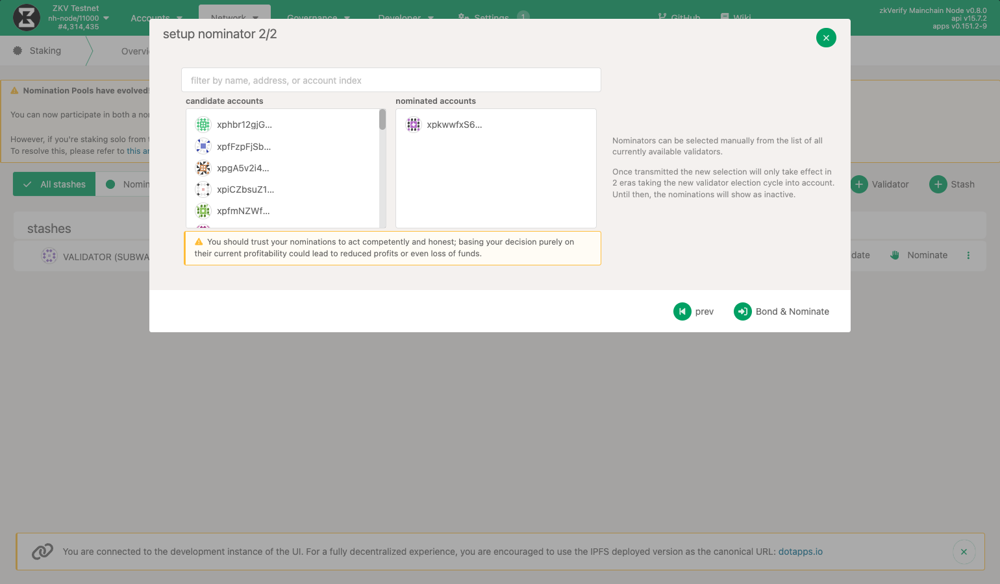

## Who are Nominators ?
zkVerify is a blockchain developed using the Substrate framework, operating on the Nominated Proof-of-Stake (NPoS) consensus mechanism. This system involves two key entities: Validators and Nominators.

1. Validators are responsible for running the validator software on their machines, participating in block production on zkVerify, and earning rewards in return.

2. Nominators, on the other hand, delegate their stake to a selected group of reliable validators and receive a portion of the rewards earned by those validators. Unlike validators, nominators do not need to run any software.

## How to nominate Validators ? 
You will need to visit [PolkadotJS](https://polkadot.js.org/apps/?rpc=wss%3A%2F%2Ftestnet-rpc.zkverify.io#/explorer) and navigate to ``Network`` > ``Staking`` > ``Account``. Over there you can find an option to nominate validators shown as ``+ Nominator``. Click on that to proceed further.

After that you will get a pop-up to select the nominator account you want to use, the amount of ACME you want to stake and the payment destination(basically which wallet the rewards will be distributed to). After filling these fields you can click on the ``next`` button.

After this, you will be shown a list of active and waitlisted validators which you can nominate. Choose all the validators you want to nominate, make sure that you trust on these validators because if the validators get slashed, it can result in loss of funds. After selecting the validators click on the ``Bond & Nominate`` button.

Lastly just click on the ``Sign and Submit`` button, to nominate your selected set of validators.

