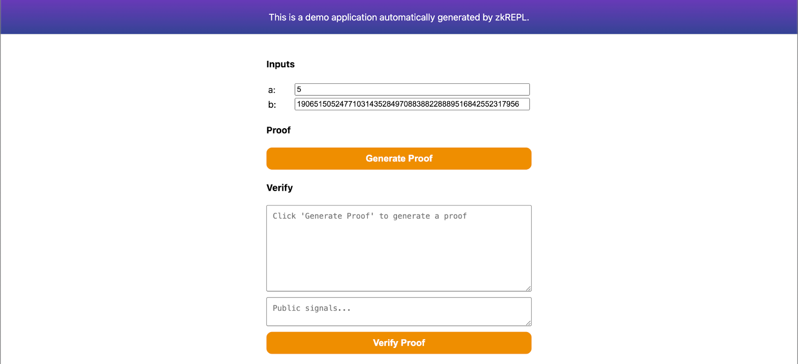
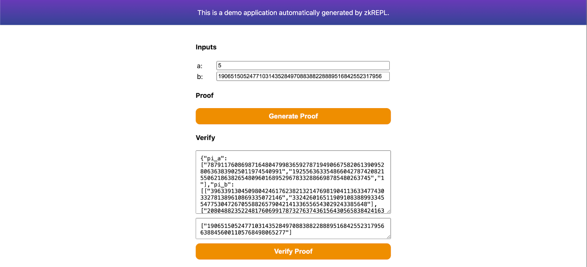

In this tutorial, we will be implementing a simple hash verification circuit with Circom and will use zkVerify to verify these proofs. The circuit we will be building is very simple where it takes a private input and a public input and just checks if the public input is the same as the Poseidon hash of the private input. 

## Steps Involved
- Creating the required circom circuit, downloading the artifacts and generating a proof
- Registering our verification key with zkVerify
- Verifying our zk proof and getting proof receipts
- Verifying the proof receipts on Ethereum

To start this tutorial, we will create our circuits using [zkRepl](https://zkrepl.dev/), which is very beginner-friendly. We won’t be diving deep into Circom DSL, but we will explore all the required code snippets.
As explained earlier, we will be having two inputs for our zk circuit in which one will be public and one will be private. And we will be using Poseidon Hash as our hash function in our circuit. To implement Poseidon Hash, we need to import corresponding libraries from circomlib.

Here’s the snippet of the implemented circuit :- 

```circom
pragma circom 2.1.6;


include "circomlib/poseidon.circom";
template Example () {

   // Getting the inputs needed for our circuit
   signal input a; // Actual Message
   signal input b; // Poseidon hash of the message
  
   component hash = Poseidon(1); // Creating our Poseidon component with one input
   hash.inputs[0] <== a;
   log(hash.out);
   assert(b == hash.out); // Checking if the input hash is same as calculated hash
}
component main { public [ b ] } = Example();
```

Over in zkRepl, we can generate our circuit artifacts as well which will be used to generate proofs for our circuit. We also need to pass our initial set of inputs to compile the circuits and generate the arctifacts. To do this, after the circuit we have a separate input code commented out, just change is as per our circuit.

```circom
/* INPUT = {
   "a": "5",
   "b": "19065150524771031435284970883882288895168425523179566388456001105768498065277"
} */
```

Then compile this circuit with zkRepl and get the required arctifacts. Next to generate proofs, click on the groth16 option given on the results tab. This will generate the required snarkjs embeddings to generate a zk proof for given inputs. Click on the main.groth16.html option to download the proof generator using which we can generate our groth16 proofs. Once downloaded, open it with any browser.



Specify your inputs and generate proof on this page. Then save the proof in proof.json file and public signals in public.json file. These files will be helpful while submitting our proofs for verification using zkVerify. Also, make sure to download main.groth16.vkey.json from zkRepl as well. 



Once we have all these files ready, we are ready to submit our proofs for verification to zkVerify. We will be using ```zkverify JS``` package to verify our proofs with zkVerify and will check on-chain through the proof receipts.

You can use [zkVerifyJS](./04-zkverify-js.md) to submit the proof to zkVerify. After getting proof receipts from our testnet, you can verify it onchain by calling the zkVerify contract. Checkout this [tutorial](./05-smart-contract.md) to verify proof receipts onchain.
