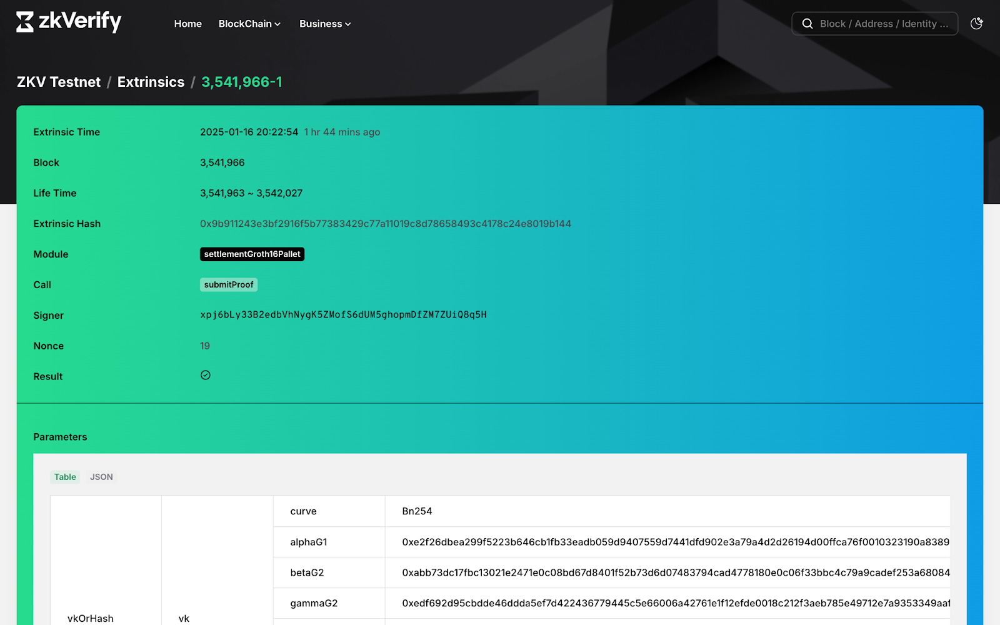
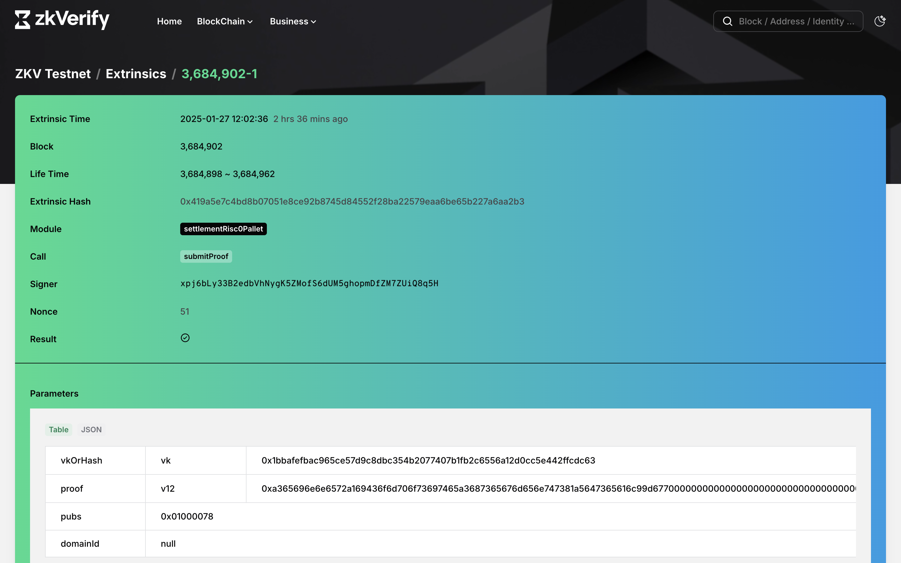
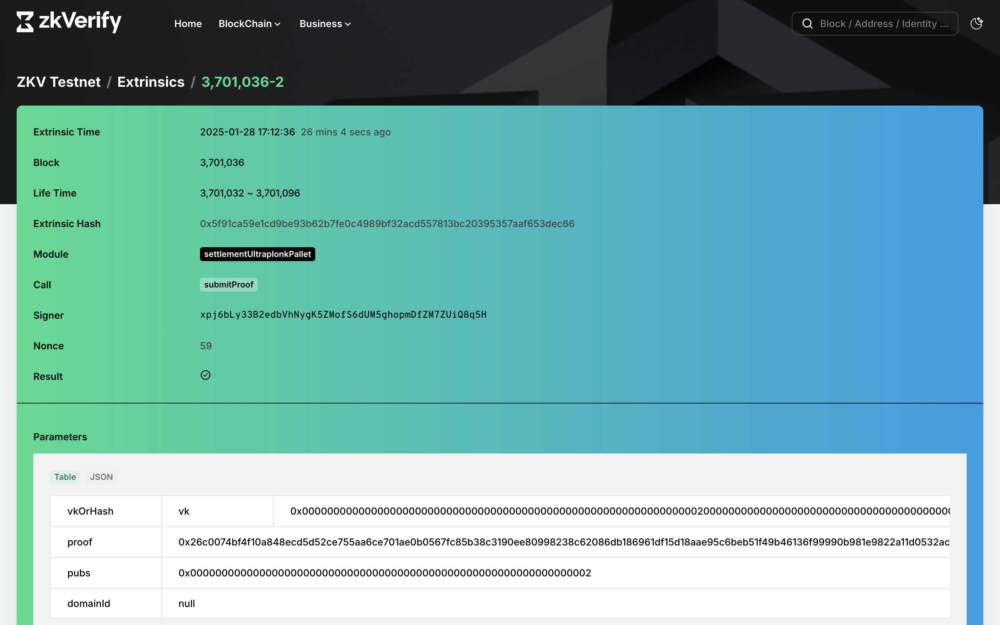

import Tabs from '@theme/Tabs';
import TabItem from '@theme/TabItem';


In this tutorial we will be verifying proofs using zkVerify JS package. ```zkVerify JS``` is a NPM package which makes it very easy to submit proofs, listen events and get attestation proofs. You can use this package with all the proof types we support.

Let's create a new project and install ```zkverify JS``` for our project. Run the following commands:
```bash
# Creating a new directory
mkdir proof-submission

# Navigating to the project directory
cd proof-submission

# Initializing an NPM project
npm init

# Installing zkVerify JS
npm i zkverifyjs
```

Create a new file named ```index.js``` to write the verification logic. Open ```index.js``` in your IDE and import the following components from ```zkVerify JS``` :

<Tabs groupId="import">
<TabItem value="circom" label="Circom">
```js
const {zkVerifySession, Library, CurveType, ZkVerifyEvents} = require("zkverifyjs");
```
</TabItem>
<TabItem value="r0" label="Risc Zero">
```js
const {zkVerifySession, ZkVerifyEvents} = require("zkverifyjs");
```
</TabItem>
<TabItem value="noir" label="Noir">
```js
const {zkVerifySession, ZkVerifyEvents} = require("zkverifyjs");
```
</TabItem>
</Tabs>

We would also need to import the required files we have generated already in previous tutorials, which are proof, verification key and public inputs. Use the following code snippets :

<Tabs groupId="import-files">
<TabItem value="circom" label="Circom">
```js
const fs = require("fs");
const proof = require("./data/proof.json");
const public = require("./data/public.json");
const key = require("./data/main.groth16.vkey.json");
```
</TabItem>
<TabItem value="r0" label="Risc Zero">
```js
const fs = require("fs");
const proof = require("../my_project/proof.json"); // Following the Risc Zero tutorial
```
</TabItem>
<TabItem value="noir" label="Noir">
```js
const fs = require("fs");
const proof = fs.readFileSync("../hello_world/proof.hex").toString()
const public = fs.readFileSync("../hello_world/pub.hex").toString()
```
</TabItem>
</Tabs>

Once you have all the requirements imported, we will start by instantiating a session with our testnet with an account(This account should have $ACME to pay for transactions). 
```js
const session = await zkVerifySession.start().Testnet().withAccount("seed-phrase")
```

For Circom and Noir proofs, we need to register a verification key on our testnet which will be used in further steps while verifying proofs. This step is not required for Risc Zero because we already got a hash of the image id which can be used directly. You can execute the following code snippet to register a vkey:

<Tabs groupId="register-vkey">
<TabItem value="circom" label="Circom">
```js
const {events, regResult} = await session.registerVerificationKey().groth16(Library.snarkjs, CurveType.bn128).execute(key);

events.on(ZkVerifyEvents.Finalized, (eventData) => {
    console.log('Registration finalized:', eventData);
    fs.writeFileSync("vkey.json", JSON.stringify({"hash": eventData.statementHash}, null, 2));
    return eventData.statementHash
});

```
</TabItem>
<TabItem value="noir" label="Noir">
```js
let vk = fs.readFileSync("../hello_world/vk.hex").toString()

const {events, regResult} = await session.registerVerificationKey().ultraplonk().execute(vk.split("\n")[0]);

events.on(ZkVerifyEvents.Finalized, (eventData) => {
    console.log('Verification finalized:', eventData);
    fs.writeFileSync("vkey.json", JSON.stringify({"hash": eventData.statementHash}, null, 2));
    return eventData.statementHash
});

```
</TabItem>
</Tabs>


Next we will send a proof verification request to the testnet, with all the details like which proving schema, proof, public signals and the key. We will also add a condition to wait till attestation is published. As we have already registered our vkey with zkVerify, we can import it and use it for our proof verification :- 

<Tabs groupId="proof-verification">
<TabItem value="circom" label="Circom">
```js
const {events, txResults} = await session.verify()
.groth16(Library.snarkjs, CurveType.bn128).waitForPublishedAttestation().withRegisteredVk()
.execute({proofData: {
    vk: vkey.hash,
    proof: proof,
    publicSignals: public
}});
```
</TabItem>
<TabItem value="r0" label="Risc Zero">
```js
const {events, txResults} = await session.verify().risc0().waitForPublishedAttestation()
.execute({proofData:{
    proof: proof.proof,
    vk: proof.image_id,
    publicSignals: proof.pub_inputs,
    version: "V1_2" // Mention the R0 version
}})
```
</TabItem>
<TabItem value="noir" label="Noir">
```js
const vkey = require("./vkey.json")
const {events, txResults} = await session.verify().ultraplonk().waitForPublishedAttestation().withRegisteredVk().execute({proofData:{
    proof: proof.split("\n")[0],
    vk: vkey.hash,
    publicSignals: public.split("\n").slice(0,-1),
}})
```
</TabItem>
</Tabs>

We can listen to events to get the current status of our submitted proof, we have various options like if proof is included in block, proof is finalized or attestations for the proof have been published. You can listen to them using our events.on() function like :- 
```js
events.on(ZkVerifyEvents.IncludedInBlock, (eventData) => {
    console.log('Transaction included in block:', eventData);
});

events.on(ZkVerifyEvents.Finalized, (eventData) => {
    console.log('Transaction finalized:', eventData);
});
```

To proceed further, we would require attestation proofs which can be verified onchain on Ethereum that the proof was verified by zkVerify, these proofs can only be generated once the proofs attestation is published on Ethereum. To get the proof we implement :- 

```js
events.on(ZkVerifyEvents.AttestationConfirmed, async(eventData) => {
    console.log('Attestation Confirmed', eventData);
    const proofDetails = await session.poe(attestationId, leafDigest);
    proofDetails.attestationId = eventData.id;
    fs.writeFileSync("attestation.json", JSON.stringify(proofDetails, null, 2));
    console.log("proofDetails", proofDetails);
})
```

You can check details about the verified proofs using our [zkVerify explorer](https://zkverify-explorer.zkverify.io/).

<Tabs groupId="explorer">
<TabItem value="circom" label="Circom">

</TabItem>
<TabItem value="r0" label="Risc Zero">

</TabItem>
<TabItem value="noir" label="Noir">

</TabItem>
</Tabs>

By running the above code snippet, your attestation proof will be saved at attestation.json file. After completing this process, we have successfully verified our proof with zkVerify and the next steps will be to use this attestation proof for our business logic onchain. Next we will be verifying the proof reciepts through a smart contract. You can check this [tutorial](./05-smart-contract.md) to understand more about the smart contract verification part.