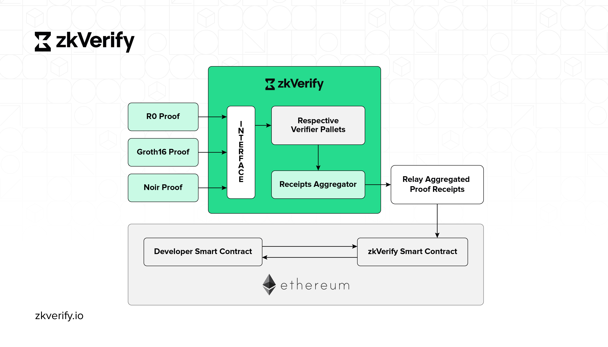

# 基础框架
zkVerify 采用“模块化区块链”范式，强调用可替换组件构建去中心化系统。在此理念下，我们选择了 Substrate 作为开发基础。

下文阐述选择的原因，重点说明 Substrate 如何契合模块化思路。

## 模块化
Substrate 让开发者能快速构建具备自定义逻辑的新链，在可组合性、可配置性和定制化上提供最大灵活度，长期来看有助于保持高质量与可维护性。

## 可升级性
框架支持 WASM 运行时，便于将逻辑分发给验证人和网络参与者。当节点升级涉及共识规则时，可自动在链上分发并运行新代码，无需下载新客户端版本，也减少废弃和硬分叉的负担。

## 稳健性
Substrate 是 Polkadot 生态的核心，也被众多项目采用。它稳定、持续更新，配套有浏览器、钱包、工具和库等生态。

## 性能
在强调模块化与兼容性的同时，Substrate 也注重效率与可扩展性，采用擦除编码、状态修剪等技术方案。它由 Rust 编写，兼具安全性与性能，是当前区块链的主流选择。

## 社区支持
围绕 Polkadot 及其他 Substrate 链（平行链与独立链）的社区庞大且活跃，当前有超过 [150 个项目](https://substrate.io/ecosystem/)在使用。其 GitHub 仓库每月都有数百次贡献。

## 共识
前述的模块化同样适用于共识层。Substrate 内置 PoW、Aura、BABE、GRANDPA 等机制。zkVerify 使用 BABE 出块，让验证人基于质押与 VRF 结果产出新区块，GRANDPA 则负责终结性。

两者结合保证高可用：即便有分叉或链重组，BABE 仍能持续出块；而在大多数验证人完成 GRANDPA 轮次时，可缩短确定性终结时间。整体上，该共识与以太坊的 Gasper、Cardano 的 Ouroboros Praos 有不少相似之处。
