本指南分步讲解如何在 zkVerify 平行链间传送 VFY。开始前请先[设置好钱包并能与 Polkadot-JS 交互](../../../overview/02-getting-started/01-connect-a-wallet.md)。

## XCM Teleport

**Teleport** 是一种 XCM 指令，用于在 zkVerify 中继链与 System Parachain 间转移资产。VFY 传送分两步执行：中继链烧毁、目标平行链铸造。

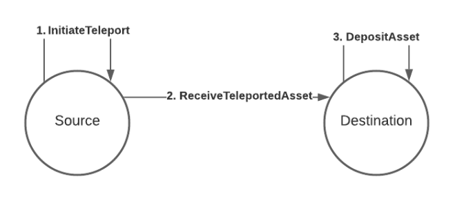

[图片来源](https://wiki.polkadot.network/learn/learn-xcm-usecases/)

本文用 teleport 在 zkVerify（Substrate）与 VFlow（EVM 兼容）间双向传送 VFY。更多 XCM 资料见[此处](https://polkadot.com/blog/xcm-the-cross-consensus-message-format/)。

### zkVerify → VFlow（PolkadotJS-UI）

在 PolkadotJS 进入 `Developer -> Extrinsics`，选择 `xcmPallet` 与 `teleportAssets`：

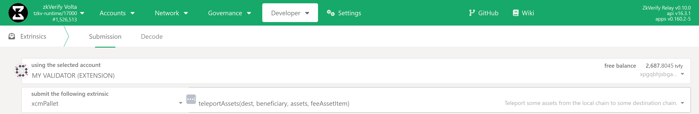

需填 4 个参数：`dest`、`beneficiary`、`assets`、`feeAssetItem`。可用“快捷传送指南”或从 `Destination` 起按步骤。

#### 快捷传送指南

进入 `Developer -> Extrinsics -> Decode`，粘贴：

`0x8c0105000100040500010300000000000000000000000000000000000000000005040000000000000000`

从 `Decode` 切到 `Submission`，修改：

- `beneficiary -> V5 -> X1 -> AccountKey20 -> key: [u8, 20]`：VFlow 接收方 EVM 地址
- `assets -> V5 -> 0 -> id -> fun -> Fungible: Compact<u128>`：传送数量（18 位精度）

提交并签名完成传送。

#### Destination

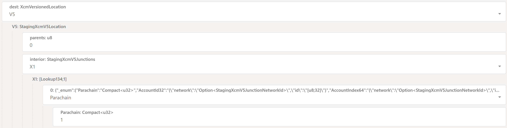

目标链设置：

- `dest: XcmVersionedLocation` 选 `V5`；`parents`=0；`interior` 选 `X1`；`0` 选 `Parachain`，填 VFlow Parachain ID `1`。

#### Beneficiary

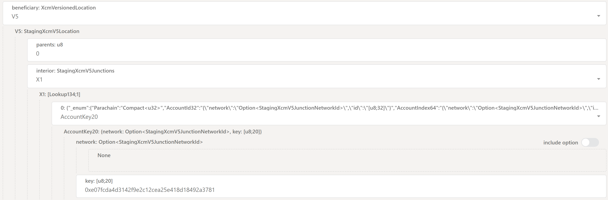

接收账户设置：

- `beneficiary: XcmVersionedLocation` 选 `V5`；`parents`=0；`interior` 选 `X1`；`0` 选 `AccountKey20`；`key` 填在 VFlow 收款的以太坊地址。

#### Assets

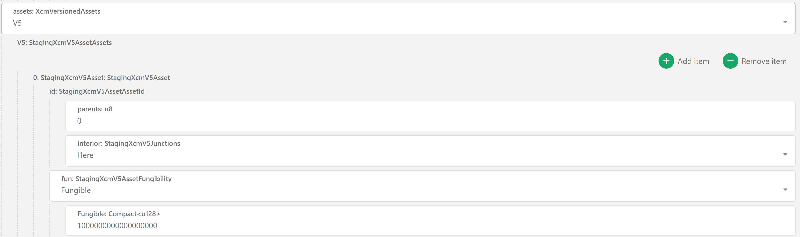

资产与金额：

- `assets: XcmVersionedAssets` 选 `V5`，点 `Add Item`；`parents`=0；`interior` 选 `Here`；`fun` 选 `Fungible`，填金额。
- 数量按 18 位精度：1 VFY = `1000000000000000000`；0.5 VFY = `500000000000000000`。

#### Fee Asset Item

指定费用资产索引，只有 VFY，填 `0`。

#### 提交 Extrinsic

点击 `Submit Transaction`，再 `Sign and Submit` 完成。

### VFlow → zkVerify（PolkadotJS-UI）

**注意：** 若桥回 Metamask 地址的代币，需先导出私钥，再导入支持 EVM+Substrate 的钱包（SubWallet/Talisman）。设置参考[钱包文档](../../../overview/02-getting-started/01-connect-a-wallet.md)。

---

流程与上文镜像。先切换到 VFlow parachain：如当前在 zkVerify，点左上徽标，下滑选 `VFlow`，再点 `Switch`。如有多个 EVM 账户，可在 `free balance` 下拉选择受益人。


在 `Developer -> Extrinsics` 选择 `zkvXcm` 与 `teleportAssets`：

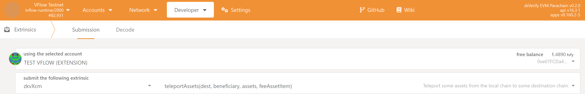

同样 4 个参数，可用快捷指南或按下文步骤。

#### 快捷传送指南

`Developer -> Extrinsics -> Decode` 粘贴：

`0x1f010501000500010100486b90dbf0cb9bfe92b6ba7d4942019a17ada772ab5fa9258ac3df821daca54d050401000013000064a7b3b6e00d00000000`

修改：
- `beneficiary -> V5 -> X1 -> AccountId32 -> id: [u8, 32]`：zkVerify 收款地址
- `assets -> V5 -> 0 -> id -> fun -> Fungible: Compact<u128>`：传送数量（18 位精度）

提交并签名完成传送。

#### Destination

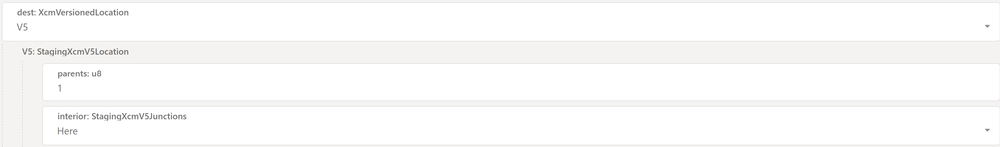

- `dest: XcmVersionedLocation` 选 `V5`；`parents`=1；`interior` 选 `Here`。

#### Beneficiary

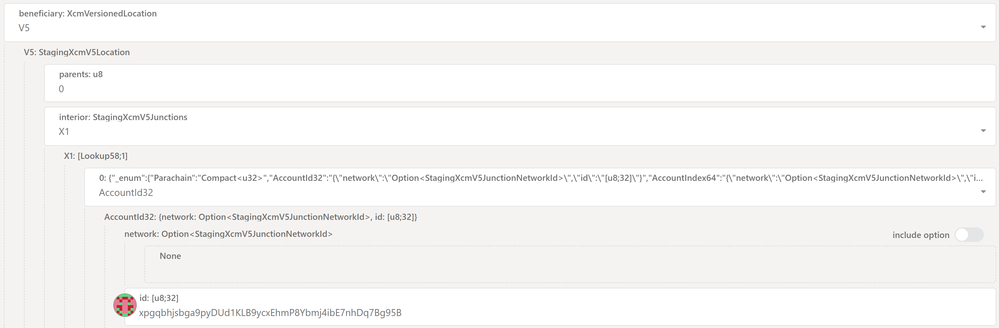

- `beneficiary: XcmVersionedLocation` 选 `V5`；`parents`=0；`interior` 选 `X1`；`0` 选 `AccountId32`；`id` 填 zkVerify 地址。

#### Assets

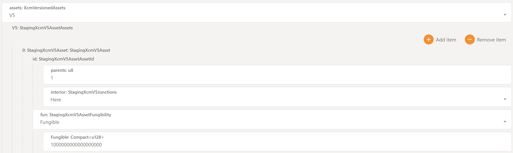

- `assets: XcmVersionedAssets` 选 `V5`，`Add Item`；`parents`=1；`interior` 选 `Here`；`fun` 选 `Fungible`，填金额（18 位小数，例如 1 VFY = `1000000000000000000`）。

#### Fee Asset Item

费用资产索引，填 `0`。

#### 提交 extrinsic

点击 `Submit Transaction`，再 `Sign and Submit` 完成。

### VFlow → zkVerify（EVM 工具）

VFlow 提供预编译合约，可用常规 EVM 工具直接传送 VFY 到 zkVerify，部署地址 `2060`。示例（web3）：

```javascript
const { Web3 } = require('web3');

// Configuration
const RPC_URL = 'wss://vflow-volta-rpc.zkverify.io'; // VFlow RPC endpoint
const PRIVATE_KEY = ''; // Your Ethereum account private key
const PRECOMPILE_ADDRESS = '0x000000000000000000000000000000000000080C'; // XCM Teleport precompile address

// XCM Teleport precompile ABI
const teleportABI = [
  {
    name: 'teleportToRelayChain',
    type: 'function',
    inputs: [
      { name: 'destinationAccount', type: 'bytes32' },
      { name: 'amount', type: 'uint256' },
    ],
    outputs: [],
    stateMutability: 'nonpayable',
  },
];

async function testTeleport() {
  // Initialize Web3
  const web3 = new Web3(RPC_URL);

  // Add your account to the wallet
  const account = web3.eth.accounts.privateKeyToAccount(PRIVATE_KEY);
  web3.eth.accounts.wallet.add(account);

  console.log(`Using account: ${account.address}`);

  // Check balance
  const balance = await web3.eth.getBalance(account.address);
  console.log(`Account balance: ${web3.utils.fromWei(balance, 'ether')} tVFY`);

  // Set up the contract
  const contract = new web3.eth.Contract(teleportABI, PRECOMPILE_ADDRESS);

  // Test parameters
  const destinationAccount = ''; // 32-byte relay chain account
  const amount = web3.utils.toWei('1', 'ether'); // 1 VFY

  console.log(`Teleporting ${web3.utils.fromWei(amount, 'ether')} VFY`);
  console.log(`From: ${account.address} (parachain)`);
  console.log(`To: ${destinationAccount} (relay chain)`);

  // Estimate gas
  const gasEstimate = await contract.methods
    .teleportToRelayChain(destinationAccount, amount)
    .estimateGas({ from: account.address });

  console.log(`Estimated gas: ${gasEstimate}`);

  // Send transaction
  console.log('Sending transaction...');
  const result = await contract.methods
    .teleportToRelayChain(destinationAccount, amount)
    .send({
      from: account.address,
      gas: gasEstimate,
    });

  console.log('✅ Transaction successful!');
  console.log(`Transaction hash: ${result.transactionHash}`);
  console.log(`Block number: ${result.blockNumber}`);
  console.log(`Gas used: ${result.gasUsed}`);
}

testTeleport();
```

注意事项：
- 这里 `amount` 不需要手动加 18 位小数。
- `destinationAccount` 是 zkVerify 的公钥 hex。在 PolkadotJS-UI 可直接用 AccountID 自动转换，这里需手动：在 PolkadotJS `Developer-> Utilities` 选 `Convert Address` 标签：

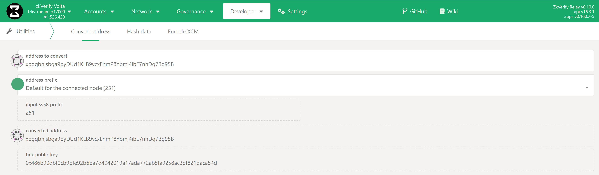

把 account id 粘贴到 `address to convert` 字段即可得到 `destinationAccount` 公钥。

### 通过 zkv-xcm-library 传送

我们开发了 TS 库 [zkv-xcm-library](https://github.com/zkVerify/zkv-xcm-library?tab=readme-ov-file#zkverify-xcm-library)，简化 XCM teleport extrinsic 构造，便于应用/前端集成。安装与用法见 README。

### 关于 XCM Teleport 手续费

XCM 消息在中继链和平行链执行，发送方和接收方都需要支付费用：
- 发送方费用**直接从主余额扣除**，交易进块即扣，**在 burn 逻辑之前**。扣费后余额不足会导致失败。
- 接收方费用**从传送金额中扣除**，在平行链侧执行 XCM 时扣。

### 深入：XCM 参数说明

简要解释 XCM 消息的构造与参数：
- `dest`：消息目标（需选择当前使用的 XCM 版本，写作时 V5 最新）。
  - `parents`：表明后续 `interior` 相对于链本身。
  - `interior`：到目标的路径，包含一系列 “跳”（Junction）。容器通常为 X1、X2、X3…，X 表示路径中 Junction 数量。
    - X0：无跳。
    - X1：一跳。
    - X2：两跳。
    - …一直到 X8。

类比文件系统：
- 根目录 = 中继链
- 子目录 = 各 Parachain
- 目录内有账户、pallet 等共识实体

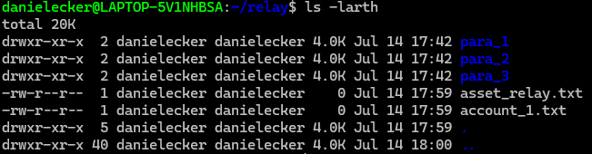

`parents = 0` 表示当前链（类似 `.`），`parents = 1` 表示父链（类似 `..`）。

设置 `interior = X1 { Parachain: 3 }` 类似指定 `./parachain_3`；设置 `interior = X2 { Parachain: 3, AccountKey20: 0x111 }` 类似指定 `./parachain_3/account_111`。

综上，本例从中继链发起（`parents=0`），到 ID 为 `1` 的 Parachain，属于一步之遥（`interior` 设为 `X1`，`Parachain`=1）。

### 常见错误与补救

本节列出一些已知用户错误及补救方式。

#### 将资金传到 VFlow 的 AccountId32

VFlow 仅支持 20 字节地址（`AccountKey20`），不应向 `AccountId32` 传送。PolkadotJS UI 泛用，无法阻止错误 extrinsic。

若发生此错误且你持有目标 `AccountId32` 的私钥，仍可恢复资金：通过 zkVerify 发起远程执行，把传送到 VFlow 的资金再转到正确地址。

需两步：[第一步](#step-1-create-the-extrinsic-on-vflow) 在 VFlow 创建通过 EVM 转账的 extrinsic；[第二步](#step-2-execute-remotely-from-zkverify) 在 zkVerify 远程执行该 extrinsic。

##### Step 1. Create the extrinsic on VFlow

**在 VFlow explorer**，进入 `Developer -> Extrinsics -> Decode`，粘贴：
`
0x2c0001503403000000000000000000000000000000000000000000000000000000000000000000000000000000000000000000000000000000000000000000000000000000000000000000000000000000000000000000000000
`
然后切到 `Submission`。需要修改：

- `Call: H160`：填 VFlow 上的接收地址
- `value: u256`：填要发送的 VFY 数量（18 位精度）。**注意**不能填满余额，需要预留执行 XCM extrinsic 的资金。例如本文步骤中预留 0.1 VFY（高估值，未用部分会退到下一步指定账户）。

设置好后**不要**提交交易，点击 UI 按钮复制编码的 call data。

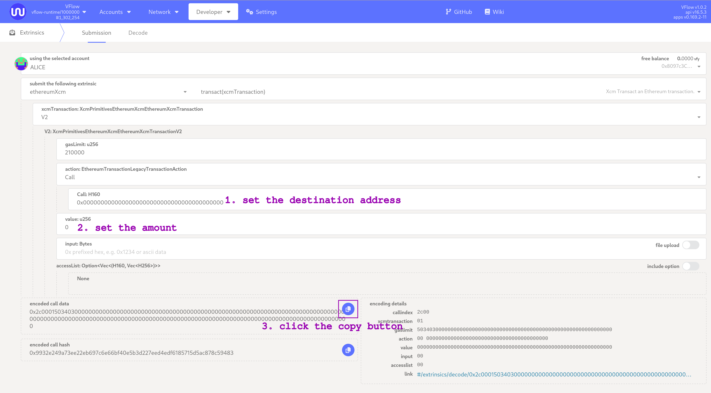

##### Step 2. Execute remotely from zkVerify

**在 zkVerify explorer**，进入 `Developer -> Extrinsics -> Decode`，粘贴：
`
0x8c000500010004051400040100001300008a5d78456301130100001300008a5d784563010006010000140d0100000103000000000000000000000000000000000000000000
`

然后切到 `Submission`。需要修改：

- `message -> Transact -> call: XcmDoubleEncoded`：填上一步复制的编码 call data
- `message -> DepositAsset -> AccountKey20 -> key: [u8; 20]`：填退款接收地址（VFlow）

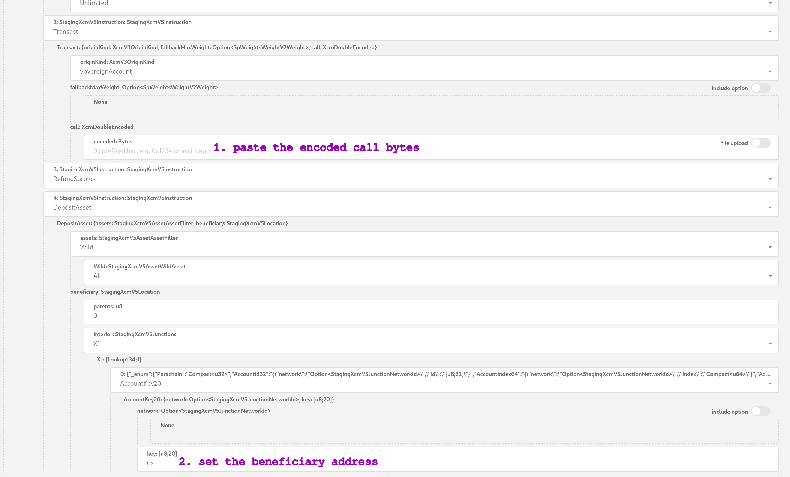

点击 `Submit Transaction`，再 `Sign and Submit` 完成操作。

VFlow 侧的执行相对 zkVerify 是异步的，需要在 VFlow explorer 观察执行是否成功；若任一步失败，可尝试从 zkVerify 重新提交 extrinsic，并在[步骤 1](#step-1-create-the-extrinsic-on-vflow) 预留足够费用以覆盖执行成本。
