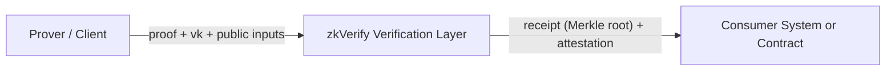

## 它是什么

当你把 ZK 放进真实系统里，proof 的生成和验证通常不在同一个地方。你会有一个 prover 侧在产出 proof，而验证结果要被另一套系统信任和复用。zkVerify 的定位就是把“验证”从应用内部逻辑里抽出来，变成一个专门的验证层。

从系统角度看，zkVerify 是一条基于 Substrate 的 L1 PoS 链，链内内置多个 verifier pallets，每个 pallet 对应一种证明体系。它专门做验证这件事，而不是把一条通用链扩展成能验证 proof 的样子。你提交验证请求时需要消耗 VFY，这一点决定了它的使用入口和成本路径。

验证结果不会只停在 zkVerify 内部。它会进入聚合流程，形成 proof receipt（Merkle root），再由 relayer 发布到目标链上的合约，供其他系统消费。这条路径决定了 zkVerify 适合做“多系统共识的验证事实”。

## 什么时候需要

当你需要一个独立、可复用的验证层时，用 zkVerify 会省掉大量验证逻辑的维护成本。你只需要把 proof 和必要的验证材料交给 zkVerify，验证结论由它来产出并被其他系统引用。

当你的验证结果要被链上合约或跨链系统消费时，zkVerify 的 receipt 发布路径会变成你工程设计里的关键一环。这时你要关心的不再是“如何在合约里跑完整验证”，而是“如何拿到 receipt 并被目标系统信任”。

## 什么时候不需要

如果你的产品只在单一系统里消费验证结果，而且验证逻辑完全可控、成本可接受，就没有必要引入 zkVerify。你可以直接在现有系统里完成验证闭环。

如果你还处在本地验证和原型阶段，也不需要急着接入 zkVerify。先把 proving 工具链跑通，等你开始考虑跨系统可信或链上消费时再接入更合理。

## 你可能会问

Q: zkVerify 会帮我生成 proof 吗？
A: 不会。proof 生成仍然由你的 prover 工具链负责，zkVerify 只负责验证。

Q: 为什么不直接在合约里验证？
A: 直接验证意味着你要维护每种 proof 的验证逻辑。zkVerify 把这部分工作集中在验证层，并通过 receipt 让其他系统复用结果。

Q: 如果我不需要跨链或链上消费，还要用吗？
A: 不一定。只有当验证结果需要被多个系统复用时，zkVerify 的价值才会显著。

## 示例

下面是一个最小心智模型，强调“生成在外部、验证在 zkVerify、消费在目标系统”的分工：

## 常见坑

症状：把 zkVerify 当成 proving 平台去用，结果发现没有 proof 生成接口。原因：混淆了“验证层”和“证明生成”。避免方式：先把 prover 侧工具链独立出来，再把验证部分交给 zkVerify。
