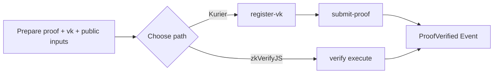

这一页带你走最短路径，把 proof 成功送进 zkVerify，并拿到“验证完成”的反馈。你会看到最小输入是什么、Kurier 和 zkVerifyJS 的区别是什么，以及一条验证闭环跑通之后会看到什么结果。如果你想最快跑通，通常 Kurier 更简单；如果你一开始就需要直接控制链上交互，就用 zkVerifyJS。

为了避免卡在环境配置，这里只保留必要步骤。你需要准备三样东西：proof、vk、public inputs。Kurier 路线会先注册 vk，zkVerifyJS 路线直接在链上提交验证。

如果你想先看一个已经跑起来的例子，可以直接打开 [zkEscrow 演示地址](https://zk-escrow.vercel.app/escrow)。这个示例页能帮助你先建立对整条验证闭环的直觉。



## 路线 A：Kurier（REST API）

Kurier 需要 API Key。你需要先申请 Key，然后把它放进 `.env` 里。

```text
API_KEY=your_kurier_api_key
```

注册 vk 的最小请求结构如下（示例为 groth16）：

```ts
const regParams = {
  proofType: "groth16",
  proofOptions: { library: "snarkjs", curve: "bn128" },
  vk: key
}
const regResponse = await axios.post(`${API_URL}/register-vk/${process.env.API_KEY}`, regParams)
```

提交 proof 的最小结构如下（示例为 ultrahonk）：

```ts
const params = {
  proofType: "ultrahonk",
  vkRegistered: true,
  chainId: 11155111,
  proofData: {
    proof: proof.proof,
    publicSignals: proof.pub_inputs,
    vk: vk.vkHash || vk.meta.vkHash
  }
}
const requestResponse = await axios.post(`${API_URL}/submit-proof/${process.env.API_KEY}`, params)
```

提交后用 job-status 轮询状态，直到 `Finalized`：

```ts
const jobStatusResponse = await axios.get(
  `${API_URL}/job-status/${process.env.API_KEY}/${requestResponse.data.jobId}`
)
if (jobStatusResponse.data.status === "Finalized") {
  // verified
}
```

## 路线 B：zkVerifyJS（直接与链交互）

zkVerifyJS 需要一个 seed phrase 来签名交易，并且账户里要有 tVFY 用来支付交易费。

```text
SEED_PHRASE="this is my seed phrase i should not share it with anyone"
```

启动会话并提交验证请求：

```ts
const session = await zkVerifySession.start().Volta().withAccount(process.env.SEED_PHRASE)
await session.verify()
  .groth16({ library: Library.snarkjs, curve: CurveType.bn128 })
  .execute({
    proofData: { vk: key, proof: proof, publicSignals: publicInputs },
    domainId: 0
  })
```

## 常见卡点

最常见的问题是把 vk 或 public inputs 传错格式，导致验证结果一直不出来。Kurier 路线可以先确认 `register-vk` 是否成功写回 vk hash，再提交 proof；zkVerifyJS 路线则需要确认账户里有 tVFY 否则交易不会被链接受。

## 延伸阅读（ZK Escrow 实战教程）

- [教程 01：纯操作版](/handbook/quickstart/tutorial-01-operations-only)
- [教程 02：核心代码解读](/handbook/quickstart/tutorial-02-core-code-explained)
- [教程 03：常见坑与规避手册](/handbook/quickstart/tutorial-03-common-pitfalls-and-how-to-avoid)
