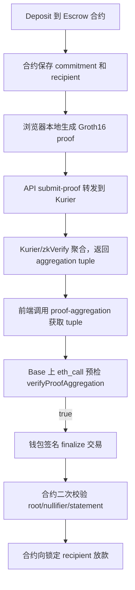
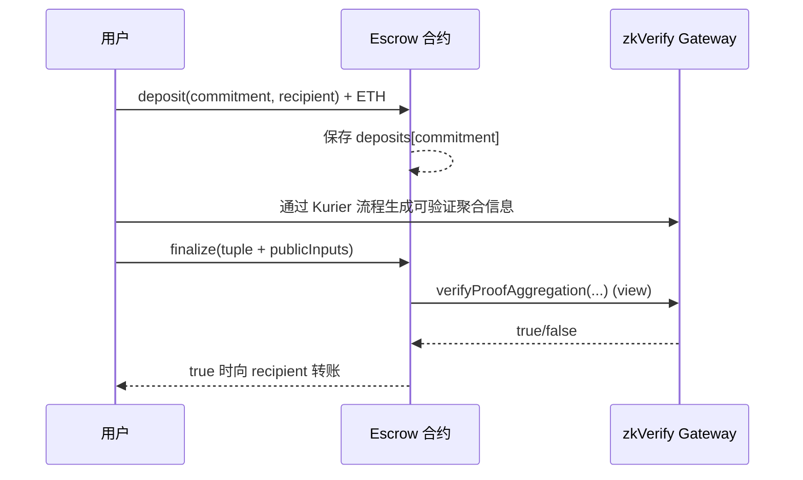

# ZK Escrow 实战教程：核心代码解读

> 面向对象：第一次做 ZK + Merkle + 链上聚合验证的开发者。
> 本文目标：把“为什么能放款、为什么会回退、每段代码在防什么问题”讲清楚。

---

## 1. 先看全局：系统到底在证明什么

这个项目并不是“证明某人是谁”，而是证明下面这件事：

1. 某个 `commitment` 确实在链上 Merkle 树里（成员证明）。
2. 发起解锁的人确实知道该 commitment 对应的秘密（`nullifier + secret`）。
3. 这次请求绑定了当前业务域、应用 ID、链 ID、时间戳，避免跨场景重放。
4. 同一个 nullifier 不能重复消费（防双花/重放）。

---

## 2. 全流程



### 这张图里最关键的边界

- `eth_call verifyProofAggregation` 是**读调用**，不会弹钱包。
- 真正写链只发生在两步：`deposit`、`finalize`。
- Kurier 的 `Aggregated/Finalized` 状态是上游进度，不等于业务放款已经成功。

---

## 3. 电路层：用约束表达“有资格解锁”

文件：`circuits/escrow/circom/escrowRelease.circom`

### 3.1 公私输入拆分

```circom
// Public inputs
signal input merkleRoot;
signal input nullifierHash;
signal input commitment;
signal input domain;
signal input appId;
signal input chainId;
signal input timestamp;

// Private inputs
signal input nullifier;
signal input secret;
signal input merklePath[levels];
signal input merkleIndex[levels];
```

解释：

- `public`：任何验证者都能看到，必须可复验。
- `private`：只在浏览器 witness 计算时使用，不会上链。

### 3.2 核心约束

```circom
hasher.nullifierHash === nullifierHash;
hasher.commitment === commitment;

tree.leaf <== hasher.commitment;
tree.root <== merkleRoot;
```

这三行约束保证了两件事：

1. `nullifierHash` 和 `commitment` 不是随便填的，它们必须来自同一组秘密输入。
2. 该 `commitment` 必须能通过 `merklePath/merkleIndex` 回到公开的 `merkleRoot`。

---

## 4. Merkle Tree 层：链上如何维护“可验证集合”

文件：`contracts/src/MerkleTreeWithHistory.sol`

### 4.1 插入叶子

```solidity
uint32 leafIndex = _insert(commitment);
emit MerkleRootUpdated(getLastRoot(), leafIndex);
```

每次 `deposit`：

- 新 commitment 入树。
- root 更新并写入历史环。

### 4.2 为什么要 root history

合约不是只认“当前最新 root”，而是维护一段历史窗口（`ROOT_HISTORY_SIZE`），这样可以兼容“proof 生成与链上状态有时间差”的正常场景。

### 4.3 校验入口

```solidity
function isKnownRoot(bytes32 _root) public view returns (bool)
```

`finalize` 前会先检查 root 是否来自链上历史，否则直接回退。

---

## 5. 防重放：nullifierUsed 是最终闸门

文件：`contracts/src/ZKEscrowRelease.sol`

```solidity
mapping(bytes32 => bool) public nullifierUsed;

require(!nullifierUsed[nullifierHash], "nullifier used");
nullifierUsed[nullifierHash] = true;
```

设计目的：

- 同一凭证只能成功一次。
- 第二次即使其他输入都正确，也会回退。

这就是业务层真正的“防重放”。

---

## 6. 合约 finalize：按顺序理解每个 require

文件：`contracts/src/ZKEscrowRelease.sol`

### 6.1 第一组：业务绑定

```solidity
require(isKnownRoot(merkleRoot), "root not known");
require(domain == expectedDomain, "domain mismatch");
require(appId == expectedAppId, "appId mismatch");
require(chainId == expectedChainId && chainId == block.chainid, "chainId mismatch");
```

含义：

- root 必须在链上真实出现过。
- proof 必须属于当前业务域/应用/链，不能跨系统复用。

### 6.2 第二组：聚合证明校验

```solidity
bytes32 leaf = _statementHash(publicInputs);
bool verified = zkVerify.verifyProofAggregation(
    domainId,
    aggregationId,
    leaf,
    merklePath,
    leafCount,
    index
);
require(verified, "zkverify invalid");
```

这一步不是看“文本状态”，而是直接在 Base 上调用 zkVerify gateway 验证 tuple 与 statement 是否匹配。

### 6.3 第三组：消费与转账

- `nullifier` 未使用
- `deposit` 存在且未 spent
- 标记 spent + 标记 nullifierUsed
- 向 deposit 时锁定的 recipient 转账

---

## 7. 为什么 `zkverify invalid` 高发：statement 协议容易漂移

文件：`contracts/src/ZKEscrowRelease.sol`

```solidity
bytes32 le = _toLittleEndian(publicInputs[i]);
bytes32 pubsHash = keccak256(pubs);
bytes32 ctxHash = keccak256(bytes("groth16"));
return keccak256(abi.encodePacked(ctxHash, vkHash, VERIFIER_VERSION_HASH, pubsHash));
```

statement 是一个“跨系统协议”：

- 输入顺序必须一致
- 数值归一化规则必须一致
- 字节序必须一致（这里是 little-endian）

只要任一处不一致，`verifyProofAggregation` 就会返回 false。

---

## 8. Kurier API 层：做的不是“验证”，而是“转发 + 结构化解析”

### 8.1 submit-proof

文件：`apps/web/src/pages/api/submit-proof.ts`

```ts
const submitPayload = {
  proofType: 'groth16',
  chainId: Number(chainId),
  vkRegistered: true,
  proofOptions: { library: 'snarkjs', curve: 'bn254' },
  proofData: {
    proof,
    publicSignals: publicInputs,
    vk: vkHash,
  },
};
```

这个路由重点是“把输入绑定关系先校验好再转发”，比如：

- `publicInputs[3] == domain`
- `publicInputs[4] == appId`
- `publicInputs[5] == chainId`
- `publicInputs[1] == antiReplay.nullifier`

### 8.2 proof-aggregation

文件：`apps/web/src/pages/api/proof-aggregation.ts`

这个路由把 Kurier 返回收敛成统一 tuple：

- `domainId`
- `aggregationId`
- `leafCount`
- `index`
- `merklePath`
- `leaf`

并且在字段不全时返回 `availableKeys`，便于快速定位“缺的是上游字段，不是合约逻辑”。

---

## 9. 前端状态机：为什么不会在错误时盲签

文件：`apps/web/src/pages/escrow.tsx`

### 9.1 预检（不弹钱包）

```ts
const zkvOk = await publicClient.readContract({
  address: zkVerifyAddr,
  abi: zkVerifyAbi,
  functionName: 'verifyProofAggregation',
  args: [domainIdFromAgg, aggregationId, localStatement, merklePath, leafCount, index],
});
```

### 9.2 真正发交易（会弹钱包）

```ts
const txHash = await writeContractAsync({
  address: escrowAddress,
  abi: escrowAbi,
  functionName: 'finalize',
  args: [domainIdFromAgg, aggregationId, merklePath, leafCount, index, publicInputs],
});
```

如果预检失败，流程会直接报错，不会进入钱包签名阶段。

---

## 10. 资金路径（防误读）



浏览器里某些交易行显示 `Value = 0`，可能只是调用交易本身没附带 ETH。是否放款成功应以：

- `Finalized` 事件
- recipient 余额变化

为准。

---

## 11. 初学者最容易混的 4 个变量

- `DOMAIN`：电路业务域（public input）
- `KURIER_ZKVERIFY_DOMAIN_ID`：聚合域（gateway 校验用）
- `VK_HASH`：合约绑定的验证键 hash
- `HASHER_ADDRESS`：Merkle 树哈希器地址

这 4 项建议在部署前做一次 checklist，对不上就不要发链上交易。
