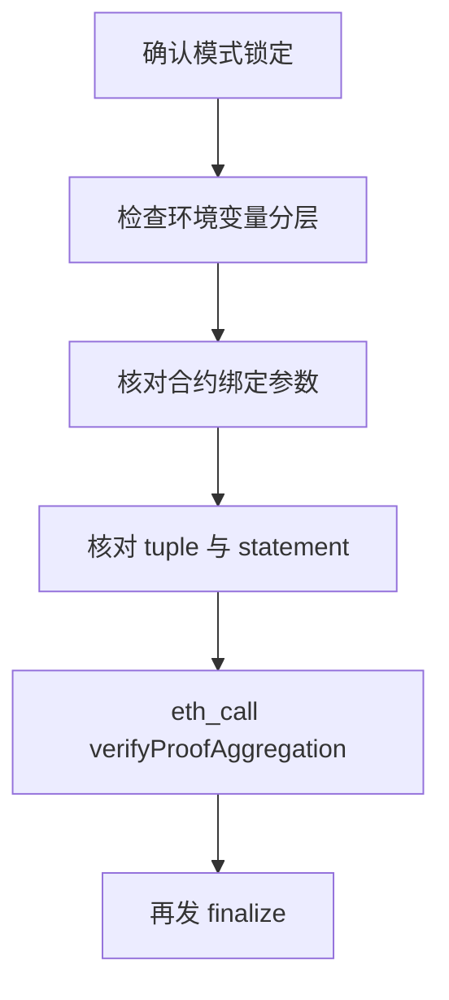

# ZK Escrow 实战教程：常见坑与规避手册

> 面向对象：首次搭建 ZK Escrow 的开发者。
> 这份文档来自真实排障记录，按“症状 -> 根因 -> 最短排查命令 -> 修复动作”整理。

---

## 1. 路线混用（aggregation / direct / local verifier）

### 现象

- `proofOptions Required`
- `INVALID_SUBMISSION_MODE_ERROR`
- `Aggregation proof fields missing from Kurier response`

### 根因

同一分支混用了不同 submission 模式，payload 和状态门槛冲突。

### 最短排查命令

```bash
rg -n "submissionMode|API_VERSION|proofOptions|vkRegistered" \
apps/web/src/pages/api/submit-proof.ts
```

### 修复动作

- 一个分支只保留一种模式。
- 现在这套仓库固定 aggregation，`submit-proof` 不要再塞 direct 逻辑。

---

## 2. 业务 domain 和聚合 domainId 混淆

### 现象

- `Aggregation domainId mismatch`
- 明明 proof 的 `domain=1`，但聚合验证失败。

### 根因

`DOMAIN`（业务）和 `KURIER_ZKVERIFY_DOMAIN_ID`（聚合）语义不同却共用同名变量。

### 最短排查命令

```bash
cat apps/web/.env.local | rg "DOMAIN|domainId|KURIER_ZKVERIFY_DOMAIN_ID"
```

### 修复动作

- 保持：`NEXT_PUBLIC_DOMAIN=1`
- 保持：`KURIER_ZKVERIFY_DOMAIN_ID=2`（Base Sepolia 聚合域）
- 在代码里永远用不同字段名。

---

## 3. `zkverify invalid`（最常见）

### 现象

- `The contract function "finalize" reverted with the following reason: zkverify invalid`

### 根因（按概率排序）

1. statement 算法或字节序不一致
2. tuple 参数不一致（domainId/aggregationId/leafCount/index/merklePath）
3. 合约绑定参数不一致（vkHash/domain/appId/chainId）

### 最短排查命令

```bash
# 1) 合约绑定参数
cast call $ESCROW "vkHash()(bytes32)" --rpc-url "$RPC_URL"
cast call $ESCROW "expectedDomain()(uint256)" --rpc-url "$RPC_URL"
cast call $ESCROW "expectedAppId()(uint256)" --rpc-url "$RPC_URL"
cast call $ESCROW "expectedChainId()(uint256)" --rpc-url "$RPC_URL"

# 2) tuple
curl -s -X POST "http://localhost:3000/api/proof-aggregation" \
  -H "Content-Type: application/json" \
  --data "{\"proofId\":\"$JOB_ID\"}"
```

### 修复动作

- 先保证 `statement == leaf`。
- 再保证 `verifyProofAggregation(...) == true`。
- 最后才发 finalize。

---

## 4. `root not known` / `root not allowed`

### 现象

- `root not known`
- `root not allowed`
- `Local tree root mismatch`

### 根因

- 扫描高度起点错误（漏了 deposit）
- hasher 地址或树参数不一致
- 本地缓存旧数据

### 最短排查命令

```bash
cast call $ESCROW "nextIndex()(uint32)" --rpc-url "$RPC_URL"
cast call $ESCROW "getLastRoot()(bytes32)" --rpc-url "$RPC_URL"
cast call $ESCROW "hasher()(address)" --rpc-url "$RPC_URL"

curl -s "http://localhost:3000/api/commitments?statusOnly=1"
```

### 修复动作

- 把 `NEXT_PUBLIC_DEPLOY_BLOCK` 设置为当前 escrow 合约部署块。
- 确认 `HASHER_ADDRESS` 与合约真实值一致。
- 必要时触发一次重扫（reset）。

---

## 5. Kurier 已 Aggregated，但前端不继续

### 现象

- 卡在 pending/aggregated
- 不触发后续验证或不弹钱包

### 根因

- `NEXT_PUBLIC_KURIER_REQUIRE_FINALIZED=true` 把流程卡在 finalized gate。

### 最短排查命令

```bash
cat apps/web/.env.local | rg "NEXT_PUBLIC_KURIER_REQUIRE_FINALIZED"
```

### 修复动作

- aggregation 路线建议设为 `false`。
- 以链上 `verifyProofAggregation` 预检作为真实门槛。

---

## 6. `forge create` 明明带了 `--broadcast` 还 dry run

### 现象

- `Warning: Dry run enabled, not broadcasting transaction`

### 根因

环境污染、命令参数顺序/终端环境未 source 完整。

### 最短排查命令

```bash
env | grep -i FOUNDRY
forge create --help | rg -n "dry|broadcast"
```

### 修复动作

```bash
cd contracts
set -a; source .env; set +a
forge create --broadcast --rpc-url "$RPC_URL" --private-key "$PRIVATE_KEY" ...
```

---

## 7. `eth_getLogs` 报 400/503/区间限制

### 现象

- Free tier 限制一次最多 10 blocks
- 后端不健康/429

### 根因

全量扫区块 + 高频轮询，触发 RPC 限流。

### 最短排查命令

```bash
curl -s -X POST "$RPC_URL" \
  -H "Content-Type: application/json" \
  --data '{"jsonrpc":"2.0","id":1,"method":"eth_blockNumber","params":[]}'
```

### 修复动作

- 使用增量索引（deployBlock + lastScannedBlock）
- 使用 The Graph 作为主读取源
- 浏览器避免直接大范围扫 logs

---

## 8. CORS + 429（前端直接打 RPC）

### 现象

- 浏览器控制台 `blocked by CORS policy`
- `429 Too Many Requests`

### 根因

前端直接请求受限 RPC endpoint。

### 最短排查命令

```bash
# 在服务端环境验证 RPC 可用性
curl -s -X POST "$RPC_URL" \
  -H "Content-Type: application/json" \
  --data '{"jsonrpc":"2.0","id":1,"method":"eth_blockNumber","params":[]}'
```

### 修复动作

- 尽量把链上读取放 API 层处理（服务端）。
- 前端只请求项目自身的 `/api/*`。

---

## 9. subgraph 构建失败（AssemblyScript 类型）

### 现象

- `Property 'toBigInt' does not exist on type ArrayBufferView`

### 根因

mapping 里把 `bytes32` 当 `BigInt` 处理，类型不匹配。

### 最短排查命令

```bash
cd indexer/subgraph
npm run build
```

### 修复动作

- `bytes32` 字段按 `Bytes` 或 hex string 持久化。
- 不要在 mapping 里直接 `toBigInt()` 处理 `bytes32`。

---


## 13. 推荐排障顺序


按这个顺序做，基本能避免“改一处坏三处”的反复返工。
