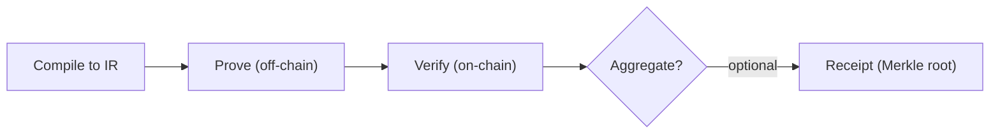

这一章把 proof 生成、验证、可选聚合和最终消费按顺序排开。只要这几个阶段混在一起，排错就会变成猜问题；顺序拉直之后，工程边界和责任分工都会清楚很多。

从系统事实看，proof 生成发生在链下，验证通常发生在链上。生成过程包含“编译到中间表示 → 离线产出 proof”，验证阶段是链上验证并给出结果，而且验证通常比 proving 快得多。这也是你在 Quickstart 里只看到验证，而没有看到编译和 witness 的原因。

这条线的下一步是否进入聚合，是一个工程选择。聚合是可选的，主要用来摊薄成本；如果你的消费端不在链上，你可以停在验证结果上，不必进入 receipt 发布路径。

报告把 prover、verifier、witness 视为 ZKP 系统的核心组件。你会在工具链、接口或日志里不断遇到这三个名字，它们分别出现在“生成证明”“验证证明”和“证明所依赖的输入材料”这一条线上。

| 组件 | 在哪一段出现 | 你会在什么操作里遇到 |
| --- | --- | --- |
| Prover | 生成 proof | 运行 proving 工具链时 |
| Verifier | 验证 proof | 链上验证或 zkVerify 验证时 |
| Witness | 生成 proof | 准备输入材料时 |

> 📌 注意：聚合是可选的。它存在的目的不是“更正确”，而是更便宜。

接下来两节会把角色分工和交接点继续拆开，这样你能顺着流程看清每一步产出什么、下一步又依赖什么。
