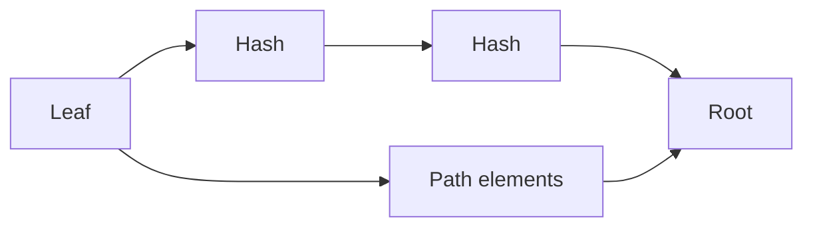

这一页用一个最小的 Merkle membership 例子，讲清楚一个核心 ZK 概念：如何在不暴露整份数据的前提下，证明“我在这棵树里”。这里的重点不是把完整电路写出来，而是让你看清 public / private input 的分界，以及 path 结构为什么必不可少。

我们要证明的是：**“我的叶子在这棵树里。”** 这句人话背后有两个工程约束：一是不能泄露你的完整身份（私有输入不能暴露），二是验证方必须能在链上或后端快速确认结果（公开输入要足够让验证发生）。

可以把 Merkle tree 理解成“名单的压缩版”。root 是整个名单的摘要，path 是你从叶子走到 root 的那条路线。你不需要公开整个名单，只要公开 root，再用 path 证明你在名单里。



**公开输入（public inputs）**通常是 root。它是“可被所有人验证”的承诺值。你把 root 给验证方，验证方用它确认你给出的路径确实能导向同一个 root。

**私有输入（private inputs）**通常是叶子值（你的身份或承诺）和路径数据。路径本身会暴露结构信息，但不会暴露整个树的所有叶子。

下面是一个最小的输入结构示意，目的是让你知道“电路需要什么”。

```text
publicInputs = { root }
privateInputs = { leaf, pathElements[], pathIndices[] }
```

这里解释三个电路里常见的变量：

- `cur`：当前哈希值，从 leaf 开始一路更新。每走一层，它都会变成新的父节点哈希。
- `pathElements[]`：你在每一层的“兄弟节点”哈希。它和 `cur` 一起算出父节点。
- `pathIndices[]`：告诉电路 `cur` 在这一层是左还是右。没有这个方向信息，就算出不对的父节点。

一个直观类比是“验收单 + 验收路线”。root 是验收单上的总编号，`pathElements` 是你走过的每个检查点，`pathIndices` 是你每次走左边还是右边。缺任何一项，最终的编号都会对不上。

```text
cur = leaf
for i in 0..depth-1:
  if pathIndices[i] == 0:
    cur = Hash(cur, pathElements[i])
  else:
    cur = Hash(pathElements[i], cur)
assert cur == root
```

> 💡 提示：排错时先看 `pathIndices`，方向错了会导致整条路径都错，看起来像“哈希对不上”。

> ⚠️ 注意：不要把整棵树的叶子当作 public inputs 提交给验证端，这会直接泄露你的隐私目的。

这一节的重点不是让你写出电路，而是让你知道“为什么这些字段必须存在”。下一节会在同一个例子里继续讲“如何在不同证明系统里做同样的事情”。
