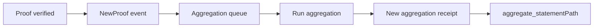

这一节讲聚合在整条链路里的位置，以及它到底产出什么。如果结果只留在 Web2，verify-only 往往就够了；如果结果要交给链上合约，聚合就不再是背景细节，而是主路径的一部分。

先看流程上的位置：proof 提交并通过验证后，如果带了 domainId，它会被放进对应的聚合队列。加入队列时会触发 `NewProof{statement, domainId, aggregationId}`，这就是“你进入哪一批聚合”的信号。

当一条聚合完成，任意用户都可以调用 `aggregate(domainId, aggregationId)` 生成 receipt。成功后会发出 `NewAggregationReceipt{domainId, aggregationId, receipt}` 事件。注意：这个事件所在的 block hash 非常关键，因为后续计算 Merkle path 必须用同一个 block。



聚合的产物可以拆成三个层面：

1) **receipt（Merkle root）**：这是一批 proof 的根，合约侧只验证它。
2) **aggregationId / domainId**：标记你属于哪一批聚合。
3) **Merkle path**：证明你的 statement 在这棵树里。

在 Kurier 路线里，你会在 `job-status` 的 `Aggregated` 状态拿到 `aggregationDetails`。它包含 receipt、root、leaf、leafIndex、numberOfLeaves 和 merkleProof。这个包是合约验证的直接输入。

```ts
if (jobStatusResponse.data.status === "Aggregated") {
  fs.writeFileSync(
    "aggregation.json",
    JSON.stringify({
      ...jobStatusResponse.data.aggregationDetails,
      aggregationId: jobStatusResponse.data.aggregationId
    })
  )
}
```

如果你走链上接口，你需要自己监听 `NewAggregationReceipt` 并记录 block hash，然后用 `aggregate_statementPath` RPC 拿到 Merkle path。注意 Published storage 只在 receipt 生成的那一个 block 有效，错过 block hash 就拿不到路径。

```text
path = aggregate_statementPath(blockHash, domainId, aggregationId, statement)
```

聚合不是“自动帮你完成”的动作。它是 permissionless 的：任何人都可以发布聚合并领取相应的费用。这也是为什么聚合事件不是由“系统服务”唯一触发，而是可能由任何参与者触发。你在系统里不能假设“某个固定服务一定会发布”。

也要理解聚合失败的边界：`aggregate` 可能失败，例如 domain 不存在、aggregationId 无效或已发布。失败时发布者只付 fail‑fast 成本，但你的 proof 并不会消失。工程上你要处理的是“等待下一个成功发布的聚合”。

> ⚠️ 注意：`NewAggregationReceipt` 的 block hash 必须记录，否则后续无法计算 Merkle path。

> 💡 提示：如果你在合约侧验证失败，先检查 Merkle path 是否来自正确的 receipt block。这个错比合约逻辑错更常见。

聚合引擎做的事情很具体：生成 receipt，以及证明某条 statement 被包含在 receipt 里的那组数据。至于结果怎么被消费，还是你的系统来决定。下一节会讲 Relay vs Mainchain API，让你知道应该走哪条接口路径。
