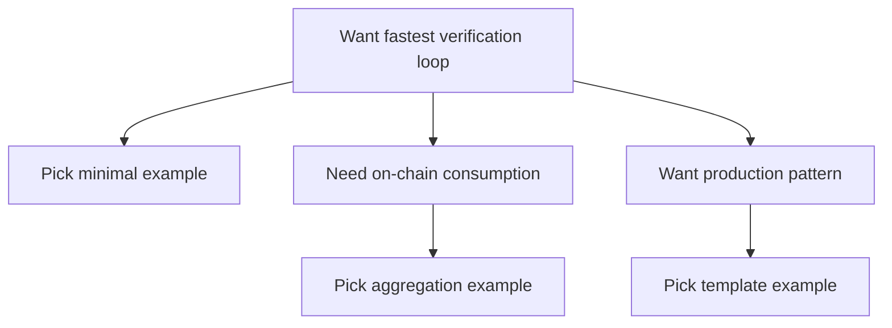

这一条路径给的是可直接运行的示例。重点不是先讲原理，而是先把 proof 流程跑起来，看清输入、输出、验证结果以及必要时的聚合结果分别长什么样。

这一章的样例不是随便堆的。它们会按“最小可验证 → 可复用模板 → 生产级思路”的顺序安排。你可以把它当作一条渐进的脚手架，从最简单的 proof 提交开始，逐步看到更多工程边界：输入如何组织、验证结果如何消费、什么时候需要聚合、什么时候不需要。

每个例子都会回答同样几件事：在证明什么、哪些输入公开、哪些输入保密、结果最终在哪里消费。这样你在改例子时就能抓住骨架，而不是只复制代码。

不同例子会用到不同证明系统和工具链，所以接口和产物不可能完全一致。这里真正有用的目标不是把所有工具链都记住，而是先找到一条你能稳定跑通的路径。

下面给一个“选择例子”的最小路径，帮助你决定从哪里开始：



如果你不知道该从哪里下手，可以用这个顺序：先跑最小样例，确认验证事件能出现；再跑一个聚合样例，确认你能拿到 receipt；最后看生产级模板，学习如何把验证结果接回业务逻辑。这个顺序不是强制的，但能让你少踩坑。

把这些例子当成起点会更有用。真正值得带回项目里的，是输入结构、提交方式、事件监听以及结果消费的模式。

```text
Example skeleton:
1) Prepare inputs
2) Generate proof
3) Submit proof
4) Observe verification result
5) Consume result
```

> 💡 提示：先把日志和事件监听加好。很多“跑不通”的问题不是证明本身错，而是你根本没看到验证事件。

> ⚠️ 注意：不要把示例当成“生产默认值”。示例是为了说明结构和路径，不是为了覆盖你的业务边界。

如果你已经有现成业务逻辑，优先选一个最接近你目标的例子，再调整输入和消费方式。下一节就是最小样例列表。
