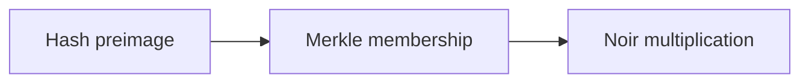

这页给三个很小的例子，目的就是把验证闭环完整跑出来。你会直接看到输入长什么样、proof 怎么提交、验证结果怎么出现，以及在需要时聚合扮演什么角色。

每个例子都回答同一组工程问题：

1) 我到底在证明什么？
2) 哪些输入是公开的，哪些必须留在私有侧？
3) 结果要在应用侧消费，还是需要走聚合？

下面先给一个总览表，帮助你快速选择从哪一个例子开始。

| 例子 | 证明的核心 | 公共输入 | 私有输入 | 适合的场景 |
| --- | --- | --- | --- | --- |
| Hash preimage | “我知道某个哈希的原像” | 哈希值 | 原像 | 快速验证链路与哈希电路 |
| Merkle membership | “我在这棵树里” | Merkle root | 叶子 + 路径 | 会员/资格证明 |
| Noir multiplication | “两个数相乘结果正确” | 乘积 | 因子 | 最小算术电路样例 |

> 💡 提示：如果你只想确认 zkVerify 的验证闭环，先跑 Hash preimage。它的结构最简单，最容易定位错误。

## 示例 1：Hash preimage

**证明内容**：我知道一个哈希值的原像。工程上它解决的问题是“我能证明我知道某个秘密，但不公开秘密本身”。

**输入拆分**：
- 公共输入：`hash`（验证方可见）
- 私有输入：`secret`（只留在 prover 侧）

```text
hash = Hash(secret)
assert hash == public_hash
```

**为什么这个例子重要**：它是最小验证闭环。你只要把 proof 提交到 zkVerify 并看到验证事件，就能确认“proof + public inputs + vk”这条链是通的。

**什么时候会踩坑**：
- 你用的哈希函数与电路不一致。
- public inputs 的序列化方式和电路预期不一致。

> ⚠️ 注意：不要把 `secret` 当成 public input 提交。这样等于公开了你要隐藏的东西，证明就失去意义。

**是否需要聚合**：不需要。这个例子本质是验证闭环与隐私边界，不涉及链上消费。

## 示例 2：Merkle membership（基础版）

**证明内容**：我在某个名单里。工程上它解决的是“我可以证明属于一个集合，但不暴露集合本身”。

**输入拆分**：
- 公共输入：`root`
- 私有输入：`leaf`, `pathElements[]`, `pathIndices[]`

```text
cur = leaf
for i in 0..depth-1:
  if pathIndices[i] == 0:
    cur = Hash(cur, pathElements[i])
  else:
    cur = Hash(pathElements[i], cur)
assert cur == root
```

**为什么这个例子重要**：它把“批量证明”引入你的直觉。你会第一次看到“我不需要公开整个集合，只需要公开 root”，这是后续聚合与链上消费的基础直觉。

**什么时候会踩坑**：
- `pathIndices` 方向搞反，导致整条路径错。
- root 来自不同树或不同顺序的叶子。

> 💡 提示：路径方向错是最常见的 bug。先打印每层的 `cur`，看是在哪一层开始偏离。

**是否需要聚合**：取决于结果消费端。如果你要链上合约消费，后续需要聚合；如果只是应用侧验证，verify-only 就够了。

## 示例 3：Noir multiplication circuit

**证明内容**：两个数的乘积正确。工程上它是“最小算术电路样例”，适合验证工具链是否可用。

**输入拆分**：
- 公共输入：`product`
- 私有输入：`a`, `b`

它比哈希例子稍微复杂，但仍然非常小，适合你验证“电路 → proof → 验证”的整条工具链。

```text
assert a * b == product
```

**为什么这个例子重要**：它让你第一次看到“算术电路”的结构，而不是纯哈希或集合证明。你会开始意识到：电路本质是约束系统，而 proof 是对这些约束的满足证明。

**什么时候会踩坑**：
- public inputs 和 private inputs 的排列顺序不一致。
- 电路的字段顺序与证明工具链的导出顺序不一致。

> ⚠️ 注意：顺序错了看起来像“proof 总是失败”，其实是输入映射错了。

## 运行顺序建议

如果你是第一次接触 ZK，建议按下面顺序跑：

1) Hash preimage → 验证“最小闭环”。
2) Merkle membership → 验证“集合证明直觉”。
3) Noir multiplication → 验证“算术电路路径”。

这样你每一步都只增加一个复杂度维度，而不是一次性上手复杂电路。



## 一个可复用的最小骨架

无论你用哪个例子，验证闭环的骨架都是一样的：

```text
1) 准备输入（public + private）
2) 生成 proof（off-chain）
3) 将 proof 提交到 zkVerify
4) 观察验证结果
5) 消费结果（应用或合约）
```

这五步本身就可以直接复用。例子一旦出错，你也能马上知道应该回头查哪一个阶段。

## 常见误解与排错思路

**误解 1：proof 失败一定是链的问题。**
事实是大多数失败来自输入错位：public inputs 不匹配、vk 版本不一致、路径方向错。

**误解 2：示例能跑就能上生产。**
示例只解决“结构”，不解决“规模、成本、权限边界”。跑通后你还需要决定是否聚合、是否需要 domain、是否要链上消费。

**误解 3：只要验证通过，业务就完成了。**
验证只是“事实成立”，业务还要决定如何使用这个事实。比如权限发放、记录审计、触发合约调用，这些都不在示例里。

> 💡 提示：调试时先把输入打印成“可读结构”，再看 proof/验证。很多时候问题不在算法，而在输入的排列或编码。

把这三类例子跑通之后，下一节会继续展示同样结构在重放防护、结果持久化和动作绑定里的变化。
