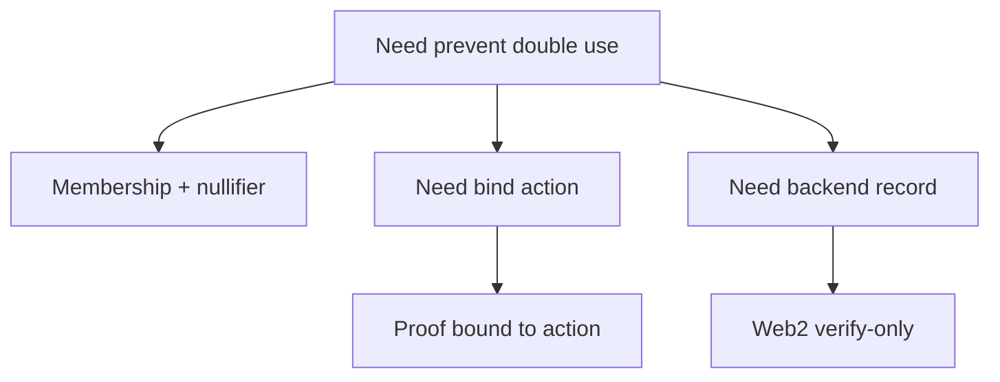

这一节的三个例子不是“跑通就结束”，而是把真实工程里会遇到的问题放进可执行结构里。它们的共同点是：你必须处理**状态复用、重放攻击、以及结果持久化**。如果你只是做过最小例子，这里是你把“演示级”升级到“能上线”的关键一步。

三个例子分别解决三个现实问题：

- **Membership + nullifier**：防止同一份资格被重复使用。
- **Proof bound to action**：防止 proof 被换个动作重放。
- **Web2 verify‑only template**：把验证结果落到后端存储，便于权限与审计。

为了让结构更清晰，下面每个例子都会按“目标 → 输入结构 → 关键逻辑 → 验证落点”的顺序展开。你可以直接把这些骨架搬到你的项目里，再替换成自己的业务字段。

---

## 示例 1：Membership + nullifier（防止重复使用）

**工程目标**：同一份资格只能用一次。典型场景是空投领取、单次投票、一次性兑换券。你允许用户证明“我在名单里”，但不允许他用同一个身份重复提交。

**关键思路**：proof 证明成员关系，nullifier 提供“唯一性”。nullifier 由私有身份 + 场景域 + 随机盐生成，但对外公开。验证通过后，你在系统里记录该 nullifier，下一次出现相同 nullifier 就拒绝。

**输入结构（示意）**：

```text
publicInputs = { root, nullifier }
privateInputs = { leaf, pathElements[], pathIndices[], secret }
```

**电路侧最小逻辑（伪代码）**：

```text
assert MerklePath(leaf, pathElements, pathIndices) == root
nullifier = Hash(secret, domain, salt)
assert nullifier == public_nullifier
```

**验证落点（Web2 / 链上）**：

```ts
// server-side pseudo logic
if (db.nullifiers.has(nullifier)) {
  throw new Error("Already used")
}
db.nullifiers.add(nullifier)
```

**常见坑**：
把 nullifier 作为私有输入，不写入 public inputs。结果是验证端无法检测重复使用，等于系统没有防重放能力。

> 💡 提示：nullifier 的本质是“可公开的一次性标识”，它必须进 public inputs 才有意义。

---

## 示例 2：Proof bound to action（防重放）

**工程目标**：同一个 proof 不能被拿去触发别的动作。比如你证明“有权限领取 A”，但别人把 proof 拿去请求 B。

**关键思路**：把 action metadata 写入 public inputs，让 proof 和具体动作绑定。动作可以是 endpoint、合约方法、参数摘要、甚至时间窗口。

**输入结构（示意）**：

```text
publicInputs = { root, actionHash }
privateInputs = { leaf, pathElements[], pathIndices[], secret }
```

**动作绑定逻辑（示意代码）**：

```ts
const action = {
  method: "claim",
  paramsHash: hash(params),
  expiry: "2026-01-31"
}
const actionHash = hash(action)
// actionHash must match publicInputs
```

**验证落点**：
验证通过后，你必须确认当前请求的 `actionHash` 与 proof 里的 `actionHash` 一致，否则拒绝执行。否则 proof 可以被“偷换场景”重放。

**常见坑**：
只在应用层存 action，不把它写入 proof。结果是 proof 变成“通用通行证”，失去动作绑定能力。

> ⚠️ 注意：proof 如果不绑定动作，就等于可重放凭证，任何人拿到都能重复使用。

---

## 示例 3：Web2 verify‑only template（验证结果持久化）

**工程目标**：把验证结果落到后端，形成稳定的“验证记录”。你不需要链上消费，但需要审计、重试或权限控制。

**关键思路**：拿到 `ProofVerified` 事件或 job‑status 结果后，把 statement 和业务上下文持久化存储。下一次请求时先查记录，而不是再次验证。

**记录结构（示意）**：

```ts
type VerificationRecord = {
  statement: string
  userId: string
  action: string
  createdAt: string
  status: "verified" | "failed"
}
```

**最小处理流程**：

```ts
if (event.type === "ProofVerified") {
  await db.verifications.insert({
    statement: event.statement,
    userId,
    action,
    createdAt: new Date().toISOString(),
    status: "verified"
  })
}
```

**常见坑**：
不存 statement，只存“验证通过/失败”的布尔值。这样你无法关联具体 proof，审计时会出现“无法追溯”的黑洞。

> 💡 提示：statement 是验证结果的唯一指纹，把它当作审计索引来用。

---

## 选择哪一个先做？

如果你的产品需要“单次凭证”，先做 nullifier；如果你担心 proof 被复制到别的动作里，先做 action 绑定；如果你只是要快速上线验证闭环，先做 verify‑only 记录。



## 这些例子真正要你带走的东西

这三类例子最后都落在三个设计判断上：

1) proof 里有没有绑定唯一性或动作语义；
2) 验证结果有没有被可靠地持久化，方便审计和复用；
3) 消费层是否把“验证成功”和“业务动作完成”分开处理。

下一节会给出统一模板，方便你把这些模式迁移到新的用例里。
