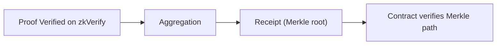

这一条路径讲的是合约侧消费：**当验证结果要进合约时，合约到底需要哪些链上材料**。这里最常见的卡点不是 proof 对不对，而是 receipt 数据根本没有准备完整。

你需要先接受一个现实：合约端不会重新验证完整 proof。它消费的是聚合后的 receipt（Merkle root）和你的 Merkle path。换句话说，**proof 验证是 zkVerify 做的，合约验证的是“你在 receipt 里”**。这条边界决定了你必须走 verify + aggregate 路径。

这一章会把“合约消费”的路径拆成两部分：

- **有合约**：你需要 receipt、aggregationId、domainId 和 Merkle path，并在合约里验证。
- **没有合约**：你只需要验证事件或 job-status 结果，在 Web2 侧消费即可。

如果你在做跨链或多合约消费，聚合就不是“可选优化”，而是“必经路径”。receipt 是链上信任的最小单位，它让合约不用验证 N 个 proof，而只验证一个 root。

你会在这一章遇到两类工程问题：

1) 我如何拿到 receipt 和 Merkle path？
2) 合约侧如何验证我在 receipt 里？

这两个问题贯穿后续所有页面。如果你只记住一句话：**链上消费需要 receipt，不是 proof**。

> ⚠️ 注意：只提交 proof 不会产生合约可用结果。没有 receipt，合约端无法验证你的 proof 被 zkVerify 接受。

> 💡 提示：如果你只是 Web2 侧消费，先不要引入合约流程。verify-only 能让你更快上线，再决定是否进入聚合路径。

下一节先处理“已经有合约”的完整 receipt 路径，再回头讲更轻量的 Web2-only 消费。
