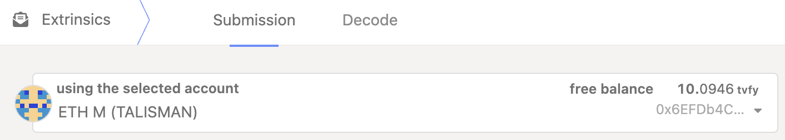

## 如何把 VFY 从 zkVerify 转到 Base？

按以下步骤操作：先将 VFY 从 zkVerify 中继链 Teleport 到 VFlow（zkVerify 的 EVM 平行链），再通过 Stargate 从 VFlow 跨到 Base。

1) 将钱包连接到 VFlow

- 阅读并执行：[Connect to VFlow](https://docs.zkverify.io/architecture/VFlow/connect-a-wallet)
- 确保钱包（如 SubWallet/Talisman + EVM 账户）已可与 Polkadot-JS、VFlow 交互。
- 若列表中没有网络，按连接指南手动添加主网 RPC。



前提：在 Polkadot-JS UI 连接两个地址

- zkVerify 主网的 Substrate 地址（以 `ZK*****` 开头）。
- VFlow 的 EVM 地址。有些钱包提供统一账户视图，可能显示为同一账户，但本质上是不同地址。

2) 在 Polkadot-JS UI 将 VFY 从 zkVerify Teleport 到 VFlow

- 参考（完整步骤）：[Teleport Token across zkVerify Parachains → From zkVerify to VFlow via PolkadotJS-UI](https://docs.zkverify.io/architecture/VFlow/VFY-Bridging/token-teleport#from-zkverify-to-vflow-via-polkadotjs-ui)

- 通过 Decode 的快捷方式（推荐）
  - 在 Polkadot-JS 进入 Developer → Extrinsics → Decode
  - 粘贴下列十六进制：

    ```
    0x8c0105000100040500010300000000000000000000000000000000000000000005040000000000000000
    ```

  - 切换到 Submission
  - 仅修改以下参数：
    - Beneficiary → V5 → X1 → AccountKey20 → key：填入 VFlow 上的 EVM 地址（20 字节）
    - Assets → V5 → 0 → fun → Fungible：填写 VFY 数量（18 位小数，如 1 VFY = 1000000000000000000）
  - 提交并签名交易

3) 通过 Stargate 将 VFlow 资产桥接到 Base

- Teleport 完成、VFY 到账 VFlow 后，用 Stargate 跨到 Base：
  - 打开：[Stargate 预填链接](https://stargate.finance/bridge?srcChain=zkverify&srcToken=0xEeeeeEeeeEeEeeEeEeEeeEEEeeeeEeeeeeeeEEeE&dstChain=base&dstToken=0xa749dE6c28262B7ffbc5De27dC845DD7eCD2b358)
  - 确认来源链为 zkVerify（VFlow EVM），目标链为 Base
  - 选择 VFY 数量并执行桥接

提示

- Teleport 数量使用 18 位小数；确保余额足以覆盖 XCM 执行费，接收端费用会从 Teleport 数量中扣除。
- 如需了解 XCM Teleport 参数，参考上述指南中的官方说明。
- 钱包配置或问题排查，先按钱包连接指南操作，再重试 Teleport。
