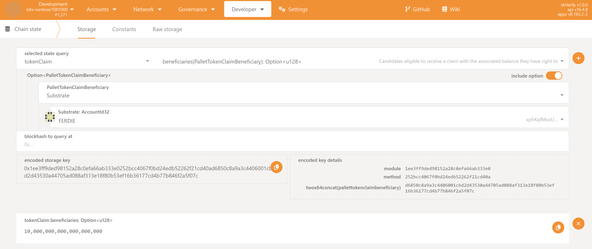
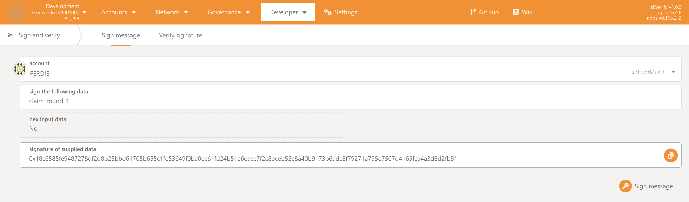
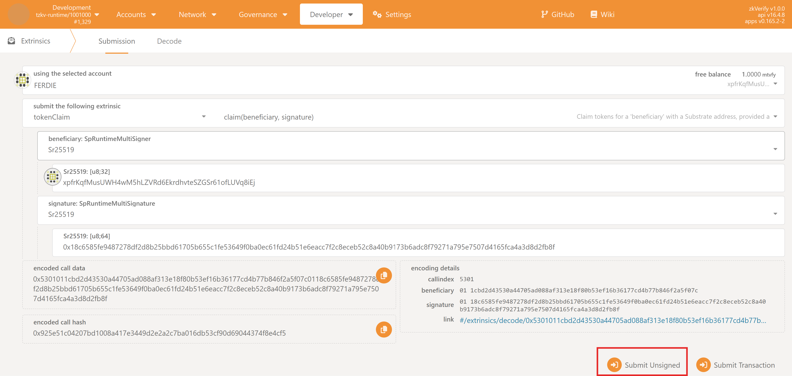

import Tabs from '@theme/Tabs';
import TabItem from '@theme/TabItem';

本指南介绍当你的 Substrate 地址在受益人名单时如何领取代币。

领取是**免手续费**的，通过提交带有效签名的 `tokenClaim` 未签名交易完成。

### Prerequisites

1.  **Claim is active**: The claim has been officially initiated. You can check this in the following way:
    1.  Navigate to the **PolkadotJS Apps** interface for our chain.
    2.  Navigate to **Developer > Chain state** tab.
    3.  Select the `tokenClaim` module and the `claimActive: bool` method.
    4.  Click on the `+` button on the right. If the claim has started `true` will be returned, `false` otherwise.
   


2.  **账户访问权限：** 你能访问受益人列表中的 Substrate 账户。
   
3.  **资格检查：** 确认你的 Substrate 地址在当前赠送的受益人列表，可通过以下方式：
    1.  Navigate to the **PolkadotJS Apps** interface for our chain.
    2.  Navigate to **Developer > Chain state** tab.
    3.  Select the `tokenClaim` module and the `beneficiaries(PalletTokenClaimBeneficiary): Option<u128>` method. Make sure also to check the `include option` button on the right.
    4.  From the new fields that show up, set:
        1.  `PalletTokenClaimBeneficiary` to `Substrate`
        2.  `Substrate: AccountId32` to your Substrate address.
        3.  Leave the `blockhash to query at` field empty
    5.  Click on the `+` button on the right. If you are eligible, you should see returned the amount you are entitled to (with 18 decimals), otherwise `<none>` will be returned.



4.  **官方领取消息：** 活动开始时官方会公布唯一的“领取消息”，需严格使用该字符串。可在链上获取：
    1.  Navigate to the **PolkadotJS Apps** interface for our chain.
    2.  Navigate to **Developer > Chain state** tab.
    3.  Select the `tokenClaim` module and the `claimId: Option<(u64, Bytes)>` method.
    4.  Click on the `+` button on the right. A number and a string will be returned. The message to be signed for this claim is the string, and you might want to copy it.


### 第一步：生成签名

假设消息为 `claim_round_1`。需用符合条件的 Substrate 账户签名此消息以证明所有权。推荐使用 PolkadotJS。

<Tabs>
<TabItem value="polkadotjs" label="Recommended: PolkadotJS Apps UI" default>

1.  打开 PolkadotJS，进入 **Developer > Sign and Verify**。
2.  选择受益人账户。
3.  在 `sign the following data` 粘贴步骤 1 的**原始**官方消息。
4.  点击 **Sign message**，钱包弹窗确认。
5.  签完后在 `signature of supplied data` 显示以 `0x` 开头的长签名，复制备用。

  

</TabItem>
<TabItem value="subkey" label="Advanced: Subkey CLI">

若熟悉命令行，可用 `subkey`：

:::warning
This method involves using your mnemonic phrase (seed phrase). Never expose your seed phrase in an insecure environment.
:::

终端运行，替换占位符：

```bash
subkey sign --message "claim_round_1" --suri "your twelve or twenty four word seed phrase" --scheme "sr25519/ed25519/ecdsa"
```
输出即签名哈希（0x 开头），复制保存。
</TabItem>
</Tabs>


### 第二步：提交领取交易
获得签名后，以未签名交易提交：

1.  On the PolkadotJS Apps interface, navigate to **Developer > Extrinsics**.
2.  Select the `tokenClaim` module from the first dropdown and the `claim(beneficiary, signature)` method in the second dropdown.

:::note
由于提交未签名交易，`using the selected account` 选择任意账户即可。
:::

Now, depending on your account type:

<Tabs>
<TabItem value="sr25519" label="Typical Flow (sr25519 scheme)" default>
若使用 sr25519 账户（如 Talisman、Subwallet 等）：

3.  `beneficiary: SpRuntimeMultiSigner` 选 `Sr25519`，在 `Sr25519: [u8;32]` 填你的地址（`ZKY..`、`xpi..` 等）
4.  `signature: SpRuntimeMultiSignature` 选 `Sr25519`，在 `Sr25519: [u8;64]` 粘贴步骤一的签名。
</TabItem>

<TabItem value="ed25519" label="Advanced (ed25519 scheme)" default>
若使用 ed25519 账户：

3.  `beneficiary` 选 `Ed25519`，`Ed25519: [u8;32]` 填地址
4.  `signature` 选 `Ed25519`，`Ed25519: [u8;64]` 粘贴签名。
</TabItem>   

<TabItem value="ecdsa" label="Advanced (ecdsa scheme)" default>
若使用 ecdsa 账户：

3.  `beneficiary` 选 `Ecdsa`，`Ecdsa: [u8;33]` 填**压缩公钥 hex**（如 `0x3..`）。可用 `subkey` 获取：
    ```bash
    subkey inspect "<Your seed Phrase>" --scheme ecdsa
    ```
    复制输出的 `Public key(hex)`。
4.  `signature` 选 `Ecdsa`，`Ecdsa: [u8;65]` 粘贴步骤一生成的签名。PolkadotJS `Sign & Verify` 可为 ECDSA 账户生成签名，推荐用 `Subkey`。
   
</TabItem>
</Tabs>


5.  Click the **"Submit Unsigned"** button and the **Submit (no signature)** button in the new window that will appear.



:::note
高级提示：若不使用 PolkadotJS 前端，`beneficiary: SpRuntimeMultiSigner` 实际需 hex 公钥。前端会自动转换 sr25519/ed25519 地址，但 ecdsa 需手动传 hex 公钥（可用 `subkey` 或 PolkadotJS 的 Convert address 工具获取）。
:::

### 第三步：验证领取
签名与账户有效时，交易会处理并显示绿色 `ExtrinsicSuccess`。可在 **Accounts** 查看余额，或确认地址已不在受益人列表。

### 故障排查
若失败，会显示红色提示及 `InvalidTransaction` 信息，可能原因：

- `Transaction is outdated`: 提交时没有活动的 claim。
- `Invalid signing address`: 领取的地址不在受益人名单。
- `Transaction has a bad signature`: 签名验证失败，可能消息不对或签名非预期地址。
