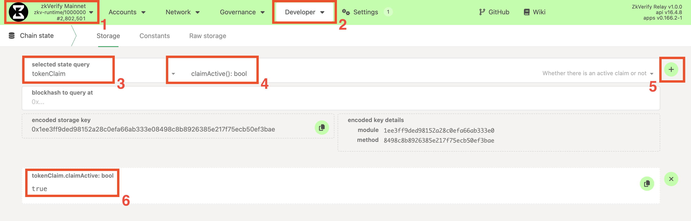
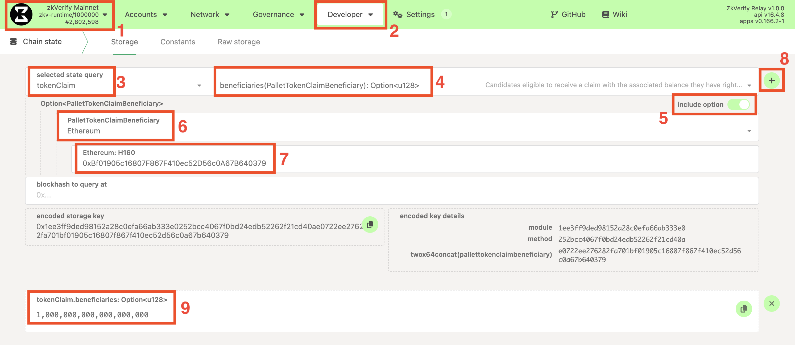
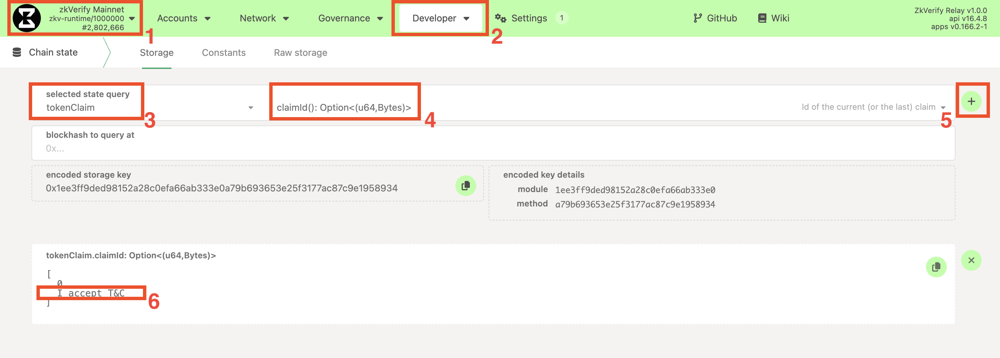
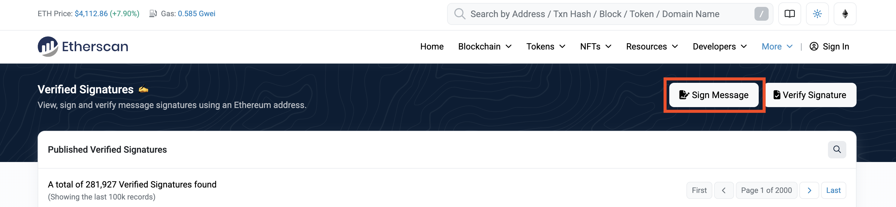
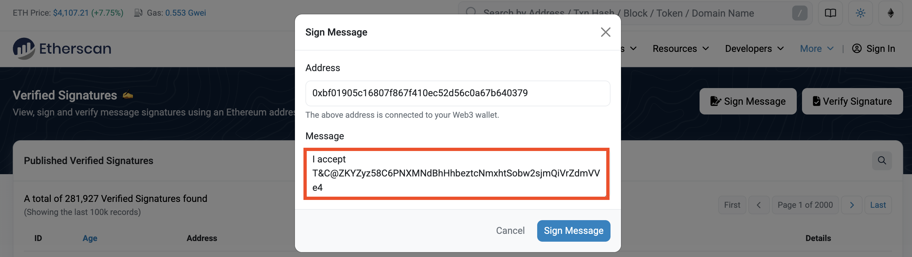
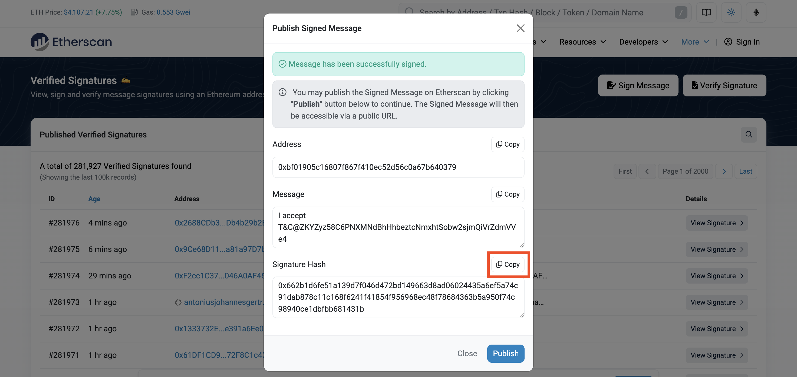
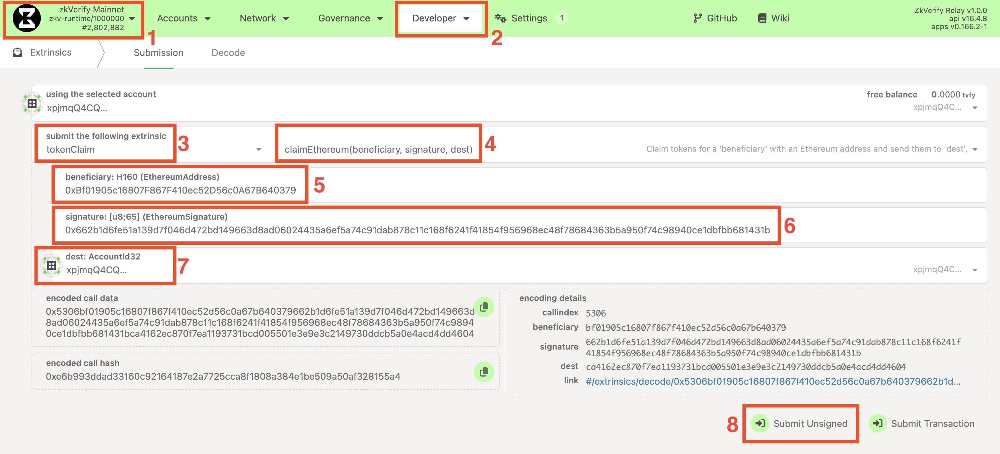

本指南介绍当你的 Ethereum 地址在受益人名单时如何领取代币。需提供一个 Substrate 地址作为接收地址。领取**免手续费**，通过提交带有效以太坊签名的未签名交易完成。

### Prerequisites

1.  **Claim is active**: The claim has been officially initiated. You can check this in the following way:
    1.  Navigate to the **PolkadotJS Apps** interface for our chain.
    2.  Navigate to **Developer > Chain state** tab.
    3.  Select the `tokenClaim` module and the `claimActive: bool` method.
    4.  Click on the `+` button on the right. If the claim has started `true` will be returned, `false` otherwise.
   


2.  **以太坊钱包：** 你能访问符合条件的以太坊钱包（如 MetaMask）。
3.  **Substrate 账户：** 用于接收代币，如无请参考 [指南](../../overview/02-getting-started/01-connect-a-wallet.md)。
   
4.  **资格检查：** 确认以太坊地址在当前受益人名单，可通过以下方式：
    1.  Navigate to the **PolkadotJS Apps** interface for our chain.
    2.  Navigate to **Developer > Chain state** tab.
    3.  Select the `tokenClaim` module and the `beneficiaries(PalletTokenClaimBeneficiary): Option<u128>` method. Make sure also to check the `include option` button on the right.
    4.  From the new fields that show up, set:
        1.  `PalletTokenClaimBeneficiary` to `Ethereum`
        2.  `Ethereum: H160` to your Ethereum address.
        3.  Leave the `blockhash to query at` field empty.
    5.  Click on the `+` button on the right. If you are eligible, you should see returned the amount you are entitled to (with 18 decimals), otherwise `<none>` will be returned.



5.  **官方领取消息：** 活动开始时官方会公布唯一“领取消息”，需严格使用该字符串。可在链上获取：
    1.  Navigate to the **PolkadotJS Apps** interface for our chain.
    2.  Navigate to **Developer > Chain state** tab.
    3.  Select the `tokenClaim` module and the `claimId: Option<(u64, Bytes)>` method.
    4.  Click on the `+` button on the right. A number and a message will be returned between square brackets `[]`. Copy only the message.


### 第一步：构造签名消息

需签名包含领取消息与目标 Substrate 地址的字符串：

格式：`[claiming_message]@[destination_address]`

**Example:**
*   Claiming Message: `claim_round_1`
*   Destination Address: `ZKXEFgKUrjavy6PEBPrqwNY6svCkz72ttwP77JApnjXKWNVb6`

The final message you need to sign is:

```bash
claim_round_1@ZKXEFgKUrjavy6PEBPrqwNY6svCkz72ttwP77JApnjXKWNVb6
```

:::warning
务必严格按格式，无空格/换行等多余字符。
:::

### 第二步：生成以太坊签名

用符合条件的以太坊账户签名步骤一的消息，可使用 Etherscan 签名工具。

**Using Etherscan:**
1.  Go to the [Etherscan](https://etherscan.io/verifiedSignatures#)'s Verified Signature tool.



:::note
多数 `_scan` 浏览器（如 [Basescan](https://basescan.org/verifiedSignatures)）也提供该工具。
:::

2.  Click on `Sign Message` and connect the Ethereum Wallet and the corresponding eligible Ethereum account.
3.  In the `Message` box, paste the **full constructed message** from Step 1.



:::warning
务必与步骤一的消息完全一致，无空格/换行等。最安全方式是在 Etherscan `Message` 框直接输入。
:::

4.  Click `Sign Message`. Your wallet will prompt you a confirmation to sign the message.
5.  After signing, copy the value of the `Signature Hash` field. This is the Ethereum signature you're going to use for claiming on zkVerify, and it will start with `0x...`.



:::warning
仅用官方/可信工具签名，需符合 [EIP-191](https://eips.ethereum.org/EIPS/eip-191) 格式，手动拼签名可能导致领取失败。
:::

### 第三步：提交领取交易

获得签名后，以未签名 extrinsic 提交：

1.  On the PolkadotJS Apps interface, navigate to **Developer > Extrinsics**.
2.  Select the `tokenClaim` module from the first dropdown and the `claimEthereum(beneficiary, signature, dest)` method in the second dropdown.
3.  For the `beneficiary: H160 (EthereumAddress)` field, paste your Ethereum Address
4.  For the `signature: [u8;65] (EthereumSignature)` field, paste the signature you copied in Step 2.
5.  For the `dest: AccountId32` field, insert the Substrate address on which you want to receive the tokens (e.g. `ZKY..`, `xpi..`).
6.  Click the **"Submit Unsigned"** button and the **Submit (no signature)** button in the new window that will appear.



### 第四步：验证领取
签名与地址有效时，交易处理并显示绿色 `ExtrinsicSuccess`。可在 **Accounts** 查看目标 Substrate 账户余额，或确认以太坊地址已不在受益人列表。

### 故障排查
若失败，会显示红色提示及 `InvalidTransaction`，可能原因：

- `Transaction is outdated`: 提交时无活动领取。
- `Invalid signing address`: 领取的以太坊地址不在名单。
- `Transaction has a bad signature`: 签名验证失败，可能消息错误或签名非预期地址。 
