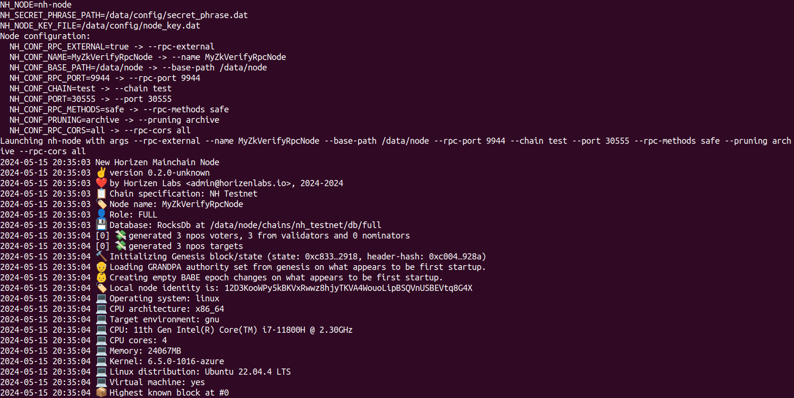
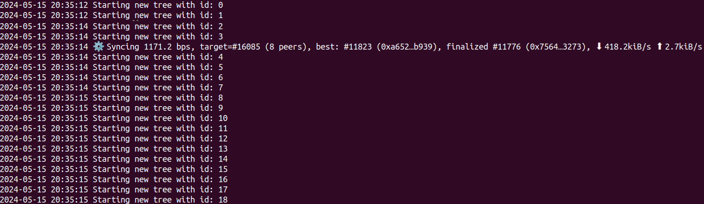
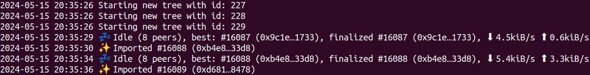
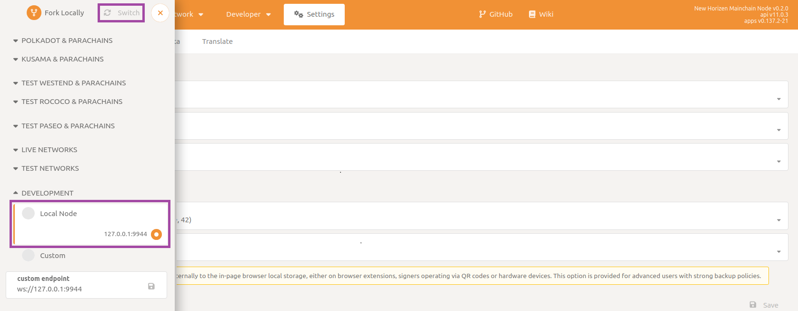
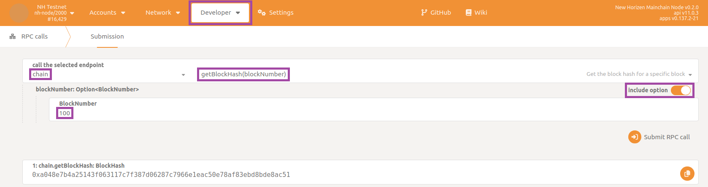
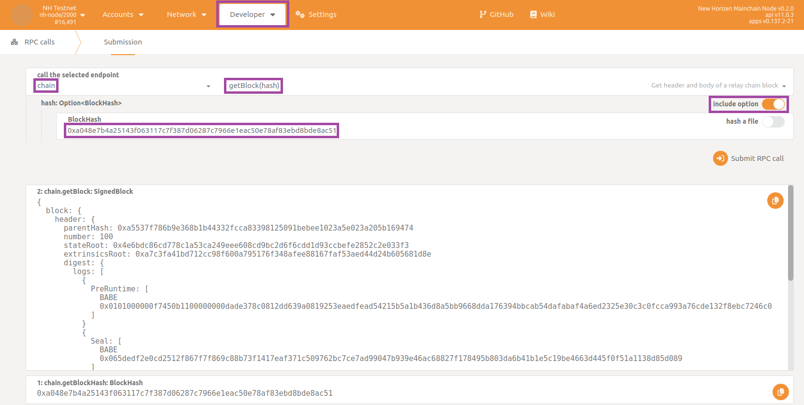
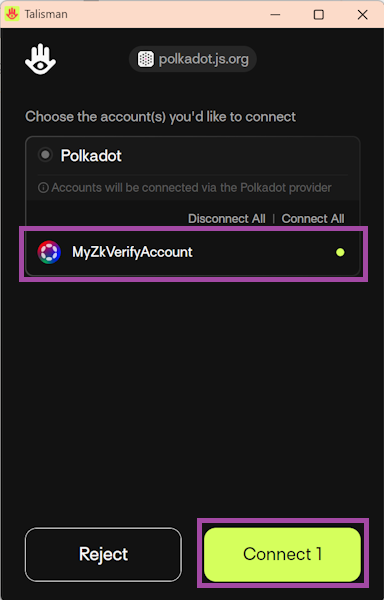
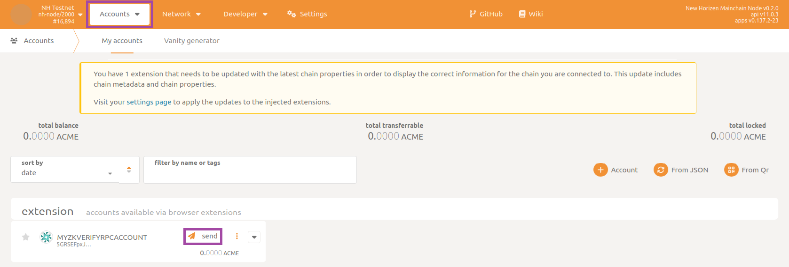
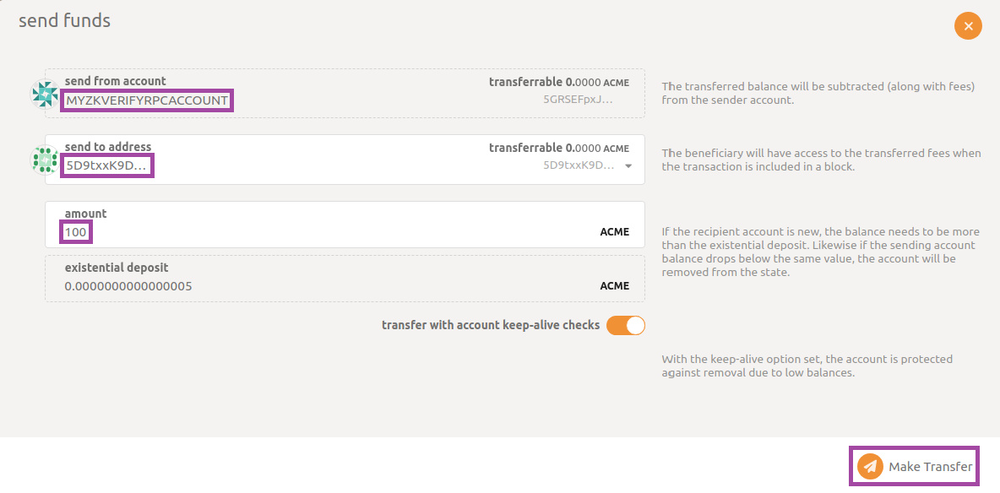

## Prepare the Environment

要运行新的 RPC 节点（节点类型见 [此处](../01-getting_started.md#node-types.md)），在终端进入 `compose-zkverify-simplified` 根目录：

```bash
cd compose-zkverify-simplified
```

运行初始化脚本：

```bash
scripts/init.sh
```

脚本交互会询问：

- 节点类型：选择 RPC
- 网络：当前仅 testnet
- 节点名：自定义标识
- RPC 方法暴露范围：仅安全方法或全部
- Archival：全量或裁剪存储

结束后，脚本会在 `deployments/rpc-node/`*`network`* 下生成文件，并提示类似：

```bash
=== Run the compose project with the following command:

========================
docker compose -f /home/your_user/compose-zkverify-simplified/deployments/rpc-node/testnet/docker-compose.yml up -d
========================
```

启动前可编辑 `deployments/rpc-node/`*`network`*`/.env` 进行自定义：`# Node miscellaneous` 为容器相关，`# Node config` 为 Substrate 配置。

:::warning
手动调整需充分理解其影响。
:::

## Run the Node

**开始运行节点：**

Within the terminal type the command below which runs the Docker container:

```bash
docker compose -f /home/your_user/compose-zkverify-simplified/deployments/rpc-node/testnet/docker-compose.yml up -d
```

执行后节点后台运行，检查：

```bash
docker container ls
```

and you should get something similar to:

```bash
CONTAINER ID   IMAGE                         COMMAND                CREATED              STATUS              NAMES
ca4bdf2c6f05   zkverify/relay-node:latest   "/app/entrypoint.sh"   About a minute ago   Up About a minute   rpc-node
```

显示如上即启动正常。

如需探索，可继续阅读下方可选步骤。

## Explore and Interact with the Node

查看日志：

```bash
docker logs rpc-node
```

and you should get something like:



输出说明：

- `Launching zkv-relay...`: 说明 `.env` 已被解析且启动成功。
- `Node name: ...`: `ZKV_CONF_NAME` 已传递。
- `Local node identity is: ...`: 节点唯一标识。
- `Highest known block at #0`: 首次运行，仅创世块。

继续观察同步（稍等几秒后）：

```bash
docker logs rpc-node
```

And you'll see the synchronization is taking place:



关注：

- `Starting new tree with id: XXX`: 历史已验证的证明树。
- `Syncing ...`: 当前高度、目标高度、对等节点数与速率。

同步时间取决于链高度，通常几分钟内完成。完成后类似：



初次批量同步完成后，将每 6 秒接收新块。

借助 Docker，重启无需重新全量下载，可尝试：

```bash
docker compose -f /home/your_user/compose-zkverify-simplified/deployments/rpc-node/testnet/docker-compose.yml down
docker compose -f /home/your_user/compose-zkverify-simplified/deployments/rpc-node/testnet/docker-compose.yml up -d
```

then inspect recent logs with:

```bash
docker logs rpc-node --tail 100
```

此时日志不会再有长时间初始下载。

如需清空链数据，可停容器并删除卷：

```bash
docker compose -f /home/your_user/compose-zkverify-simplified/deployments/rpc-node/testnet/docker-compose.yml down
docker volume rm zkverify-rpc-testnet_node-data
```

## Interacting with the node

现在可用 PolkadotJS 交互：访问 [此地址](https://polkadot.js.org/apps/#/explorer)，在左上下拉选择本地节点：



:::note
若无法连接，检查 `.env` 中 `ZKV_CONF_RPC_EXTERNAL` 是否为 `true`，`NODE_NET_RPC_WS_PORT` 是否与自定义端点一致。
:::

可先提交 RPC 查询区块哈希与内容。

Navigate to to the section called `Developer` then to the subsection `RPC calls` and select the `chain` endpoint and command `getBlockHash`. Make sure to enable the `include option` flag, and then type in a block number (100 in this example).  Finally click on `Submit RPC call` button.



返回区块哈希后，用 `getBlock` 获取区块体。

Again, the node is responding to your request, this time providing the full body of the queried block.



:::note
若 `init.sh` 选择了非 archive，过旧区块可能被修剪，出现 `State already discarded`。
:::

也可尝试转账。在 Substrate 中账户对应一对密钥（类似比特币或以太坊账户）。

通过 PolkadotJS 提交 extrinsic 需安装兼容扩展钱包（如 [Talisman](https://docs.zkverify.io/tutorials/connect-a-wallet#using-talisman) 或 [Subwallet](https://docs.zkverify.io/tutorials/connect-a-wallet#using-talisman)），刷新页面后弹窗授权。



Next, navigate to the section `Accounts` then to the subsection `Accounts` and send funds by clicking on the `send` button:



选择账户、填入目标地址和金额，点击 `Make Transfer`。



数秒后会弹出绿色提示，确认交易提交与转账成功。
