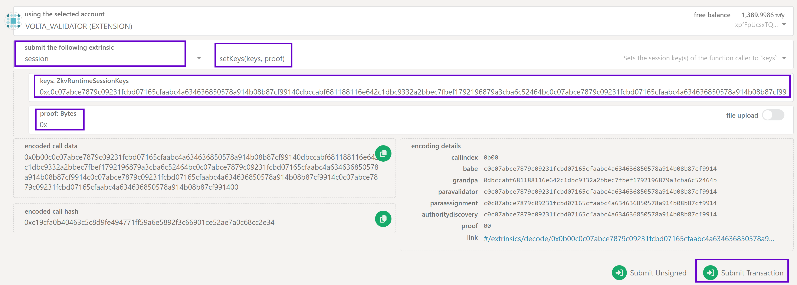
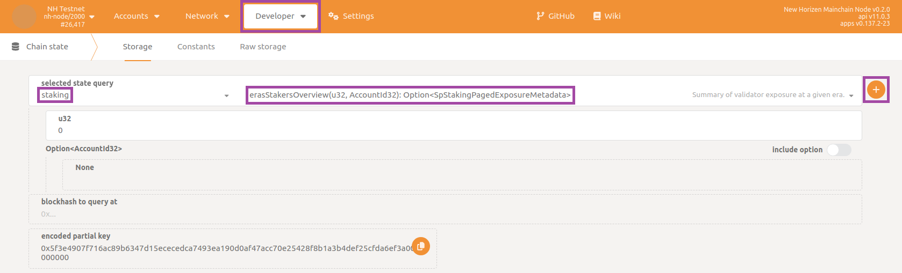
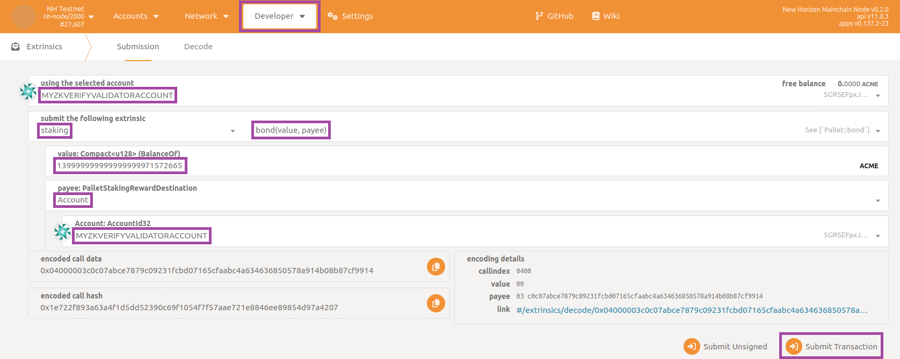
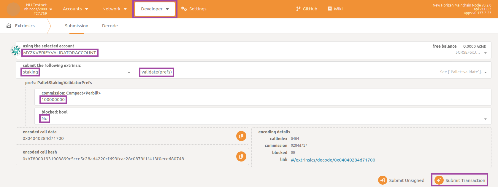
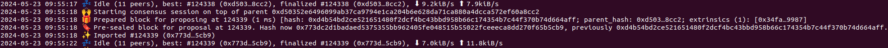
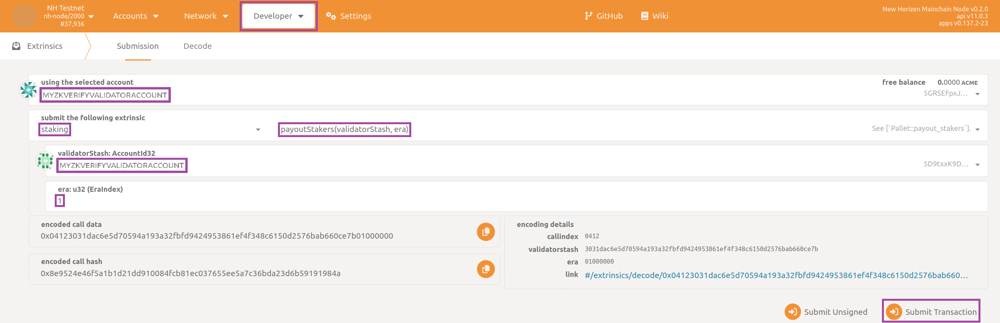

## Who are Validators ?

zkVerify 基于 Substrate，采用 NPoS 共识，包含两类角色：Validator 与 Nominator。

1. Validator 运行验证节点参与出块并获得奖励。
2. Nominator 将质押委托给可信验证人，获得部分奖励，无需运行软件。

## Steps Involved
- 启动验证节点
- 在网络注册
- 质押 tVFY
- 开始验证

## Bootstrapping the validator node

我们提供了启动验证节点的脚本，按此 [教程](../02-run_using_docker/01-getting_started_docker.md) 安装依赖后，运行：

```bash
cd compose-zkverify-simplified

scripts/init.sh
```

脚本会询问节点信息，按以下选择：
- Node Type：Validator
- Network：Testnet
- Node Name：自定义
- Node Key：让脚本随机生成
- Secret Phrase：导入或新建（建议新建以区分）


At the end of the session the script will populate directory `deployments/validator-node/`*`network`* with the proper files and you will get the following message:

```bash
=== Run the compose project with the following command:

========================
docker compose -f /home/your_user/compose-zkverify-simplified/deployments/validator-node/testnet/docker-compose.yml up -d
========================
```

运行提示的命令启动验证节点：
```bash
docker compose -f /home/your_user/compose-zkverify-simplified/deployments/validator-node/testnet/docker-compose.yml up -d
```

检查容器是否运行：
```bash
docker ls
```

输出示例：

```bash
CONTAINER ID   IMAGE                            COMMAND                CREATED              STATUS              NAMES
ca4bdf2c6f05   zkverify/relay-node:latest   "/app/entrypoint.sh"   About a minute ago   Up About a minute   validator-node
```

## Register your node with the network

本节介绍在链上注册验证人，仅需一次。提交若干 extrinsic 后，节点可出块并通过质押获得奖励。需提供 5 个公钥：Babe、Para Validator、Para Assignment、Authority Discovery、Grandpa。Grandpa 用 ed25519，其余用 sr25519。


:::note
提交会更改链状态，需在与助记词关联的账户中准备足够资金支付手续费。
:::


生成 Babe/Para Validator/Para Assignment/Authority Discovery：
```bash
docker run --rm -ti --entrypoint zkv-relay zkverify/relay-node:latest key inspect --scheme sr25519
```

and provide your validator secret phrase when prompted for (`URI:`), then hit enter. You should get the following response:

```bash
Secret phrase:       demise trumpet minor soup worth airport minor height sauce legend flag timber
  Network ID:        substrate
  Secret seed:       0x9b6a3ec8063e64e9d896ed8dbcd895d7fd0d7a3a982ed9b6839e2b55c49b9e15
  Public key (hex):  0xc0c07abce7879c09231fcbd07165cfaabc4a634636850578a914b08b87cf9914
  Account ID:        0xc0c07abce7879c09231fcbd07165cfaabc4a634636850578a914b08b87cf9914
  Public key (SS58): 5GRSEFpxJ8rU4LLiGrsnvkk7s1hdJXFZzx1T41KhECzTn7ot
  SS58 Address:      5GRSEFpxJ8rU4LLiGrsnvkk7s1hdJXFZzx1T41KhECzTn7ot
```

取 `Public key (hex)`。再用 ed25519 生成 Grandpa：

```bash
docker run --rm -ti --entrypoint zkv-relay zkverify/relay-node:latest key inspect --scheme ed25519
```

and provide same secret phrase when prompted for (`URI:`), then hit enter. You should get the following response:

```bash
Secret phrase:       demise trumpet minor soup worth airport minor height sauce legend flag timber
  Network ID:        substrate
  Secret seed:       0x9b6a3ec8063e64e9d896ed8dbcd895d7fd0d7a3a982ed9b6839e2b55c49b9e15
  Public key (hex):  0x0dbccabf681188116e642c1dbc9332a2bbec7fbef1792196879a3cba6c52464b
  Account ID:        0x0dbccabf681188116e642c1dbc9332a2bbec7fbef1792196879a3cba6c52464b
  Public key (SS58): 5CNiZaphDhE8gT7cCDNZrXkd6vFfsuPjNQqdS8eEEw8mroHp
  SS58 Address:      5CNiZaphDhE8gT7cCDNZrXkd6vFfsuPjNQqdS8eEEw8mroHp
```

`Public key (hex)` 即 Grandpa。获取三类公钥后，访问 [PolkadotJS](https://polkadot.js.org/apps/?rpc=wss%3A%2F%2Fzkverify-volta-rpc.zkverify.io#/explorer)，调用 `sessions` 模块的 `setKeys` extrinsic。

`keys` 字段填入 Babe + Grandpa（去掉 `0x`）+ 其余键（去掉 `0x`），例如：

```bash
0xc0c07abce7879c09231fcbd07165cfaabc4a634636850578a914b08b87cf99140dbccabf681188116e642c1dbc9332a2bbec7fbef1792196879a3cba6c52464bc0c07abce7879c09231fcbd07165cfaabc4a634636850578a914b08b87cf9914c0c07abce7879c09231fcbd07165cfaabc4a634636850578a914b08b87cf9914c0c07abce7879c09231fcbd07165cfaabc4a634636850578a914b08b87cf9914
```

`proof` 字段设为 ``0x``，提交并签名：



数秒后应弹出绿色提示确认提交成功。

## Staking tVFY

接下来为验证节点质押 tVFY。

:::warning
目前最小质押 10000 tVFY。可在 `Developer -> Chain State -> staking state query -> minValidatorBond` 查看。
:::

在 PolkadotJS 查看当前 era 活跃验证人：`Developers` > `ChainState` > `staking`，先查 `currentEra`，再用 `eraStakersOverview` 输入该 era，获取活跃验证人信息。




The response you get should have a payload similar to this:

```json
[
  [
    [
      0
      5ETuZEyLnfVzQCaDM8aQCcsNnz6xjPKvQCtqynCLqwng8QLd
    ]
    {
      total: 279,999,999,999,999,999,995,132,984
      own: 279,999,999,999,999,999,995,132,984
      nominatorCount: 0
      pageCount: 0
    }
  ]
  [
    [
      0
      5D29UEzgStCBTnjKNdkurDNvd3FHePHgTkPEUvjXYvg3brJj
    ]
    {
      total: 279,999,999,999,999,999,995,132,984
      own: 279,999,999,999,999,999,995,132,984
      nominatorCount: 0
      pageCount: 0
    }
  ]
  [
    [
      0
      5DiMVAp8WmFyWAwaTwAr7sU4K3brXcgNCBDbHoBWj3M46PiP
    ]
    {
      total: 139,999,999,999,999,999,971,572,664
      own: 139,999,999,999,999,999,971,572,664
      nominatorCount: 0
      pageCount: 0
    }
  ]
]
```
可查看每个验证人的地址、质押总额、提名等。示例中第三名质押 `139,999,999,999,999,999,971,572,664`（单位 `tVFY*10^18`），需至少质押此数（含被提名）以进入活跃集合。

更多质押说明见 [指南](../04-nominators/01-nominators.md)。

请质押高于前 10 最低值。进入 `Developer` > `Extrinsics`，选择 `staking` 模块的 `bond` extrinsic，填写质押金额，选择 payee 账户并签名。




## Start validating

质押完成后，执行 `staking` 模块的 `validate(prefs)` extrinsic，设置提名佣金（不确定可填 `100000000`），`blocked` 设为 `no` 并签名。



等待绿色提示确认提交。可在 `Network -> Staking` 的 `Active` 标签确认验证人已在列表。

## Conclusion

完成！等待当前 era 结束再过一轮（每个 era 6 小时，最坏约 12 小时），节点便会出块。可在 `Network -> Explorer` 查看最新出块，或在 `Network -> Staking` 使用质押控制台。也可在 Docker 日志中看到类似下图的出块信息：



reporting your validator node is not only syncing the blockchain but also contributing by authoring new blocks (`Starting consensus session...` and `Pre-sealed block for proposal...`).

If you are interested in how to claim the new tokens you deserve as an active validator, navigate to the section `Developer` then to the subsection `Extrinsics` and select `staking`, `payoutStakers`.  Remember to select your validator account as `using the selected account`, then choose your validator account as `validatorStash: AccountId32` and insert target era in the textbox `era: u32 (EraIndex)`.  Finally click on `Submit Transaction` button:



the era index being retrievable from section `Developer` then to the subsection `Chain state`, state `staking`, `erasRewardPoints`, then filtering with respect to your validator account.

:::warning
You will want to periodically repeat this claim operation (even better to automate it in some way) as the blockchain progresses.  You can only claim rewards for the **previous 30 eras** (approximately one week).
:::
