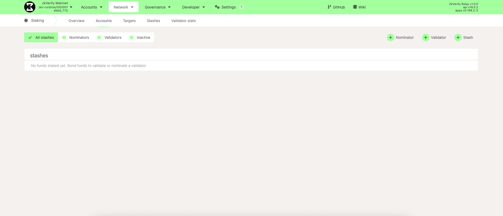
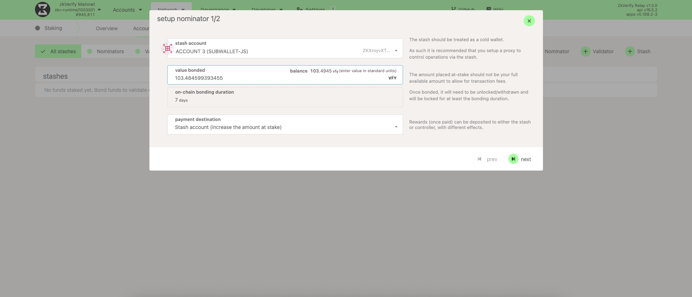
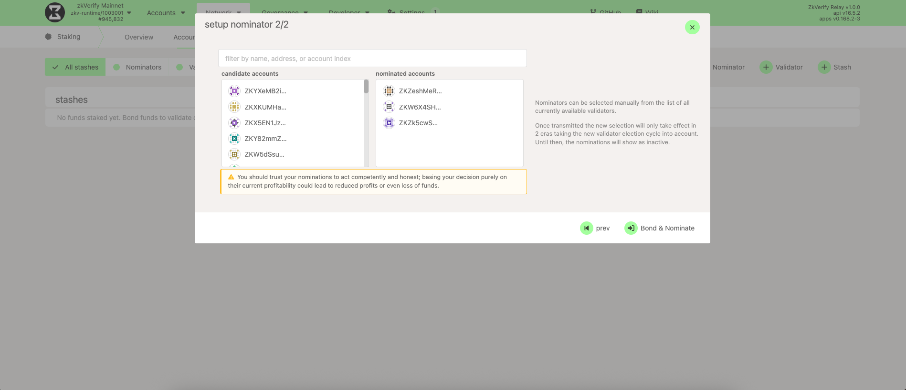
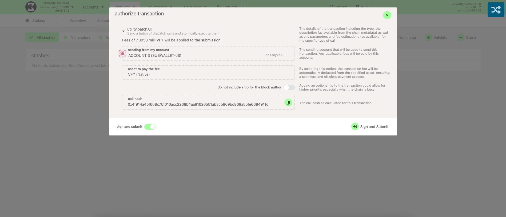

质押 VFY 可选 SubWallet 或 PolkadotJS。

### Option 1: Staking with SubWallet (recommended)

最友好的方式是使用 SubWallet 浏览器插件，可直接在钱包内提名验证人。

[SubWallet 提供完整教程，涵盖：](https://docs.subwallet.app/main/extension-user-guide/earning/direct-nomination/start-staking)

- 选择验证人集合
- Bond 你的代币
- 监控奖励与派发

建议按其指南操作。

[观看我们关于 SubWallet 质押的视频。](https://youtu.be/cBQUoEzr3ZM)

### Option 2: Staking with PolkadotJS (advanced)

访问 [PolkadotJS](https://polkadot.js.org/apps/?rpc=wss%3A%2F%2Fzkverify-volta-rpc.zkverify.io#/explorer)，进入 `Network → Staking → Accounts`，点击 `+ Nominator` 开始。PolkadotJS 是包括 zkVerify 在内的 Substrate 标准界面。

选择提名账户，输入质押数量并选择奖励接收账户。Bond 会锁定代币，仍归你所有，但需解锁后才可转移。填好后点击 `Next`。

查看活跃与待选验证人列表，选择你信任的验证人——若被惩罚，提名人也可能受损。建议多选以分散风险并提升被选概率。准备好后点击 `Bond & Nominate`。

最后点击 `Sign and Submit` 完成提名。

:::warning
目前成为提名人至少需质押 **10 VFY**。最新数值可在 `Developer → Chain State → staking → minNominatorBond` 点击 `+` 查询。
:::

