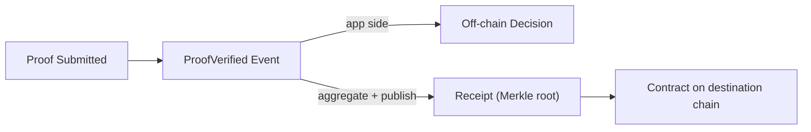

zkVerify 的两种模式是：verify-only 和 verify + aggregate。先把两条路径各自讲清楚，再对比它们的边界。

verify-only 的核心是“验证结果留在应用侧”。proof 在 zkVerify 上验证通过后会产生 `ProofVerified` 事件，你的系统可以直接消费这个结果来驱动权限、结算或审计逻辑，不需要把任何内容发布到目标链。对工程来说，这条路径的重点是：你只需要把 proof 验证跑通，不必承担链上合约消费的依赖。

verify + aggregate 的核心是“验证结果要被链上合约信任”。验证通过后会进入聚合流程，生成 receipt（Merkle root），再由 relayer 发布到目标链上的合约。合约侧消费的是 receipt，而不是重新验证 proof。这条路径意味着你要把验证结果变成链上可引用的数据。

两者的差别只有一个：验证结果最终被谁消费。应用侧消费就止步于 `ProofVerified`，链上消费就必须走 receipt 发布。

zkVerify 的 receipt 本质是已验证 proofs 的 Merkle root。它之所以重要，是因为合约端不会重新跑完整验证，而是读取 receipt 来确认结果来自 zkVerify。这个差异会直接影响你的系统边界：你是在应用层消费验证信号，还是在链上消费聚合后的证明结果。

VFlow 是 zkVerify 面向 EVM 世界的系统 Parachain，用来把 VFY 桥接到 EVM 链。它不是“必须依赖”，但它解释了为什么很多 EVM 场景会选择 verify + aggregate：最终消费端在链上。



下面是一个最小的工程处理示例，强调“事件驱动”和“是否进入 receipt 发布”这个分支点：

```text
on ProofVerified(statement):
  if consumer_is_onchain:
    wait for receipt published by relayer
    contract consumes receipt
  else:
    handle result in application
```

最容易踩的坑是把“验证通过”当成“链上可用”。症状是 proof 已验证，但合约端没有可验证的结果。原因是没有进入 receipt 发布路径。解决办法是先明确消费端是否在链上，再决定是否需要 verify + aggregate。
