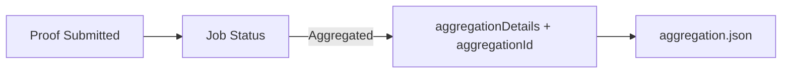

这一节只做一件事：让你看到 verify + aggregate 的输出形态。你不用改 proving 侧，也不用换 proof。你只需要在 Kurier 的 job-status 上等到状态变成 `Aggregated`，然后把返回的数据保存下来。

最直观的理解是把这一步当作“拿到收据”。proof 通过验证不代表你已经拿到可消费的结果，只有进入聚合并拿到 `aggregationDetails`，后面的系统才有足够的材料去证明“这条 proof 确实被包含在聚合里”。

在 Kurier 路线上，`Aggregated` 出现时，返回体会包含 `aggregationDetails` 和 `aggregationId`。一个最小的写入示例如下：

```ts
if (jobStatusResponse.data.status === "Aggregated") {
  fs.writeFileSync(
    "aggregation.json",
    JSON.stringify({
      ...jobStatusResponse.data.aggregationDetails,
      aggregationId: jobStatusResponse.data.aggregationId
    })
  )
}
```

`aggregationDetails` 里最关键的字段是这些，它们描述了 receipt、叶子位置和 Merkle 证明所需的信息：

```json
{
  "receipt": "0x...",
  "receiptBlockHash": "0x...",
  "root": "0x...",
  "leaf": "0x...",
  "leafIndex": 6,
  "numberOfLeaves": 8,
  "merkleProof": ["0x...", "0x..."]
}
```

你可以把它理解成“打包凭证”：receipt 是这批证明的根，leaf 和 merkleProof 是你那一条 proof 的位置说明。这些字段会在后面的链上消费里派上用场。

> 📌 Note: 只有当状态进入 `Aggregated`，你才会拿到 `aggregationDetails`。

下面这张图把数据流画出来，帮你记住要等到哪一步才有 receipt：



如果你只是做 verify-only，这一步可以跳过；但一旦你要让链上合约消费结果，这一步就是你必须拿到的“收据”。
