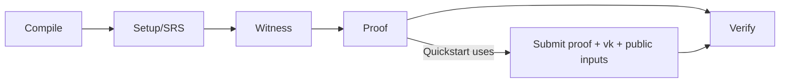

这一页的目的不是重新讲概念，而是把 Quickstart 的动作翻译成“系统实际发生了什么”。你刚刚跑通的流程，其实只覆盖了完整生命周期里的一小段，但对工程判断已经够用了。

先看发生了哪些步骤。你准备了 proof、vk 和 public inputs，然后把它们提交到 zkVerify。链上验证成功后，会触发 `ProofVerified` 事件，这就是你在 Quickstart 里看到的“验证成功”。从生命周期角度看，这对应的是“Proof 生成”和“Verify”两个环节，中间的编译、setup、witness 都在你的 proving 工具链里完成了，只是你在 Quickstart 里没有展开。

下面这张图把 Quickstart 和完整生命周期的关系对齐一下：

再看角色分工。Producer 负责写电路或程序并定义 vk 的来源，这一步在 Quickstart 之前就完成了。Prover 是生成 proof 的一方，通常在用户或客户端侧完成。Verifier 是 zkVerify，它接收 proof、vk 和 public inputs，验证成功后产生 `ProofVerified` 事件。

可以用一个简单的责任表格记住这三类角色：

| 角色 | 负责什么 | Quickstart 里在哪出现 |
| --- | --- | --- |
| Producer | 定义电路/程序与 vk | 在你准备 vk 时隐含出现 |
| Prover | 生成 proof | 在你提交 proof 前完成 |
| Verifier | 验证 proof | zkVerify 上触发 `ProofVerified` |

最容易误解的是把 zkVerify 当成 Prover。症状是一直在寻找“生成 proof 的接口”。原因是把验证层当成证明层。正确理解是：zkVerify 只验证，不生成 proof。

下一章会把“Proof 生成之前发生的事情”和“验证之后发生的事情”讲清楚，这样你能把 Quickstart 放回到完整系统里。
