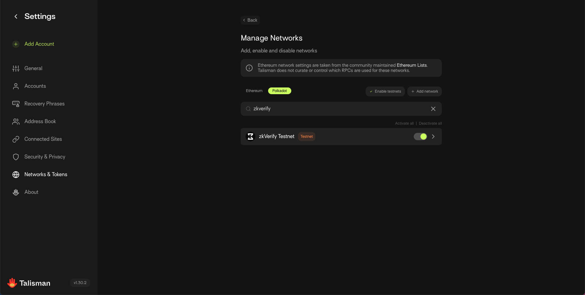
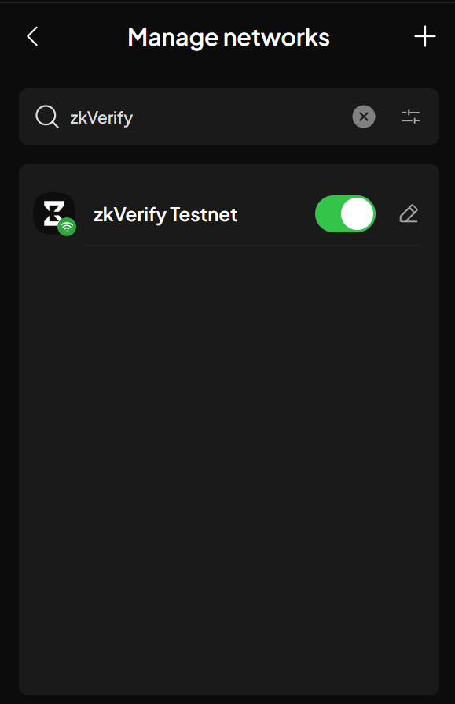

import Tabs from '@theme/Tabs';
import TabItem from '@theme/TabItem';

# 连接钱包

## 推荐钱包

### SubWallet

一款覆盖 Polkadot、Substrate 与 Ethereum 的综合钱包。
SubWallet 可在 150+ 网络间管理资产，支持硬件钱包、轻客户端、MetaMask 兼容等，满足多种使用习惯与需求。

https://www.subwallet.app/

### Talisman

Talisman 提供安全、易用的资产管理与 dApp 交互体验，覆盖 Polkadot 与 Ethereum 生态。支持多网络、NFT 管理及硬件钱包，是一体化的钱包方案。

https://www.talisman.xyz/

## 通过 Polkadot-JS 连接 zkVerify 主网 / 测试网

本节讲解如何在 [Polkadot-JS](https://polkadot.js.org/apps/#/explorer) 网页端连接 zkVerify 主网或测试网。

### 基于 Substrate 的钱包

Substrate 钱包原生支持 zkVerify 及其他 Substrate 链，在质押、治理、多账户管理等功能上支持最全面。

#### SubWallet

1.  **安装 SubWallet**：在 [SubWallet 官网](https://subwallet.app/)获取浏览器扩展。
2.  **创建或导入账户**：创建新账户，或用助记词导入现有账户。
3.  **连接 Polkadot-JS**：
      * 打开 [Polkadot-JS 界面](https://polkadot.js.org/apps/#/explorer)。
      * SubWallet 会弹出授权窗口。
      * 勾选要连接的账户。
      * 点击 `Approve` / `Connect` 授权。
4.  **验证连接**：在 `Accounts` 标签页可看到账户，带有 “SUBWALLET-JS” 标识。

连接 zkVerify 主网 / 测试网：
1.  点击左上角当前网络图标（默认 Polkadot）打开侧栏。
2.  在列表中找到 `zkVerify` 并点击。
3.  点击侧栏顶部的 `Switch`，界面会重载并连接到所选网络。

### EVM 钱包

<u>重要：Metamask 不适用于原生 Substrate 场景。</u> 仅支持 EVM 的钱包（如 Metamask）**无法**与 Polkadot-JS 的原生功能交互。**强烈建议**使用 **SubWallet**（或 Talisman）等多链钱包，兼容 Substrate 与 EVM 网络，提供一致体验。

你的 EVM 地址（如 `0x...`）与原生 Substrate 地址（如 `5...` 或 `xp...`）格式不同。在连接 EVM 兼容平行链（如 VFlow）时，可在 `Accounts` 标签页查看。

**提示**：如果已连接钱包但未显示账户，尝试：

- **刷新页面**：简单刷新常能解决。
- **检查钱包权限**：在扩展中确认已允许连接 Polkadot-JS。
- **切换网络**：先切换到其他网络再切回 zkVerify，可强制重新检测账户。

## 连接 zkVerify 网络

下方是主网与测试网的 zkVerify RPC 与 Explorer 地址，可用于配置钱包并通过推荐的浏览器钱包与链交互：

<Tabs groupId="networks">
<TabItem value="mainnet" label="Mainnet">
| <!-- -->                  | <!-- -->                             |
| ------------------------- | ------------------------------------ |
| zkVerify RPC URL  | wss://zkverify-rpc.zkverify.io        |
| zkVerify Explorer | https://zkverify.subscan.io |
</TabItem>
<TabItem value="testnet" label="Testnet">
| <!-- -->                  | <!-- -->                             |
| ------------------------- | ------------------------------------ |
| zkVerify Testnet RPC URL  | wss://zkverify-volta-rpc.zkverify.io        |
| zkVerify Testnet Explorer | https://zkverify-testnet.subscan.io/ |
</TabItem>
</Tabs>

按以下指引使用这些参数配置钱包，开始探索 zkVerify 测试网。

### 使用 Talisman

1. 打开 Settings。
2. 选择 Network & Tokens。
3. 点击 Manage Networks。
4. 找到 Polkadot。
5. 搜索 “zkVerify Testnet”，开启开关。

### 使用 SubWallet

1. 打开 Settings（左上角图标）。
2. 选择 Manage Networks。
3. 在列表中搜索 “zkVerify Testnet”。
4. 点击对应按钮启用。

## 获取 $tVFY zkVerify 测试网代币

前往 [测试网水龙头](https://zkverify-faucet.zkverify.io/)，提交邮箱与钱包地址，24 小时内可收到 $tVFY。

感谢参与测试！如需帮助，欢迎在 [Discord](https://discord.gg/zkverify) 联系我们。
