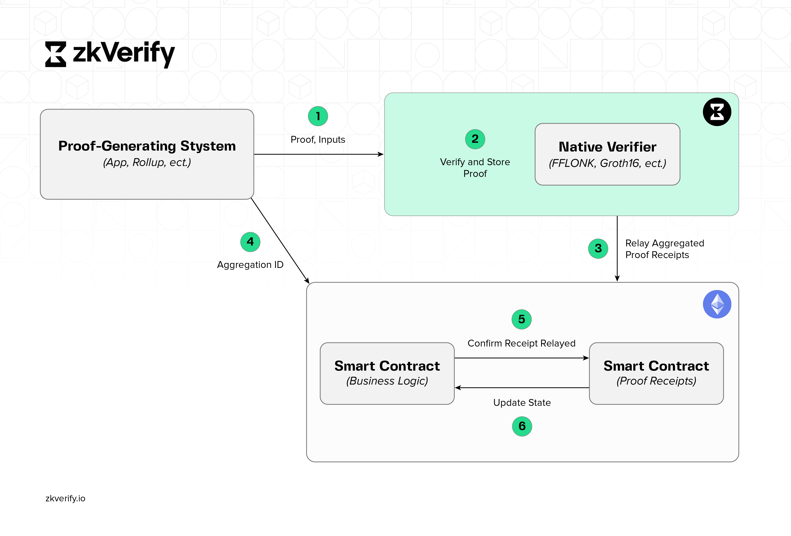
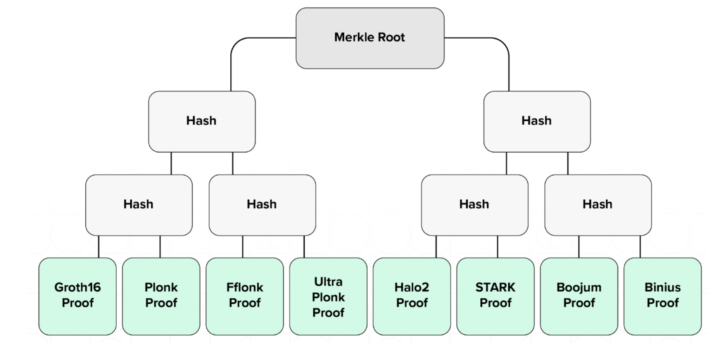

本指南介绍如何使用用于 ZK 证明验证的模块化区块链 [zkVerify](https://zkverify.io/)。集成后，dApp 可以利用零知识证明提升安全性与功能。

## 高层架构

下图展示了 zkVerify 集成到典型 ZK 应用流程的方式。证明验证职责完全交给 zkVerify，结算链上只存储聚合结果（小哈希）。

1. **证明生成系统：** 可以是任意应用（如 zkRollup 或 zkApplication），生成零知识证明来说明某计算已完成。图中示例是链上应用，但也可以是 web2 应用。

2. **验证并存储证明：** 通过 RPC 向 zkVerify 提交证明，进入 mempool 后由接收节点验证，并随提议区块传播全网；共识过程中各节点验证，达成共识后区块上链存储。

3. **中继证明聚合：** 当验证数量足够（或达到设定时间）后，按 domain ID 聚合。聚合是包含以证明为叶子的 Merkle 树根的数字签名消息。它虽非 ZK 证明，但可作为密码学证明，供合约客户端用 Merkle 证明在链上验证，以事件形式出现在包含该证明的区块中。

  

  

    <strong>图示</strong>：zkVerify Merkle 树，叶子为不同证明类型，在<strong>异构证明系统</strong>间实现自然聚合。
  

4. **Aggregation ID：** zkVerify 生成的唯一标识，便于 zkApplication 在合约中快速查询验证结果。

5. **确认聚合：** L1 上的 zkApp 合约可通过 Merkle 证明检查 zkVerify 合约，确认证明已被验证；也可根据实现通过回调触发后续动作。

6. **更新状态：**（可选）对应 zkRollup 等场景需更新状态，可通过回调或应用直接读取 L1 上 zkVerify 合约完成。

