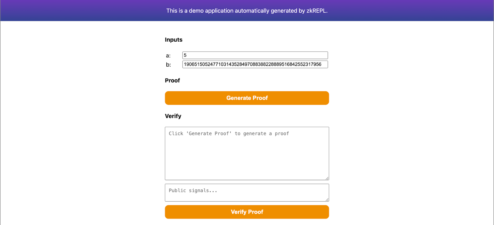
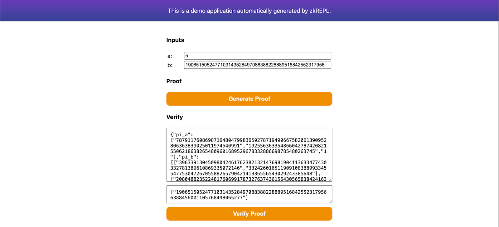

import Tabs from '@theme/Tabs';
import TabItem from '@theme/TabItem';

本指南介绍如何生成可由 [zkVerify](https://zkverify.io/) 验证的兼容证明。可通过下方标签查看各证明类型的操作步骤。

<Tabs groupId="generate">

<TabItem value="groth16" label="Groth16">
我们将用 Circom 实现一个简单的哈希验证电路，并通过 zkVerify 验证。电路接受一个私有输入和一个公共输入，检查公共输入是否等于私有输入的 Poseidon 哈希。

## 步骤

- 编写 circom 电路，下载产物并生成证明
- 在 zkVerify 注册 verification key
- 验证 zk 证明并获取证明凭证
- 在以太坊上验证证明凭证

本教程使用对新手友好的 [zkRepl](https://zkrepl.dev/) 创建电路，不深入 Circom DSL，只展示必要代码。电路包含一个公共输入和一个私有输入，使用 Poseidon 哈希；需从 circomlib 引入相关库。

电路示例如下：

```circom
pragma circom 2.1.6;


include "circomlib/poseidon.circom";
template Example () {

   // Getting the inputs needed for our circuit
   signal input a; // Actual Message
   signal input b; // Poseidon hash of the message

   component hash = Poseidon(1); // Creating our Poseidon component with one input
   hash.inputs[0] <== a;
   log(hash.out);
   assert(b == hash.out); // Checking if the input hash is same as calculated hash
}
component main { public [ b ] } = Example();
```

在 zkRepl 可生成用于证明的电路产物。编译并生成产物时需提供初始输入，修改下方注释的输入片段即可：

```circom
/* INPUT = {
   "a": "5",
   "b": "19065150524771031435284970883882288895168425523179566388456001105768498065277"
} */
```

在 zkRepl 编译电路并获取产物。生成证明时，点击结果页的 groth16 选项，获取生成证明所需的 snarkjs 嵌入。下载 main.groth16.html 作为证明生成器，用浏览器打开即可。



在页面填写输入并生成证明，将 proof 保存为 proof.json，公共信号保存为 public.json，提交 zkVerify 验证时会用到。同时下载 main.groth16.vkey.json。


</TabItem>

<TabItem value="ultrahonk" label="Ultrahonk">
我们将按照 Noir Lang 的快速入门生成 UltraHonk 证明，并在 zkVerify 上验证。不会深入 Noir 细节，重点是高效验证。

## 步骤

- 使用 noirup 安装 Noir，使用 bbup 安装 bb（Barretenberg Backend）
- 生成 Noir UltraHonk 证明
- 用 Bash 将 proof、vk、public inputs 转为所需 hex 格式
- 在 zkVerify 验证并获取证明凭证
- 在以太坊验证证明凭证

先用 noirup 安装 Noir 工具链，并安装 Noir 使用的 Barretenberg Backend。执行：

1. 运行以下命令安装 `noirup`：

```bash
curl -L https://raw.githubusercontent.com/noir-lang/noirup/refs/heads/main/install | bash
```

2. 运行 `noirup` 安装最新版 Noir Toolkit：

```bash
noirup
```

3. 运行以下命令安装 `bbup`：

```bash
curl -L https://raw.githubusercontent.com/AztecProtocol/aztec-packages/refs/heads/master/barretenberg/bbup/install | bash
```

:::warning
当前 verifier 兼容 `bb`/`bb.js` 生成的 Noir 证明版本在 `v0.84.0` 及以上、不包含 `v0.86.*`。
:::

4. 使用 `bbup` 安装 Barretenberg Backend：

```bash
bbup -v <version>
```

5. 创建 hello_world Noir 项目：

```bash
nargo new hello_world
```

执行完上述命令后即可得到 hello-world 示例项目，更多见 [Noir docs](https://noir-lang.org/docs/getting_started/quick_start)。接下来为 hello_world 生成证明。

生成证明前先创建 `Prover.toml`，存放 hello_world 电路输入。可手动创建或运行 `nargo check` 生成，填入：

```toml
x = "1"
y = "2"
```

执行电路获取 witness，用于生成证明和 vk：

```bash
nargo execute
```

获得 witness 后，用 `bb` 生成 proof 与 vk。UltraHonk prover 有 ZK 与 Plain 两种：ZK 略慢但零知识，Plain 略快但可能泄露 witness 信息。根据需求选择：

<Tabs groupId="ultrahonk-prover-options">
<TabItem value="ZK" label="ZK">

```bash
# To generate zero-knowledge proof
bb prove -s ultra_honk -b ./target/hello_world.json -w ./target/hello_world.gz -o ./target --oracle_hash keccak --zk
```

</TabItem>
<TabItem value="Plain" label="Plain">

```bash
# To generate a plain proof
bb prove -s ultra_honk -b ./target/hello_world.json -w ./target/hello_world.gz -o ./target --oracle_hash keccak
```

</TabItem>
</Tabs>

无论选择哪种，生成 `vk` 相同：

```bash
# To generate vk
bb write_vk -s ultra_honk -b ./target/hello_world.json -o ./target --oracle_hash keccak
```

完成后，`target` 目录会有 `proof`、`public_inputs`、`vk`，用于验证。最后将其转换为 zkVerify 直接使用的格式。zkVerify 支持两种 UltraHonk 证明，但需在转换时通过 `PROOF_TYPE` 指定 `ZK` 或 `Plain`。

运行以下脚本将三文件转为 hex：

```bash
#!/usr/bin/env bash

PROOF_TYPE="ZK"                          # Set to "Plain" if you are using the non-zk variant of UltraHonk
PROOF_FILE_PATH="./target/proof"         # Adjust path depending on where the Noir-generated proof file is
VK_FILE_PATH="./target/vk"               # Adjust path depending on where the Noir-generated vk file is
PUBS_FILE_PATH="./target/public_inputs"  # Adjust path depending on where the Noir-generated public_inputs file is

# You may ignore these:
ZKV_PROOF_HEX_FILE_PATH="./target/zkv_proof.hex"
ZKV_VK_HEX_FILE_PATH="./target/zkv_vk.hex"
ZKV_PUBS_HEX_FILE_PATH="./target/zkv_pubs.hex"

# Convert proof to hexadecimal format
{
  if [ -f "$PROOF_FILE_PATH" ]; then
    PROOF_BYTES=$(xxd -p -c 256 "$PROOF_FILE_PATH" | tr -d '\n')
    printf '`{\n    "%s:" "0x%s"\n}`\n' "$PROOF_TYPE" "$PROOF_BYTES" > "$ZKV_PROOF_HEX_FILE_PATH"
    echo "✅ 'proof' hex file generated at ${ZKV_PROOF_HEX_FILE_PATH}."
  else
    echo "❌ Error: Proof file '$PROOF_FILE_PATH' not found. Skipping." >&2
  fi
}

# Convert vk to hexadecimal format
{
  if [ -f "$VK_FILE_PATH" ]; then
    printf "\"0x%s\"\n" "$(xxd -p -c 0 "$VK_FILE_PATH")" > "$ZKV_VK_HEX_FILE_PATH"
    echo "✅ 'vk' hex file generated at ${ZKV_VK_HEX_FILE_PATH}."
  else
    echo "❌ Error: Verification key file '$VK_FILE_PATH' not found. Skipping." >&2
  fi
}

# Convert public inputs to hexadecimal format
{
  if [ -f "$PUBS_FILE_PATH" ]; then
    xxd -p -c 32 "$PUBS_FILE_PATH" | sed 's/.*/"0x&"/' | paste -sd, - | sed 's/.*/[&]/' > "$ZKV_PUBS_HEX_FILE_PATH"
    echo "✅ 'pubs' hex file generated at ${ZKV_PUBS_HEX_FILE_PATH}."
  else
    echo "❌ Error: Public inputs file '$PUBS_FILE_PATH' not found. Skipping." >&2
  fi
}

```

</TabItem>

<TabItem value="ultraplonk" label="Ultraplonk">
本节略，原文未提供额外步骤，可参考 UltraHonk 转换与提交流程，使用相应的 Ultraplonk 生成器与输入。

我们将使用 Noir Lang 的快速入门生成 UltraPlonk proof，并在 zkVerify 上验证。这里不会深入讲解 Noir 的实现细节，重点是如何高效地在 zkVerify 上验证这些 proof。

## 步骤

- 使用 `noirup` 安装 Noir，并使用 `bbup` 安装 bb（Barretenberg Backend）
- 生成 Noir UltraPlonk proof
- 使用 Noir-CLI 将 proof 和 vk 转换为所需的 hex 格式
- 在 zkVerify 上验证 proof 并获得 proof receipt
- 在以太坊上验证 proof receipt

开始本教程前，首先需要用 `noirup` 安装 Noir 工具链。为了生成 proof，还需要安装 Noir Toolkit 使用的 Barretenberg Backend。请执行以下命令安装这些依赖：

1. 运行以下命令安装 `noirup`：

```bash
curl -L https://raw.githubusercontent.com/noir-lang/noirup/refs/heads/main/install | bash
```

2. 运行 `noirup` 安装最新版 Noir Toolkit：

```bash
noirup
```

3. 运行以下命令安装 `bbup`：

```bash
curl -L https://raw.githubusercontent.com/AztecProtocol/aztec-packages/refs/heads/master/barretenberg/bbup/install | bash
```

:::warning
Starting from [bbup v.0.87.0](https://github.com/AztecProtocol/aztec-packages/pull/13800) Ultraplonk has been officially deprecated.
To keep submitting Noir proofs via zkVerify, please switch to a previous bbup version(recommended 0.76.4).
You can do this via the command:
`bbup -v <version>`
:::

4. 运行 `bbup` 安装 Barretenberg Backend：

```bash
bbup -v <version>
```

5. 使用以下命令创建 `hello_world` Noir 项目：

```bash
nargo new hello_world
```

执行完以上命令后，你就创建好了 hello-world 示例 Noir 项目。想进一步了解这个项目，可以阅读 [Noir docs](https://noir-lang.org/docs/getting_started/quick_start)。接下来我们会为 `hello_world` 项目生成 proof。

要生成 proof，首先需要创建一个 `Prover.toml` 文件，用来保存 `hello_world` Noir 电路的输入。请按下列内容填写：

```toml
x = "1"
y = "2"
```

接着执行 `hello_world` 电路并获得 witness，它会用于生成 proof 和 vk。执行以下命令：

```bash
nargo execute
```

生成 witness 后，就可以用 `bb` 工具生成 proof 和 vk。执行以下命令生成所需文件：

```bash
# To generate proof
bb prove -b ./target/hello_world.json -w ./target/hello_world.gz -o ./target/proof

# To generate vk
bb write_vk -b ./target/hello_world.json -o ./target/vk

```

执行完这些命令后，你会在 `target` 目录下得到 `proof` 和 `vk` 两个文件，后续验证会用到它们。
</TabItem>

<TabItem value="risc-zero" label="Risc Zero">
请结合 Risc Zero 官方教程生成证明，之后在 zkVerifyJS 或 PolkadotJS 提交时按 Risc Zero 选项填写 proof、image_id 与 public inputs，并指定 Domain ID。

本教程将带你完成一个 Risc0 zkVM 应用的构建过程。

应用构建完成后，你可以在本地传入不同输入运行它，它会返回一份代码执行证明。之后你可以把这份 proof 提交到 zkVerify Mainchain，并检查它是否被正确验证并写入区块。

如果你想进一步了解 zkVM 应用是什么，可以阅读 Risc0 文档中的 [这一节](https://dev.risczero.com/api/zkvm/)。

## 前置条件

- Risc0 安装前置要求：参考 [这些步骤](https://dev.risczero.com/api/zkvm/install#prerequisites)。
- Risc0 安装方法：参考 [这些步骤](https://dev.risczero.com/api/zkvm/install#install)。
- 机器要求：16 GB RAM。

:::tip[**Toolchain version**]

注意：本教程基于 Risc0 toolchain `2.2.0` 版本编写。大概率也可以使用更新版本，但如果遇到问题，可以显式切换到该版本：`rzup --version 2.2.0`。

:::

## 构建应用

在本教程中，你将构建一个应用：它接收一个字符串输入，对其执行 sha256 哈希，并把哈希结果作为输出返回。借助 Risc0 zkVM 的零知识特性，你可以证明自己知道某个输入能产生该输出，而无需公开输入本身。这个场景在证明敏感数据的所有权时很有用，例如密码或私钥。

:::tip[**Don't get confused with terminology!**]

请不要混淆 _application inputs_ 和 _verification public inputs_。运行应用时，默认你处于私有环境，可以提供任意 application inputs，并且这些输入应保持私密；运行结束后，你会得到执行 proof 和执行输出。输出可以安全地分享给其他人，因为它们会成为验证阶段的 public inputs。

:::

要构建这个应用，请按以下步骤进行：

- 在终端中初始化一个新的 Risc0 项目：

  ```bash
  cargo risczero new hasher --guest-name hasher_guest
  cd hasher
  ```

  这将成为你的工作目录。

- 修改 host 程序（可将其理解为运行 zkVM 的那部分代码）：

  - Open the file `hasher/host/Cargo.toml` with a text editor and add at the bottom the following lines:

    ```rust
    serde_json = "1.0.137"
    ciborium = "0.2.2"
    hex = "0.4.3"
    ```

  - Open the file `hasher/host/src/main.rs`. After all the imports add the following:

    ```rust
    use serde::Serialize;
    use std::{fs::File, io::Write};
    #[derive(Serialize)]
    pub struct Proof{
        proof: String,
        image_id: String,
        pub_inputs: String
    }
    ```

    And then replace these lines:

    ```rust
    // For example:
    let input: u32 = 15 * u32::pow(2, 27) + 1;
    ```

    with the following code:

    ```rust
    let input: String = std::env::args().nth(1).unwrap();
    println!("Input argument is: {}", input);
    ```

    and these lines:

    ```rust
    // TODO: Implement code for retrieving receipt journal here.
    // For example:
    let _output: u32 = receipt.journal.decode().unwrap();
    ```

    with the following code:

    ```rust
    let mut bin_receipt = Vec::new();
    ciborium::into_writer(&receipt, &mut bin_receipt).unwrap();
    let image_id_hex = hex::encode(
        HASHER_GUEST_ID
            .into_iter()
            .flat_map(|v| v.to_le_bytes().into_iter())
            .collect::<Vec<_>>(),
    );
    let receipt_journal_bytes_array = &receipt.journal.bytes.as_slice();
    let proof = Proof{
        proof: "0x".to_string()+&hex::encode(&bin_receipt),
        image_id: "0x".to_string()+&image_id_hex,
        pub_inputs: "0x".to_string()+&hex::encode(&receipt_journal_bytes_array)
    };

    let json_string = serde_json::to_string_pretty(&proof).unwrap();
    let mut file = File::create("proof_output.json").unwrap();
    file.write_all(json_string.as_bytes()).unwrap();
    ```

  In this way you have prepared the host to easily receive command-line argument and to save the proof json data in `proof.json`, which will be useful in a later step when you need to submit them on the zkVerify Mainchain.

- Modify the guest program (just consider it as the code whose execution you want to prove and you want other to verify):

  - Open the file `hasher/methods/guest/Cargo.toml` with a text editor and add at the bottom the following line:

    ```rust
    sha2 = "0.10"
    ```

  - Open the file `hasher/methods/guest/src/main.rs` with a text editor and overwrite its content with the following code:

    ```rust
    use risc0_zkvm::guest::env;
    use sha2::{Digest, Sha256};

    fn main() {
        // read the input
        let input: String = env::read();

        let mut hasher = Sha256::new();
        hasher.update(input.as_bytes()); // Update the hasher with the input bytes
        let result = hasher.finalize(); // Get the hash digest
        let output = format!("{:x}", result); // Convert the hash digest to a hexadecimal string

        // write public output to the journal
        env::commit(&output);
    }
    ```

  Just a brief description of the above code: the program input is read, the computation is performed (hashing) and the output is written back.

- From a terminal located at your working directory, build the project with:

  ```bash
  cargo build --release
  ```

## 运行应用

现在你已经可以运行应用了。

在工作目录打开终端，执行以下命令：

```bash
RISC0_DEV_MODE=0 cargo run --release -- "zkVerify is da best!"
```

你可以将 `zkVerify is da best!` 替换成自己想测试的输入。

总结一下，上面的命令会：

- 使用修改后的 host 程序启动一个 Risc0 zkVM。
- 读取你通过命令行参数提供的 application input（这里是 `zkVerify is da best!`）。
- 执行 guest 程序，并生成执行 proof。
- 在终端打印序列化后的 proof 和序列化后的输出。
- 使用 proof 和输出（把输出作为 verification public input）做一次可选的本地验证，作为双重确认。

最后，你需要保存以下内容：

- 序列化后的 proof（`receipt_inner_bytes_array` 字符串）。
- 序列化后的输出（`receipt_journal_bytes_array`）。
- guest 程序的指纹，也就是 image id（`image_id_hex`）。

它们会在后续验证阶段分别作为 proof、public inputs 和 verification key 使用。

现在你已经学会了如何搭建并运行 Risc0 zkVM 应用，可以继续修改 guest 程序代码，尝试调整执行逻辑。
</TabItem>

<TabItem value="sp1" label="SP1">

将 SP1 proof 提交给 zkVerify 的 SP1 verification pallet 之前，需要先生成一个 compressed SP1 proof。
如果你想快速试一遍，可以先按照 [官方 SP1 quickstart guide](https://docs.succinct.xyz/docs/sp1/getting-started/quickstart) 创建一个 fibonacci 示例应用，然后用下面这段代码替换 `script/main.rs`：

```rust
use sp1_sdk::{include_elf, Prover, ProverClient, SP1Stdin};

pub const FIBONACCI_ELF: &[u8] = include_elf!("fibonacci-program");

fn main() {
    // Setup the inputs.
    let mut stdin = SP1Stdin::new();
    let n: u32 = 20;
    stdin.write(&n);

    // Setup the prover client.
    let client = ProverClient::from_env();

    // Setup the program for proving.
    let (pk, vk) = client.setup(FIBONACCI_ELF);

    // Generate the SP1 proof in compressed mode.
    let proof = client
        .prove(&pk, &stdin)
        .compressed()
        .run()
        .expect("failed to generate proof");
}
```
<Tabs groupId="sp1-zkv-sdk">
<TabItem value="with-sdk" label="With sp1_zkv_sdk">

获得 compressed proof 之后，还需要对 proof、verification key 和 public inputs 做后处理，生成 SP1 verification pallet 所需的 `serialized_proof`、`vk_hash` 和 `public_values`。
[`sp1_zkv_sdk`](https://github.com/zkVerify/sp1-verifier/tree/main/sp1-zkv-sdk) crate 提供了完成这些转换的辅助函数。

请在 `script` 目录下的 `Cargo.toml` 中，把下列依赖加入 `[dependencies]`：

```toml
bincode = { version = "2", features = ["serde"] }
sp1-zkv-sdk = { git="https://github.com/zkVerify/sp1-verifier" }
```

然后在代码中加入以下 imports：

```rust
use sp1_zkv_sdk::*; // for the `convert_to_zkv` and `hash_bytes` methods.
use std::{fs::File, io::Write};
use serde::{Deserialize, Serialize};

// Struct of the output we need
#[derive(Serialize, Deserialize)]
struct Output{
    image_id: String,
    pub_inputs: String,
    proof: String
}

// Helper function to get hex strings
fn to_hex_with_prefix(bytes: &[u8]) -> String {
    let hex_string: String = bytes.iter()
        .map(|b| format!("{:02x}", b))
        .collect();
    format!("0x{}", hex_string)
}
```

接着，在 SP1 prover SDK 生成 proof 之后，补上以下代码：

```rust
// Convert proof and vk into a zkVerify-compatible proof.
let SP1ZkvProofWithPublicValues {
    proof: shrunk_proof,
    public_values,
} = client
    .convert_proof_to_zkv(proof, Default::default())
    .unwrap();
let vk_hash = vk.hash_bytes();

// Serialize the proof
let serialized_proof = bincode::serde::encode_to_vec(&shrunk_proof, bincode::config::legacy())
    .expect("failed to serialize proof");

// Convert to required struct
let output = Output{
    proof: to_hex_with_prefix(&serialized_proof),
    image_id: to_hex_with_prefix(&vk_hash),
    pub_inputs: to_hex_with_prefix(&public_values),
};

// Convert to JSON and store in the file
let json_string = serde_json::to_string_pretty(&output)
    .expect("Failed to serialize to JSON.");

let mut file = File::create("proof.json").unwrap();
file.write_all(json_string.as_bytes()).unwrap();
```

</TabItem>
<TabItem value="without-sdk" label="Without sp1_zkv_sdk">
如果你不想在应用中依赖 `sp1_zkv_sdk`，下面这些小节展示了如何手动完成所需转换。
首先需要在 `script` 目录下的 `Cargo.toml` 的 `[dependencies]` 中加入：
```toml
bincode = { version = "2", features = ["serde"] }
```

然后导入必要模块，并定义一个结构来保存 proof。请在 imports 后加入以下代码：

```rust
use sp1_sdk::HashableKey;   // for the `hash_babybear` method.
use std::{fs::File, io::Write};
use serde::{Deserialize, Serialize};

// Struct of the output we need
#[derive(Serialize, Deserialize)]
struct Output{
    image_id: String,
    pub_inputs: String,
    proof: String
}

// Helper function to get hex strings
fn to_hex_with_prefix(bytes: &[u8]) -> String {
    let hex_string: String = bytes.iter()
        .map(|b| format!("{:02x}", b))
        .collect();
    format!("0x{}", hex_string)
}
```

### Proof

SP1 verification pallet 支持 shrunk STARK proof。下面这段代码可以从 `Proof generation` 小节得到的 `proof` 中生成所需数据。请把它放在 SP1 prover SDK 生成 proof 之后：

```rust
// Extract the inner compressed proof.
let compressed_proof = proof
    .proof
    .try_as_compressed()
    .expect("proof is not compressed");

// Shrink the compressed proof.
let SP1ReduceProof {
    vk,
    proof: shard_proof,
} = client
    .inner()
    .shrink(*compressed_proof, Default::default())
    .expect("failed to shrink");

let input = SP1CompressWitnessValues {
    vks_and_proofs: vec![(vk.clone(), shard_proof.clone())],
    is_complete: true,
};
let proof_with_vk_and_merkle = self.inner().make_merkle_proofs(input);
let zkv_proof = Proof {
    shard_proof,
    vk,
    vk_merkle_proof: proof_with_vk_and_merkle.merkle_val.vk_merkle_proofs[0].clone(),
}

// Serialize the shrunk_proof
let serialized_proof = bincode::serde::encode_to_vec(&zkv_proof, bincode::config::legacy())
  .expect("failed to serialize proof");

```

### Verification Key

SP1 verification pallet 接收通过 `hash_babybear` 方法哈希、并以 little endian bytes 序列化的 verification key。示例如下：

```rust
// `vk` is the verification key obtained from `ProverClient::setup` method.
let vk_hash: [u8; 32] = vk.hash_bytes();
```

### Public Values

SP1 verification pallet 接收以 bytes 向量表示的 public inputs，可以直接从最初的 `SP1ProofWithPublicValues` proof 中提取：

```rust
let public_values = proof.public_values.to_vec();
```

### Storing the output

当所有 proof artifacts 都生成后，我们会把它们写入一个 json 文件，供后续验证使用。请加入以下代码，把这些 artifacts 保存为所需结构：

```rust
let output = Output{
    proof: to_hex_with_prefix(&serialized_proof),
    image_id: to_hex_with_prefix(&vk_hash),
    pub_inputs: to_hex_with_prefix(&public_values),
};

let json_string = serde_json::to_string_pretty(&output)
    .expect("Failed to serialize to JSON.");

let mut file = File::create("proof.json").unwrap();
file.write_all(json_string.as_bytes()).unwrap();
```

</TabItem>
</Tabs>
</TabItem>

<TabItem value="ezkl" label="EZKL">
参考 ezkl 教程生成证明，使用生成的 proof、vk、public inputs，通过 zkVerifyJS 或 PolkadotJS 按 ezkl 选项提交，并选择对应 Domain ID。

我们将使用 zkonduit 的 quickstart guide 生成 EZKL proof，然后在 zkVerify 上完成验证。这里不会展开讲 EZKL 的内部实现，重点放在如何高效地在 zkVerify 上验证这些 proof。

## 步骤

- 安装 EZKL 及其依赖
- 定义模型并导出为 ONNX 格式
- 生成 EZKL proof
- 使用 Bash 将 proof、vk 和 instances（public inputs）转换为所需 hex 格式
- 在 zkVerify 上验证 proof 并获得 proof receipt
- 在以太坊上验证 proof receipt

开始本教程前，首先需要安装 EZKL zkML 库。本教程主要使用 Bash CLI；但在定义示例模型时，会借助 Python3 和 PyTorch。只要你能把模型导出为 `.onnx` 格式，其他框架也同样可行。更多替代方案可参考 zkonduit 提供的 [EZKL documentation](https://docs.ezkl.xyz/getting-started/setup/) 和 [ONNX documentation](https://onnx.ai/onnx/intro/)。建议使用虚拟环境。请执行以下命令安装依赖：

1. 运行以下命令安装 `ezkl`：

```bash
curl https://raw.githubusercontent.com/zkonduit/ezkl/main/install_ezkl_cli.sh | bash
```

2. 安装 ONNX：

```bash
pip install onnx
```

3. 安装 PyTorch：

```bash
pip install torch torchvision
```

4. 定义模型，导出到 `network.onnx`，并创建 `input.json` 文件：

_重要：_ 如果你已经准备好了导出的模型（`network.onnx`）和输入文件（`input.json`），可以完全跳过这一步。

为了说明流程，我们创建一个 Python 脚本，定义一个学习线性函数 $y = 2x + 1$ 的简单模型。文件名就叫 `export_model.py`。

```python
import torch
import torch.nn as nn
import json
import os

# 1. DEFINE THE PYTORCH MODEL
class SimpleModel(nn.Module):
    def __init__(self):
        super(SimpleModel, self).__init__()
        self.linear = nn.Linear(1, 1)
        # Manually set weights to learn y = 2x + 1
        self.linear.weight.data.fill_(2.0)
        self.linear.bias.data.fill_(1.0)

    def forward(self, x):
        return self.linear(x)

# 2. EXPORT TO ONNX
model = SimpleModel()
model.eval()

# Define a dummy input for the ONNX export
dummy_input = torch.randn(1, 1)
onnx_path = "network.onnx"
torch.onnx.export(model, dummy_input, onnx_path, export_params=True, input_names=['input'], output_names=['output'])

print(f"Model exported to {onnx_path}")

# 3. CREATE THE INPUT DATA FILE
# Let's test with an input of x = 2. We expect the output to be 2*2 + 1 = 5
input_data = dict(input_data = [[2.0]])
json_path = "input.json"

with open(json_path, 'w') as f:
    json.dump(input_data, f)

print(f"Input data saved to {json_path}")
```

先在 Bash 中运行 `chmod +x export_model.py` 给脚本执行权限，然后执行 `python3 export_model.py`。脚本完成后，你应该会得到两个文件：`network.onnx` 和 `input.json`。这时就可以开始使用 `ezkl` 了。

5. 生成 Settings：
   首先需要让 `ezkl` 为模型生成初始电路参数。要检查模型并创建这份配置文件，请运行：

```bash
ezkl gen-settings -M network.onnx -O settings.json
```

这一步会生成 `settings.json`。

6. 校准 Settings（可选）：

这一步 _可选_，但很关键，因为它会运行一次模拟前向传播，以确定模型中数值最合适的 fixed-point scaling。实质上，它会微调 `settings.json` 的参数，使之更贴近你的真实模型和数据，从而降低 proof 因算术误差失败的概率。你需要为 `calibrate-settings` 命令提供一个 `calibration.json` 数据文件。该文件的数据形状和结构必须与 `input.json` 保持一致，只是具体数值不同，并且这些数值应具有代表性，而不是随便填的 dummy 数据。`ezkl` 会利用这份数据自动调优电路设置（例如 scales、constraints 和 logrows）。为了简化教程，我们直接使用 `input.json` 作为校准数据文件。执行以下命令开始校准：

```bash
ezkl calibrate-settings -D input.json -M network.onnx --settings-path settings.json
```

这一步会用优化后的参数更新 `settings.json`。

7. 编译模型：

这一步会把神经网络转换成 arithmetic circuit，这是生成 proof 的基础对象。请运行：

```bash
ezkl compile-circuit -M network.onnx --settings-path settings.json --compiled-circuit model.compiled
```

这一步会生成 `model.compiled` 文件，其中包含适用于零知识证明的模型优化格式。

8. 下载对应的 SRS 文件：

你需要根据所使用的 commitment scheme（默认是 KZG）以及 `logrows` 的数量下载相应的 Structured Reference String（SRS）文件。这些信息都写在 circuit settings 文件中。执行以下命令开始下载：

```bash
ezkl get-srs -S settings.json
```

默认情况下，下载的 SRS 会保存在 `~/.ezkl/srs`。

9. 执行 Trusted Setup，生成加密密钥：

执行以下命令：

```bash
ezkl setup -M model.compiled --pk-path pk.key --vk-path vk.key
```

此时你应该已经得到 `pk.key`（prover 使用的 proving key）和 `vk.key`（verifier 使用的 verification key）。

10. 生成 witness：

这一步会根据你的输入数据和编译后的模型生成 witness 文件。直接运行：

```bash
ezkl gen-witness -M model.compiled -D input.json -V vk.key -O witness.json
```

这一步会生成 `witness.json` 文件。

11. 生成 proof：

要利用 witness 和其他 artifacts 生成零知识 proof，请运行：

```bash
ezkl prove -M model.compiled --pk-path pk.key --proof-path proof.json -W witness.json
```

执行后你会得到一个名为 `proof.json` 的 JSON 文件，其中同时包含 proof 和 instances（public inputs）。

12. 生成 VKA：

Reusable EZKL verifier 依赖一个额外 artifact，叫做 Verification Key Artifact（简称 VKA）。生成方法如下：

```bash
ezkl create-evm-vka -S settings.json --vk-path vk.key --vka-path vka.bytes
```

执行后你会额外得到一个 `vka.bytes` 文件。

到这里基本就准备好了。`proof.json` 和 `vka.bytes` 这两个 artifact 已经包含了 zkVerify 验证该 proof 所需的全部信息。最后一步是把其中的数据提取出来，并转换成可直接供 zkVerify 使用的格式。

为此，请执行以下 Bash 命令：

```bash
# Convert vka to hexadecimal format
tail -c +9 vka.bytes | xxd -p | tr -d '\n' | sed 's/.*/`{"vkBytes": "0x&"}`/' > zkv_vk.hex

# Convert proof to hexadecimal format
jq -r '.proof[] | select(type == "number")' proof.json | awk 'BEGIN {printf "\"0x"} {printf "%02x", $1} END {printf "\"\n"}' > zkv_proof.hex

# Convert instances (public inputs) to hexadecimal format
echo "[$(jq -r '.pretty_public_inputs.outputs | flatten | map("\"\(.)\"") | join(", ")' proof.json)]" > zkv_pubs.hex
```

</TabItem>

</Tabs>

生成 proof 后，你可以通过多种方式在 [zkVerify](https://zkverify.io) 上完成验证。推荐的方式是使用 [Kurier](./05-kurier.md)。你也可以任选以下方式之一进行验证：

1. 使用 [Kurier](./05-kurier.md)
2. 使用 [zkVerifyJS package](./06-zkverify-js.md)
3. 使用 [Polkadot.js frontend](https://polkadot.js.org/apps/?rpc=wss%3A%2F%2Fzkverify-volta-rpc.zkverify.io#/extrinsics)
4. 使用 [subxt](https://github.com/paritytech/subxt) Rust crate
