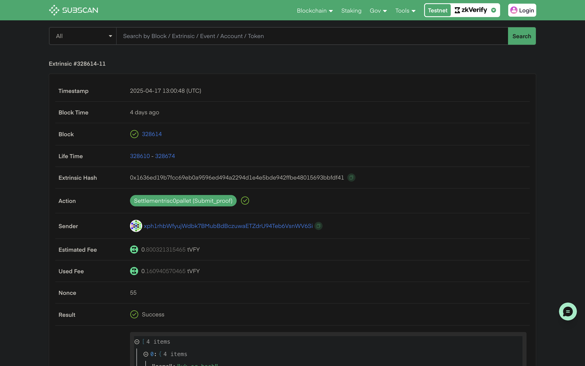
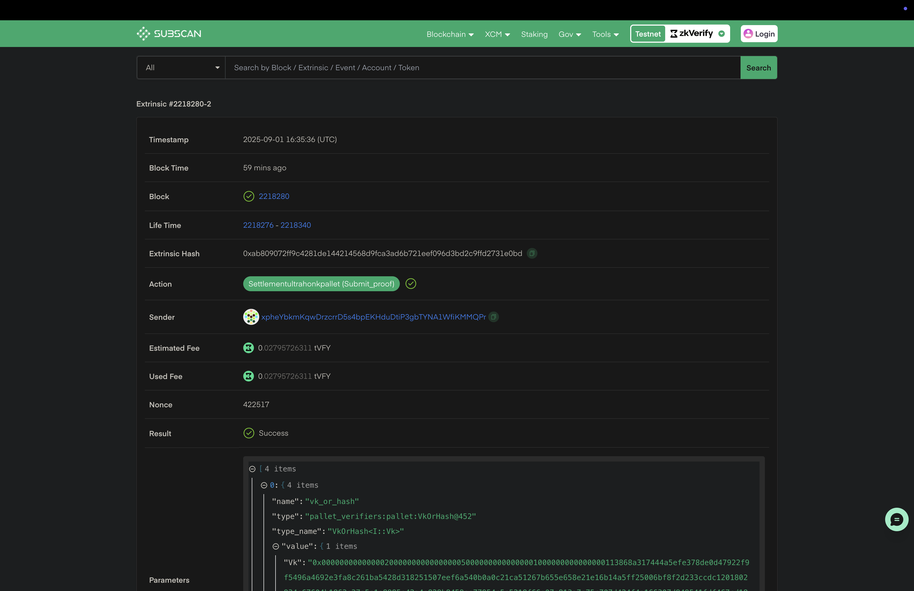
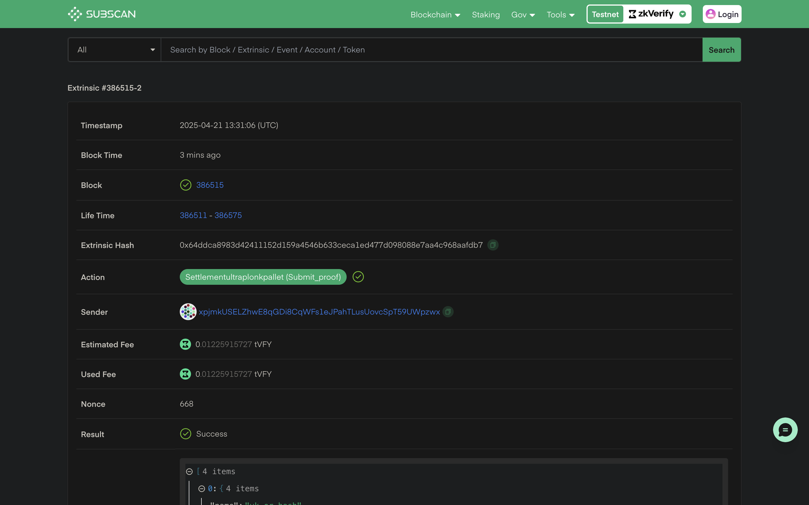
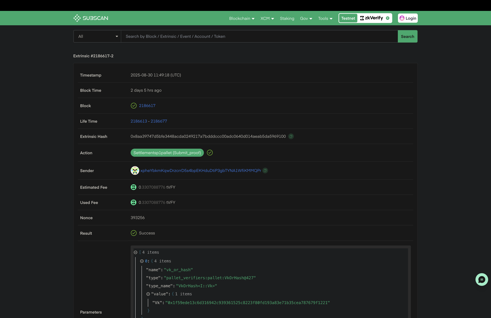
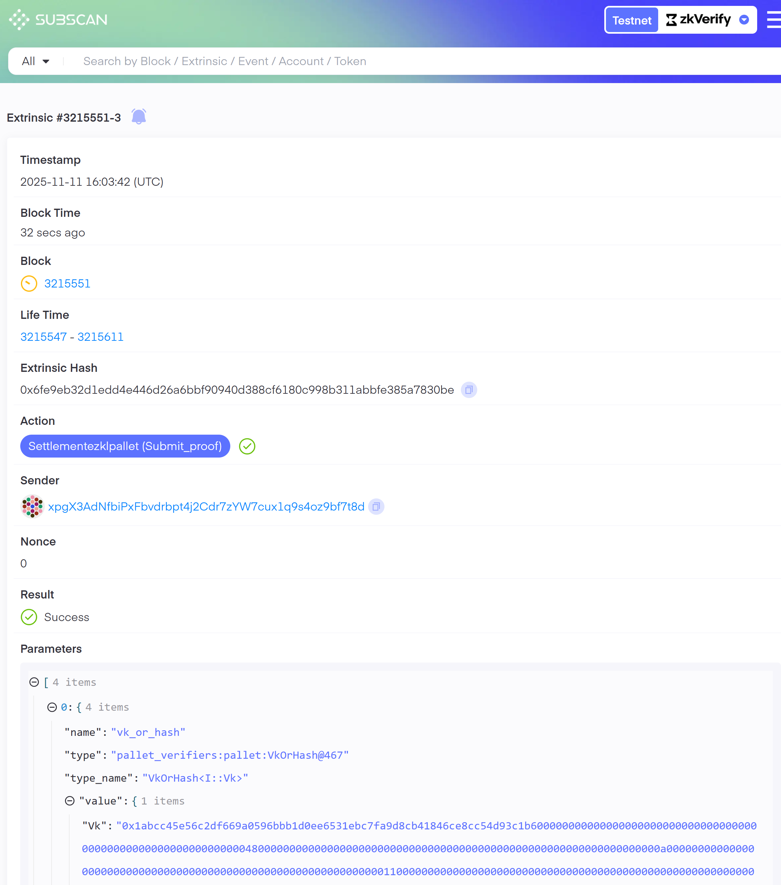

import Tabs from '@theme/Tabs';
import TabItem from '@theme/TabItem';

:::info
本教程使用的全部代码可在 [这里](https://github.com/zkVerify/tutorials/tree/main/zkVerifyJS) 查看。
:::

本教程将使用 zkVerify JS 包验证证明。```zkVerify JS``` 是一个 NPM 包，可方便提交证明、监听事件与获取聚合证明，适用于我们支持的所有证明类型。

:::note
开始前请将 Node JS 升级到最新版本（v24.1.0），可用 ``node -v`` 查看版本。
:::

新建项目并安装 ```zkverify JS```，执行以下命令：

新建目录：
```bash
mkdir proof-submission
```
进入项目目录：
```bash
cd proof-submission
```
初始化 NPM 项目：
```bash
npm init -y && npm pkg set type=module
```
安装 `zkverifyjs` 和 `dotenv`：
```bash
npm i zkverifyjs dotenv
```

创建 ``.env`` 存储 ``SEED PHRASE``，稍后用于发送证明：
```bash
SEED_PHRASE = "this is my seed phrase i should not share it with anyone"
```

新建 ```index.js``` 编写验证逻辑，导入 ```zkVerify JS``` 与 ``dotenv``：

<Tabs groupId="import">
<TabItem value="circom" label="Circom">
```js
import { zkVerifySession, Library, CurveType, ZkVerifyEvents } from "zkverifyjs";
import dotenv from 'dotenv';
dotenv.config();
```
</TabItem>
<TabItem value="r0" label="Risc Zero">
```js
import { zkVerifySession, ZkVerifyEvents, Risc0Version } from "zkverifyjs";
import dotenv from 'dotenv';
dotenv.config();
```
</TabItem>
<TabItem value="ultrahonk" label="Ultrahonk">
```js
import { zkVerifySession, ZkVerifyEvents } from "zkverifyjs";
import dotenv from 'dotenv';
dotenv.config();
```
</TabItem>
<TabItem value="ultraplonk" label="Ultraplonk">
```js
import { zkVerifySession, ZkVerifyEvents } from "zkverifyjs";
import dotenv from 'dotenv';
dotenv.config();
```
</TabItem>
<TabItem value="sp1" label="SP1">
```js
import { zkVerifySession, ZkVerifyEvents } from "zkverifyjs";
import dotenv from 'dotenv';
dotenv.config();
```
</TabItem>
<TabItem value="ezkl" label="Ezkl">
```js
import { zkVerifySession, ZkVerifyEvents } from "zkverifyjs";
import dotenv from 'dotenv';
dotenv.config();
```
</TabItem>
</Tabs>

还需导入此前生成的文件：proof、verification key、public inputs，示例如下：

<Tabs groupId="import-files">
<TabItem value="circom" label="Circom">
```js
import fs from "fs";
const proof = JSON.parse(fs.readFileSync("./data/proof.json"));
const publicInputs = JSON.parse(fs.readFileSync("./data/public.json"));
const key = JSON.parse(fs.readFileSync("./data/main.groth16.vkey.json"));
```
</TabItem>
<TabItem value="r0" label="Risc Zero">
```js
import fs from "fs";
const proof = JSON.parse(fs.readFileSync("../my_project/proof.json")); // Following the Risc Zero tutorial
```
</TabItem>
<TabItem value="ultrahonk" label="Ultrahonk">
```js
import fs from "fs";
const proof = fs.readFileSync('../target/zkv_proof.hex', 'utf-8');
const publicInputs = fs.readFileSync('../target/zkv_pubs.hex', 'utf-8');
const vk = fs.readFileSync('../target/zkv_vk.hex', 'utf-8');
```
</TabItem>
<TabItem value="ultraplonk" label="Ultraplonk">
```js
import fs from "fs";
const bufvk = fs.readFileSync("../target/vk");
const bufproof = fs.readFileSync("../target/proof");
const base64Proof = bufproof.toString("base64");
const base64Vk = bufvk.toString("base64");
```
</TabItem>
<TabItem value="sp1" label="SP1">
```js
import fs from "fs";
const proof = JSON.parse(fs.readFileSync("../my_project/proof.json")); // Following the SP1 tutorial
```
</TabItem>
<TabItem value="ezkl" label="Ezkl">
```js
import fs from "fs";
const proof = fs.readFileSync('../target/zkv_proof.hex', 'utf-8');
const publicInputs = fs.readFileSync('../target/zkv_pubs.hex', 'utf-8');
const vk = fs.readFileSync('../target/zkv_vk.hex', 'utf-8');
```
</TabItem>
</Tabs>

:::info
接下来编写核心逻辑，将证明发送到 zkVerify 验证。以下代码需放在 async main 函数内：
```js
async function main(){
  // Required code
}

main();
```
:::

导入完成后，先用带 $tVFY 的账号在 Volta 测试网上实例化 session：
```js
const session = await zkVerifySession.start().Volta().withAccount(process.env.SEED_PHRASE);
```

然后向 Volta 提交验证请求，传入证明类型、proof、public signals、key，并指定聚合用的 ``domainId``。关于 Domain 与聚合见[此处](../../architecture/04-proof-aggregation/01-overview.md)，按目标链选择 Domain ID（[现有域列表](../../architecture/04-proof-aggregation/05-domain-management.md)）。同时创建事件监听器，在证明被聚合时监听 ``NewAggregationReceipt``：

<Tabs groupId="proof-verification">
<TabItem value="groth16" label="Circom">
```js
let statement, aggregationId;

session.subscribe([
  {
    event: ZkVerifyEvents.NewAggregationReceipt,
    callback: async (eventData) => {
      console.log("New aggregation receipt:", eventData);
      if(aggregationId == parseInt(eventData.data.aggregationId.replace(/,/g, ''))){
        let statementpath = await session.getAggregateStatementPath(
          eventData.blockHash,
          parseInt(eventData.data.domainId),
          parseInt(eventData.data.aggregationId.replace(/,/g, '')),
          statement
        );
        console.log("Statement path:", statementpath);
        const statementproof = {
          ...statementpath,
          domainId: parseInt(eventData.data.domainId),
          aggregationId: parseInt(eventData.data.aggregationId.replace(/,/g, '')),
        };
        fs.writeFileSync("aggregation.json", JSON.stringify(statementproof));
    }
    },
    options: { domainId: 0 },
  },
]);

const {events} = await session.verify()
.groth16({library: Library.snarkjs, curve: CurveType.bn128})
.execute({proofData: {
    vk: key,
    proof: proof,
    publicSignals: publicInputs
}, domainId: 0});
```
</TabItem>
<TabItem value="r0" label="Risc Zero">
```js
let statement, aggregationId;
session.subscribe([
  {
    event: ZkVerifyEvents.NewAggregationReceipt,
    callback: async (eventData) => {
      console.log("New aggregation receipt:", eventData);
      if(aggregationId == parseInt(eventData.data.aggregationId.replace(/,/g, ''))){
        let statementpath = await session.getAggregateStatementPath(
          eventData.blockHash,
          parseInt(eventData.data.domainId),
          parseInt(eventData.data.aggregationId.replace(/,/g, '')),
          statement
        );
        console.log("Statement path:", statementpath);
        const statementproof = {
          ...statementpath,
          domainId: parseInt(eventData.data.domainId),
          aggregationId: parseInt(eventData.data.aggregationId.replace(/,/g, '')),
        };
        fs.writeFileSync("aggregation.json", JSON.stringify(statementproof));
    }
    },
    options: { domainId: 0 },
  },
]);

const {events} = await session.verify().risc0({ version: Risc0Version.V2_1} ) // Mention the R0 version used while proving
.execute({proofData:{
    proof: proof.proof,
    vk: proof.image_id,
    publicSignals: proof.pub_inputs,
}, domainId: 0})
```
</TabItem>
<TabItem value="Ultrahonk" label="Ultrahonk">
```js
let statement, aggregationId;

session.subscribe([
  {
    event: ZkVerifyEvents.NewAggregationReceipt,
    callback: async (eventData) => {
      console.log("New aggregation receipt:", eventData);
      if(aggregationId == parseInt(eventData.data.aggregationId.replace(/,/g, ''))){
        let statementpath = await session.getAggregateStatementPath(
          eventData.blockHash,
          parseInt(eventData.data.domainId),
          parseInt(eventData.data.aggregationId.replace(/,/g, '')),
          statement
        );
        console.log("Statement path:", statementpath);
        const statementproof = {
          ...statementpath,
          domainId: parseInt(eventData.data.domainId),
          aggregationId: parseInt(eventData.data.aggregationId.replace(/,/g, '')),
        };
        fs.writeFileSync("aggregation.json", JSON.stringify(statementproof));
    }
    },
    options: { domainId: 0 },
  },
]);

const {events} = await session.verify()
    .ultrahonk()
    .execute({proofData: {
        vk: vk.split("\n")[0],
        proof: proof.split("\n")[0],
        publicSignals: publicInputs.split("\n").slice(0,-1)
    }, domainId: 0});
```
</TabItem>
<TabItem value="Ultraplonk" label="Ultraplonk">
```js
let statement, aggregationId;

session.subscribe([
  {
    event: ZkVerifyEvents.NewAggregationReceipt,
    callback: async (eventData) => {
      console.log("New aggregation receipt:", eventData);
      if(aggregationId == parseInt(eventData.data.aggregationId.replace(/,/g, ''))){
        let statementpath = await session.getAggregateStatementPath(
          eventData.blockHash,
          parseInt(eventData.data.domainId),
          parseInt(eventData.data.aggregationId.replace(/,/g, '')),
          statement
        );
        console.log("Statement path:", statementpath);
        const statementproof = {
          ...statementpath,
          domainId: parseInt(eventData.data.domainId),
          aggregationId: parseInt(eventData.data.aggregationId.replace(/,/g, '')),
        };
        fs.writeFileSync("aggregation.json", JSON.stringify(statementproof));
    }
    },
    options: { domainId: 0 },
  },
]);

const {events} = await session.verify()
    .ultraplonk({numberOfPublicInputs: 2}) // Make sure to replace the numberOfPublicInputs field as per your circuit 
    .execute({proofData: {
        vk: base64Vk,
        proof: base64Proof,
    }, domainId: 0});
```
</TabItem>
<TabItem value="sp1" label="SP1">
```js
let statement, aggregationId;

session.subscribe([
  {
    event: ZkVerifyEvents.NewAggregationReceipt,
    callback: async (eventData) => {
      console.log("New aggregation receipt:", eventData);
      if(aggregationId == parseInt(eventData.data.aggregationId.replace(/,/g, ''))){
        let statementpath = await session.getAggregateStatementPath(
          eventData.blockHash,
          parseInt(eventData.data.domainId),
          parseInt(eventData.data.aggregationId.replace(/,/g, '')),
          statement
        );
        console.log("Statement path:", statementpath);
        const statementproof = {
          ...statementpath,
          domainId: parseInt(eventData.data.domainId),
          aggregationId: parseInt(eventData.data.aggregationId.replace(/,/g, '')),
        };
        fs.writeFileSync("aggregation.json", JSON.stringify(statementproof));
    }
    },
    options: { domainId: 0 },
  },
]);

const {events} = await session.verify()
    .sp1()
    .execute({proofData:{
        proof: proof.proof,
        vk: proof.image_id,
        publicSignals: proof.pub_inputs,
    }, domainId: 0})
```
</TabItem>
<TabItem value="ezkl" label="Ezkl">
```js
let statement, aggregationId;

session.subscribe([
  {
    event: ZkVerifyEvents.NewAggregationReceipt,
    callback: async (eventData) => {
      console.log("New aggregation receipt:", eventData);
      if(aggregationId == parseInt(eventData.data.aggregationId.replace(/,/g, ''))){
        let statementpath = await session.getAggregateStatementPath(
          eventData.blockHash,
          parseInt(eventData.data.domainId),
          parseInt(eventData.data.aggregationId.replace(/,/g, '')),
          statement
        );
        console.log("Statement path:", statementpath);
        const statementproof = {
          ...statementpath,
          domainId: parseInt(eventData.data.domainId),
          aggregationId: parseInt(eventData.data.aggregationId.replace(/,/g, '')),
        };
        fs.writeFileSync("aggregation.json", JSON.stringify(statementproof));
    }
    },
    options: { domainId: 0 },
  },
]);

const {events} = await session.verify()
    .ezkl()
    .execute({proofData: {
        vk: vk.split("\n")[0],
        proof: proof.split("\n")[0],
        publicSignals: publicInputs.split("\n").slice(0,-1)
    }, domainId: 0});
```
</TabItem>
</Tabs>

可以监听事件获取提交证明的状态，收集用于链上验证的重要数据。我们有区块包含、交易最终化等事件，可用 events.on() 监听：
```js
events.on(ZkVerifyEvents.IncludedInBlock, (eventData) => {
    console.log("Included in block", eventData);
    statement = eventData.statement;
    aggregationId = eventData.aggregationId;
})
```

用 ``node index.js`` 运行脚本后，会生成 ``aggregation.json``，其中包含在目标链验证聚合所需的全部信息，如：
```json
{
  "root": "0xef4752160e8d7ccbc254a87f71256990f2fcd8173e15a592f7ccc7e130aa5ab0",
  "proof": [
    "0x40fbf21f1990ef8d1425d12ec550176fe848a7c63f0c59f7a48101e51c9aceee",
    "0x0be311c3643fb3fcd2b59bf4cfd02bdef943caf78f92d94a080659468c38fef9",
    "0x2117831ac2000ccdbb51f5deef96d215961ca42920a9196259e8b6e91b9fef53"
  ],
  "numberOfLeaves": 8,
  "leafIndex": 0,
  "leaf": "0xc5a8389b231522aad8360d940eb3ce275f0446bba1a9bd188b31d1c7dd37f136",
  "domainId": 0,
  "aggregationId": 137
}

```

可在 [zkVerify explorer](https://zkverify-testnet.subscan.io/) 通过 ``txHash`` 查看已验证证明的详情。

<Tabs groupId="explorer">
<TabItem value="circom" label="Circom">

</TabItem>
<TabItem value="r0" label="Risc Zero">

</TabItem>
<TabItem value="ultrahonk" label="Ultrahonk">

</TabItem>
<TabItem value="ultraplonk" label="Ultraplonk">

</TabItem>
<TabItem value="sp1" label="SP1">

</TabItem>
<TabItem value="ezkl" label="Ezkl">

</TabItem>
</Tabs>

运行上述代码后，证明凭证会保存在 attestation.json 中。至此已用 zkVerify 完成验证，接下来可在链上业务中使用该凭证。下一步可通过智能合约验证收据，参见[此教程](./08-smart-contract.md)。
