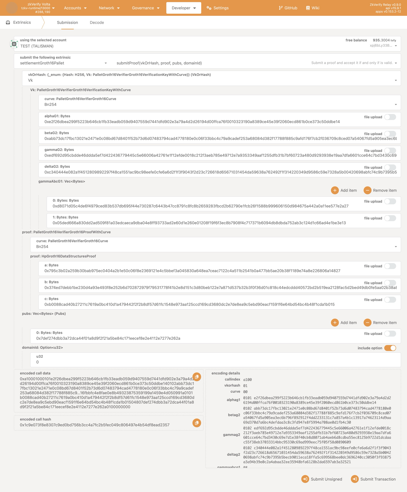
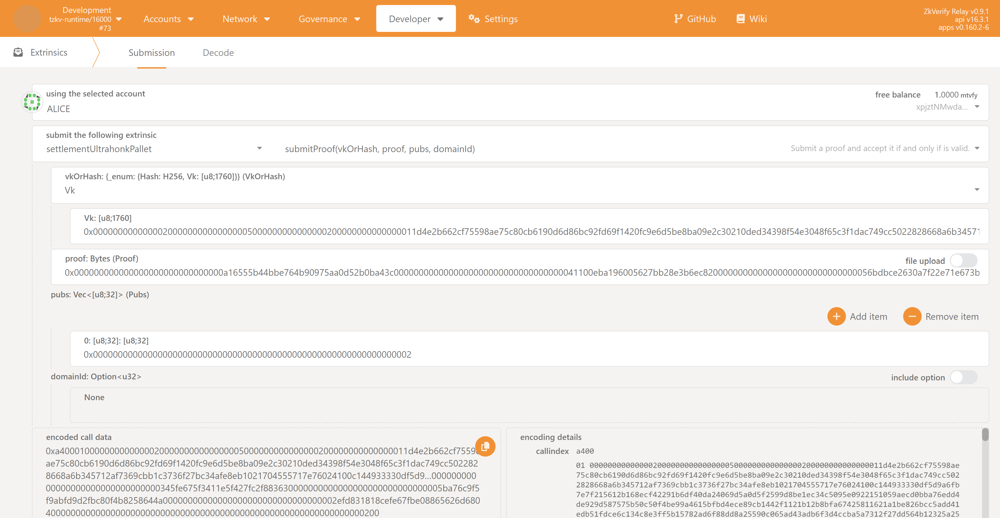
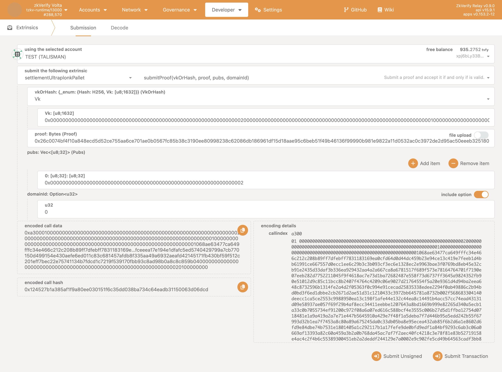
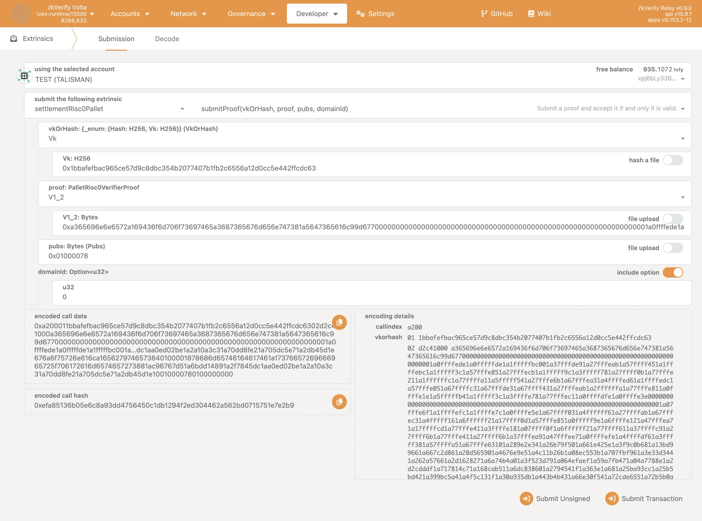
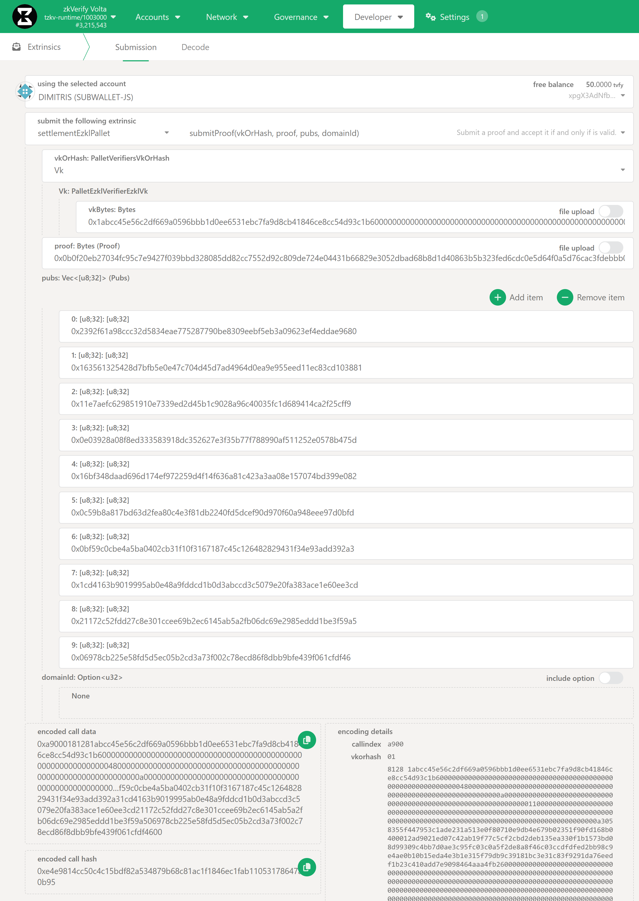

import Tabs from '@theme/Tabs';
import TabItem from '@theme/TabItem';

本教程讲解如何用 [PolkadotJS](https://polkadot.js.org/apps/?rpc=wss%3A%2F%2Fzkverify-volta-rpc.zkverify.io#/extrinsics) 向 zkVerify 链提交兼容的 ZK 证明。可通过下方标签查看各证明类型的操作步骤。

<Tabs groupId="verify-polkadotjs">

<TabItem value="groth16" label="Groth16">

1. 访问 [polkadot.js.org 前端](https://polkadot.js.org/apps/?rpc=wss%3A%2F%2Fzkverify-volta-rpc.zkverify.io#/extrinsics)
2. 选择账户（需有 tVFY）。
3. 选择 `settlementGroth16Pallet`，调用 `submitProof`。
4. 在 `vkOrHash` 字段选择 `Vk`
5. 将上一步得到的 json 文件内容按字段粘贴，去掉引号。`gammaAbcG1` 与 `input` 字段需根据条目数量点击 `Add Item` 添加。
6. 输入对应聚合域的 Domain ID，可视为聚合目标链。可在[此处](../../architecture/04-proof-aggregation/05-domain-management.md)查看可用域列表。

7. 点击 `submitTransaction`。

</TabItem>

<TabItem value="ultrahonk" label="Ultrahonk">

1. 打开 [PolkadotJs 前端](https://polkadot.js.org/apps/?rpc=wss%3A%2F%2Fzkverify-volta-rpc.zkverify.io#/extrinsics)
2. 选择账户（需有 tVFY）。
3. 选择 `settlementUltrahonkPallet`，调用 `submitProof`。
4. 在 `vkOrHash` 字段选择 `Vk`
5. 将上一步得到的 hex 文件内容粘贴到各字段，需填写 Vk、proof 与 public inputs。如有多个 public inputs，点击 `Add Item` 添加。
6. 输入对应聚合域的 Domain ID，可视为聚合目标链。可在[此处](../../architecture/04-proof-aggregation/05-domain-management.md)查看可用域列表。

7. 点击 `submitTransaction`。

</TabItem>

<TabItem value="ultraplonk" label="Ultraplonk">

1. 打开 [PolkadotJs 前端](https://polkadot.js.org/apps/?rpc=wss%3A%2F%2Fzkverify-volta-rpc.zkverify.io#/extrinsics)
2. 选择账户（需有 tVFY）。
3. 选择 `settlementUltraplonkPallet`，调用 `submitProof`。
4. 在 `vkOrHash` 字段选择 `Vk`
5. 将上一步得到的 hex 文件内容粘贴到各字段，需填写 Vk、proof 与 public inputs。如有多个 public inputs，点击 `Add Item` 添加。
6. 输入对应聚合域的 Domain ID，可视为聚合目标链。可在[此处](../../architecture/04-proof-aggregation/05-domain-management.md)查看可用域列表。

7. 点击 `submitTransaction`。

</TabItem>

<TabItem value="risc-zero" label="Risc Zero">

1. 打开 [PolkadotJs 前端](https://polkadot.js.org/apps/?rpc=wss%3A%2F%2Fzkverify-volta-rpc.zkverify.io#/extrinsics)，选择账户（需有 tVFY）。
2. 选择 `settlementRisc0Pallet` 并调用 `submitProof`。
3. 在 `vkOrHash` 字段选择 `Vk` 并粘贴 verification key（即要验证执行的代码 image id），前缀加 `0x`。
4. 在 `proof` 字段选择生成证明所用的 risc0 版本，加载二进制文件或粘贴证明字节，前缀加 `0x`。
5. 在 `pubs` 字段粘贴 public inputs，前缀加 `0x`。
6. 输入对应聚合域的 Domain ID，可视为聚合目标链。可在[此处](../../architecture/04-proof-aggregation/05-domain-management.md)查看可用域列表。
7. 点击 `submitTransaction`。

</TabItem>

<TabItem value="ezkl" label="Ezkl">

1. 打开 [PolkadotJs 前端](https://polkadot.js.org/apps/?rpc=wss%3A%2F%2Fzkverify-volta-rpc.zkverify.io#/extrinsics)
2. 选择账户（需有 tVFY）。
3. 选择 `settlementEzklPallet`，调用 `submitProof`。
4. 在 `vkOrHash` 字段选择 `Vk`
5. 将上一步得到的 hex 文件内容粘贴到各字段，需填写 Vk、proof 与 public inputs。如有多个 public inputs，点击 `Add Item` 添加。
6. 输入对应聚合域的 Domain ID，可视为聚合目标链。可在[此处](../../architecture/04-proof-aggregation/05-domain-management.md)查看可用域列表。

7. 点击 `submitTransaction`。

</TabItem>

</Tabs>
