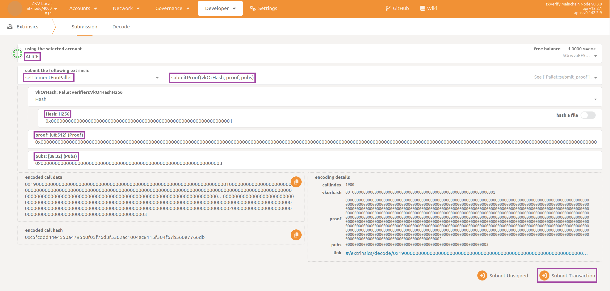

## 本地测试

在完成集成前，应从用户角度确认一切正常。

为此，你需要在本机启动本地 devnet。该网络完全私有，只用于为开发者提供可用假币快速测试的环境。

首先创建临时 Docker 镜像。在仓库根目录打开终端，执行：

```bash
. cfg
bootstrap.sh
```

完成后可用下述命令检查是否生成了新镜像（标签 `latest`）：

```bash
docker image ls
```

接下来运行本地链，可使用仓库提供的 Docker compose：

```bash
docker compose -f docker/dockerfiles/zkv-docker-compose.yaml up
```

该命令从零启动本地链（创世块），包含两个验证者和一个 RPC 节点。查看终端日志，确认三节点互联、正常出块等。

最后检查 pallet 与功能是否可用。打开浏览器访问 [PolkadotJS](https://polkadot.js.org/apps/?rpc=ws%3A%2F%2F127.0.0.1%3A9944#/explorer)，然后：

- 进入 `Developer` -> `Extrinsics`。
- 在 `using the selected account` 下拉中选 `Alice`。
- 在 `submit the following extrinsic` 下拉中选择你的 pallet（此处为 `settlementFooPallet`），并选择 `submitProof`。
- 在 `vkOrHash` 下拉中选 `Vk`，填入 `Vk`、`proof`、`pubs`（可用 `verifiers/foo/src/resources.rs` 中的数据）。
- 点击 `Submit Transaction`，再点击 `Sign and Submit`。



数秒后右上角应弹出绿色提示，表示 extrinsic 成功提交。

完成测试后，可用 `docker compose -f docker/dockerfiles/zkv-docker-compose.yaml up` 停止容器，并视情况用 `docker image rm` 删除镜像。

:::tip[**Testing with binaries**]
上述测试也可直接使用源码构建的二进制（无需 Docker）完成。务必启动两个验证者和一个 RPC 节点，并使用正确的命令行参数。
:::

能完成至此，说明你已做得很棒！现在可以在 zkVerify 仓库提交 PR 了，感谢你的贡献！
