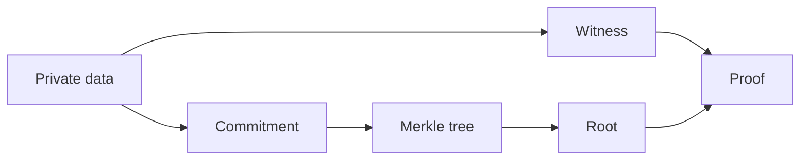

这一节只覆盖四个概念，因为它们是你后面每一步都会碰到的“最低词汇表”。我不会在这里讲数学定义，只讲工程上它们为什么出现、什么时候会撞上、错了会怎样。先把这些点搞清楚，后面的电路、proof、链上验证才有落点。

**Commitment** 先从工程角度理解：它是“先承诺、后公开”的做法。你把一份数据先变成一个短的承诺值，后续需要证明时再用原始数据去打开它。为什么要这样做？因为链上或日志里你需要绑定一个事实，但又不能把原始数据直接曝光。你会在“身份、余额、资格证明”这类场景里反复遇到它。忽略这点的后果是：你要么泄露隐私，要么拿不到可验证的绑定点。

**Merkle tree** 是用来做“批量承诺”的结构。单个 commitment 可以绑定一条数据，但当你有很多条数据时，树结构能让你只公开一个 root，再用一条 Merkle path 证明某个叶子是否包含在树里。你会在“批量证明”“聚合结果”“链上验证”这些环节看到它，它的工程意义是：你不用把所有数据带到链上，只要带一条 path 就能证明成员关系。忽略它的后果是链上数据量暴涨，或者你只能做单条验证。

**Poseidon** 在工程里更像“电路友好的哈希”。普通哈希在电路里成本很高，而 Poseidon 这类哈希是为电路设计的，因此很多 ZK 工具链会默认选择它。你会在电路里看到 `Poseidon(...)` 或配置项里出现它，这意味着电路里要做哈希运算时，成本和约束数会更可控。忽略这一点会导致电路规模膨胀、证明时间飙升。

**Witness** 是 proof 的原材料。它包含私有输入和中间值，通常不应该离开 Prover 侧。你在生成 proof 的命令里经常会看到 `witness` 作为显式产物。工程上它的意义是“证明是基于哪些真实输入生成的”，但它不应该被验证端看到，否则隐私假设就破了。忽略这一点的后果是：证明虽然能过，但系统已经不再满足零知识要求。

下面用一个小例子把这些概念放到同一条线上。设想你要证明“我属于某个名单”，但不公开名单内容：

1) 对每个人的身份数据做 commitment，得到一堆叶子。
2) 把叶子组织成 Merkle tree，公开 root。
3) 在电路里用 Poseidon 计算哈希，确保成本可控。
4) Witness 里放私有身份和路径元素，生成 proof。



一个最小结构示意（不是代码，仅用于理解输入输出关系）：

```text
commitment = Hash(private_data)
root = MerkleRoot(commitments[])
witness = { private_data, merkle_path }
proof = Prove(circuit, witness)
```

> 💡 Tip: 如果你在电路里做哈希，先确认你用的是“电路友好”的哈希，否则证明时间会先把你卡住。

> ⚠️ Warning: witness 一旦落到验证端，就等于你把隐私直接交出去。即使 proof 验证成功，系统也已经失去零知识意义。

最后强调一下，这四个概念之所以重要，不是因为它们“理论上正确”，而是因为它们决定了工程上的三个关键边界：能否批量验证、能否控制证明成本、能否保证隐私不泄露。下一节会用一个一致的例子把这些概念串起来，你会更容易看到它们在同一个流程里怎么协作。
