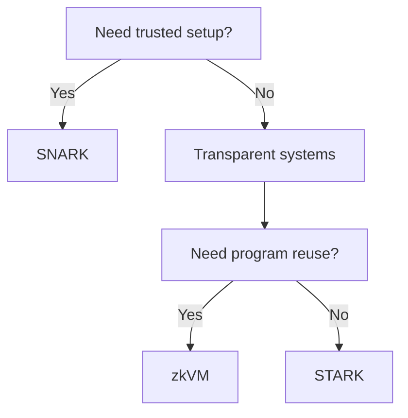

这一节解决一个新手最常问的问题：**我到底该选哪条证明系统路线？** 这里不讲语法细节，只讲你会真实承担的工程代价。你最终在做的，不是“选名词”，而是选一套成本结构：proof 有多大、验证有多贵、是否需要可信 setup、以及本地 proving 会不会变成瓶颈。

先建立一个工程前提：proof 生成通常发生在链下，验证通常发生在链上，而且验证一般比 proving 快。这个事实决定了成本分布的基本形态：本地是“生产线”，链上是“质检线”。不同证明系统就是在“生产线成本”和“质检线成本”之间做不同的权衡。

这类选择很像“采购不同规格的生产设备”。你不需要理解全部数学细节，但必须知道选错会让你在链上或本地付出长期成本。比如，proof 体积变大意味着链上验证更贵；prover 开销变大意味着本地吞吐下降。这些是工程硬账，不是概念偏好。

先把差异压到一张表里，把它当作“第一轮筛选器”。

| 选项（工程分类） | Setup 风格 | proof 规模 | 验证成本 | 你会在哪种场景倾向它 |
| --- | --- | --- | --- | --- |
| SNARK 系列 | 需要可信 setup | 小 | 低 | 链上成本敏感、希望验证尽量便宜 |
| STARK 系列 | 透明（无可信 setup） | 大 | 高 | 不希望依赖可信仪式、可接受更高链上成本 |
| zkVM | 透明（无可信 setup） | 更大 | 更高 | 想复用现有程序逻辑、接受更高 prover 成本 |

一个常见误解是“通用性一定更好”。zkVM 更通用没错，但它的代价是更高的 prover 开销和更大的 proof。如果你是高频验证场景，这个代价会被放大；如果你更担心可信 setup 的依赖，那透明系统的吸引力会更强。换句话说，通用性不是福利，是成本结构的一部分。

另一个容易忽略的限制来自部署环境。以 EVM 为例，现有 BN254 预编译会限制你能用的 proof 格式。你如果要把验证结果放到 EVM 合约里消费，proof 的格式和曲线选择会被现实限制住，而不是“理论上可行”。这会影响你对 SNARK/STARK/zkVM 的可用性判断。

可以用“工厂校准”的类比来理解 setup：
SNARK 更像“先校准再量产”，校准成本是一次性的，但产出效率高；STARK/zkVM 更像“不做校准直接生产”，但每次生产都更贵。你选的是长期成本结构，而不是学术标签。

下面是一条更工程化的决策路径，用来快速缩小范围：

1) **你能接受可信 setup 吗？**
   - 能接受 → SNARK 系列是首选。
   - 不能接受 → 优先看 STARK 或 zkVM。
2) **链上验证成本是不是你的瓶颈？**
   - 是 → 倾向 proof 小、验证快的体系。
   - 否 → 可以考虑透明系统，接受更大的 proof。
3) **你是否需要复用已有程序逻辑？**
   - 是 → zkVM 更贴近现有工程习惯。
   - 否 → 电路型系统往往更省成本。

> 💡 Tip: 原型阶段不要追求“最优系统”。先选你熟悉的工具链把流程跑通，再用真实的性能数据回头调整选型。

这里再补一个容易被忽视的点：proof 聚合是可选的，它的目的就是摊薄验证成本。当你的证明频率变高、链上压力上升时，你才会真正感受到“proof 体积”和“验证成本”的差别。也就是说，你的选型在早期可能看起来差别不大，但规模上来后会拉开差距。

如果你不确定自己属于哪一类项目，可以做一个小实验：用同一个电路或程序分别跑两套体系，记录 proving 时间、proof 体积和验证成本趋势。只要看到这些数字，你就能把“工程代价”从抽象变成可测的选择条件。

> ⚠️ Warning: 不要用“理论最优”覆盖“工程最优”。真正把系统跑起来之后，约束往往来自部署环境，而不是论文里的指标。

最后给一个最简的检查清单，防止你在选择时漏掉关键问题：

- 我是否能接受可信 setup 的依赖？
- 我的验证是不是会发生在链上？验证成本敏感吗？
- 我的证明生成是不是会成为吞吐瓶颈？
- 我是否需要复用已有程序逻辑？

这一节的目标是让你用工程代价做第一轮判断，而不是被名称带偏。下一节会把这些选择放回具体例子里，看它们如何影响 proof 的形态和验证路径。
