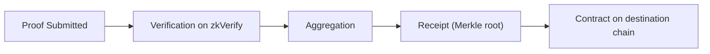

如果你已经理解 ZK 的基本原理，这一条路径的目标不是再解释“什么是证明”，而是让你搞清楚：**当 proof 进入 zkVerify 后，系统内部到底发生了什么，你要为哪些边界负责**。很多工程失败不是“证明算法不对”，而是把验证层当成应用层，或者把验证层当成证明层，结果职责错位、数据走向错了。

先把 zkVerify 的角色放到系统里：它是一条专门验证 proof 的链，而不是通用合约平台。它的职责就是接收 proof、验证其有效性、把验证结果变成可复用的输出。你在项目里引入 zkVerify，本质上是在把“验证是否成立”这件事从应用内部拿出来，让它变成一个多系统都能信任的事实。

你会在这个路径里关注四件事：

1) proof 提交后发生了什么；
2) 验证结果如何被聚合成可复用的产物；
3) 验证结果何时、如何发布到其他系统；
4) 你作为开发者需要在哪里提供输入、在哪里接回结果。

这里最容易被忽略的是“验证结果的落点”。验证完成只是开始，真正决定你能不能把结果用起来的是**聚合与发布**。zkVerify 会把验证过的 proof 进入聚合流程，生成 receipt（Merkle root），再由 relayer 发布到目标链上的合约。对于链上消费而言，合约侧看到的不是 proof 本身，而是 receipt 及其证明路径。

你可以把 zkVerify 想成“验收中心”：你把 proof 交给它，它给你一个可被引用的“验收单”。验收单可以被其他系统拿来复用，但它本身不等同于 proof。你如果把 proof 当成验收单，就会在链上消费时卡住。

另一个你必须关心的点是**成本结构**。zkVerify 是链上验证，所以每次验证都有成本，VFY 是支付这个成本的媒介。这意味着你在工程上要考虑：一次验证的成本是否可接受，是否需要通过聚合来摊薄成本，以及是否要把结果发布给链上消费端。

这里还会涉及一个选择：你是用 Kurier 这样的 relay API，还是直接与链交互。这个选择不是“高级/低级”的区别，而是工程控制权与复杂度的权衡。Kurier 给你更像 Web2 的体验，但也意味着你把一部分链上交互细节交给了它。

为了避免“看懂了但不会落地”，你可以把整个过程拆成三层责任：

- **提交层**：准备好 proof、vk 和 public inputs，确保它们来自同一套编译产物；
- **验证层**：让 zkVerify 产出可复用结果；
- **消费层**：决定结果在应用内消费还是链上消费。

这条路径接下来会把每一层展开成具体机制。你会看到 proof 提交时的 statement hash 是如何形成的，domain 在聚合里起什么作用，receipt 发布后如何被合约验证，以及你应该在哪一步记录必要的链上信息。

> 💡 Tip: 如果你已经能稳定跑通 proof 生成，但总是在“结果怎么用”这一步卡住，问题往往不在 proving，而在“消费层是否走了聚合发布路径”。

> ⚠️ Warning: 不要把 zkVerify 当成 proving 平台。它只负责验证，不会替你生成 proof，也不会帮你决定业务逻辑如何消费结果。

为了帮助你快速定位“你现在在哪一层”，可以先用这张简化路线做自检：

1) 我是否已经能稳定生成 proof 和 public inputs？
2) 我是否在 zkVerify 上得到稳定的验证结果？
3) 我的结果要留在应用侧，还是要给链上合约用？

如果你能回答这三个问题，你就能把后续的机制页当作“查字典”，而不是“从头学习”。下一节会从 proof 提交流程开始，把验证层内部的机制一层层拆开。
