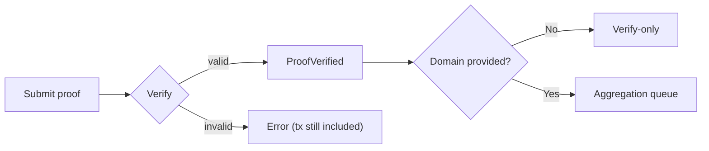

这一节讲的是“proof 提交之后到底发生了什么”。你在工程里最容易卡住的并不是“怎么提交”，而是**提交之后系统到底如何分流**：哪些路径会产生验证事件、哪些会进入聚合、哪些情况会被拒绝但交易仍然上链。理解这条流向，你才能判断该监听什么事件、该在什么时刻做下一步动作。

可以把提交流程想成“分拣中心”。proof 一旦进入 zkVerify，会先被验证；如果你选择了聚合路径，它会被送进某个 domain 的队列里；如果没有 domain，它就只走 verify-only。这条分流是系统设计的硬边界，不理解它会导致你监听错事件或错过关键数据。

先看最核心的输入：zkVerify 会把 proof 绑定成一个 statement hash。这个 hash 是验证体系的“指纹”，由验证上下文、vk、proof 版本信息和 public inputs 构成。它不是业务语义，但它决定了你后续的事件、路径和聚合结果是否能对得上。

```text
statement = keccak256(
  keccak256(verifier_ctx),
  hash(vk),
  version_hash(proof),
  keccak256(public_inputs_bytes)
)
```

如果 proof 通过验证，系统会发出 `ProofVerified` 事件，事件里包含 statement 值；如果验证失败，交易仍然会被打包进区块，但会报错且仍需支付费用。这一点很关键：**失败不等于没上链**，它是防止 DoS 的设计选择。你做服务侧重试时要记住这一点，否则会反复重复付费。

下面是整体流程的最小结构图，先让你看到“verify-only vs verify+aggregate”的分叉：



### Verify-only 路径（无聚合）
这条路径的特点是：你只关心验证事件，不关心聚合事件。你提交 proof，验证成功就监听 `ProofVerified`，拿到 statement 值并在你的应用里消费即可。这里没有 receipt、没有 Merkle path，也没有 domain。

**什么时候会用它？**
当你的消费端在应用侧（Web2/后端服务），验证结果只是业务信号时，verify-only 是最短路径。

**什么时候不该用？**
当你的消费端是链上合约时，verify-only 不会产出可被合约消费的结果，你需要进入聚合路径。

### Verify + Aggregate 路径（domain 必须）
聚合路径从 domain 开始。你在提交 proof 时提供 domainId，系统会把 proof 路由到该 domain 的下一条 aggregation。proof 被加入时会触发 `NewProof{statement, domainId, aggregationId}` 事件。这是你确认“证明已进入聚合队列”的唯一信号。

一旦聚合完成，会发出 `NewAggregationReceipt{domainId, aggregationId, receipt}`。这里的 receipt 是 Merkle root，后续链上消费要靠它。注意：你要记录该事件所在的 block hash，因为之后计算 Merkle path 必须使用**相同 block**。如果你丢了这个 block hash，后面再查 path 会失败。

聚合路径的另一个关键动作是获取 Merkle path：通过 `aggregate_statementPath` RPC，你用 block hash、domainId、aggregationId 和 statement 来取回路径。这个路径就是你证明“我的 proof 在这批聚合里”的凭证。

### Domain 相关的拒绝与降级
聚合不是“强制成功”的。提交时如果 domainId 不存在、domain 不能接受新 proof、用户资金不足或用户不在允许列表，系统会发出 `CannotAggregate` 事件。注意这时 `submitProof` 不会失败，它只是发出事件告诉你“没有进入聚合”。如果你只监听 `ProofVerified`，会错过这个信号。

`CannotAggregate` 的常见原因包括：

- `DomainNotRegistered{domainId}`
- `InvalidDomainState{domainId, state}`
- `DomainStorageFull{domainId}`
- `InsufficientFunds`
- `UnauthorizedUser`

这些原因不是“验证失败”，而是“聚合失败”。你需要在业务里区分这两类错误。

### Kurier 的状态流（帮助你做外部轮询）
如果你走 Kurier 路线，状态流会表现为：`Queued` → `Valid` → `Submitted` → `IncludedInBlock` → `Finalized` 或 `Failed`。注意：如果你提交时没有提供 chainId，这些状态不会生成。很多人误以为系统卡住，其实是因为根本没走链上状态更新。

> ⚠️ Warning: 只要你走链上验证，失败交易仍会被打包并收费。不要用“无限重试”来当作兜底策略。

> 💡 Tip: 如果你既要 verify-only 也要可能进入聚合，就同时监听 `ProofVerified` 与 `CannotAggregate`，否则你会误判 proof 的最终路径。

为了收束本节，把“你应该关注的事件”再总结成一条工程清单：

1) `ProofVerified`：证明已通过验证，拿到 statement。
2) `NewProof`：证明进入某个聚合队列，记录 domainId/aggregationId。
3) `NewAggregationReceipt`：聚合完成，记录 block hash。
4) `CannotAggregate`：聚合失败的原因，不要当成验证失败。

下一节会专门讲 domain 的语义和状态机，解释“为什么聚合必须有 domain”，以及什么时候你应该使用它、什么时候应该避免它。
