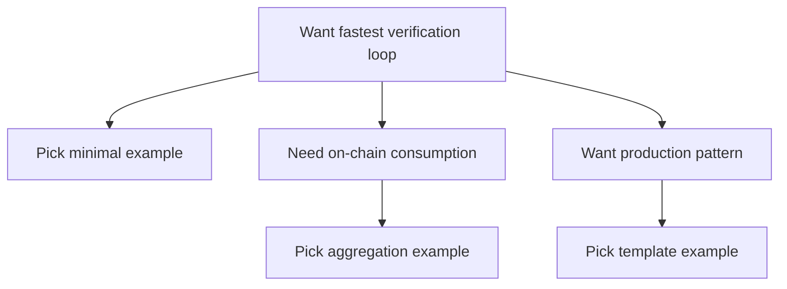

如果你来这里的目的很明确——“给我一个能跑起来的例子”，那么这一路径就是为你准备的。很多工程师不是不想学概念，而是缺一个能验证思路的起点：先把一个可运行的样例跑通，确认链路正确，再往复杂场景扩展。这一章的定位就是“可跑 + 可改”，而不是“讲原理”。

可以把这部分理解成厨房里的菜谱：你不需要先成为厨师，只要把食材备好、按步骤做，就能看到结果。跑通之后你再回头去理解“为什么要这样配比”，效率会高很多。这个路径的价值不是把你变成 ZK 专家，而是帮你快速建立工程信心。

这一章的样例不是随便堆的。它们会按“最小可验证 → 可复用模板 → 生产级思路”的顺序安排。你可以把它当作一条渐进的脚手架，从最简单的 proof 提交开始，逐步看到更多工程边界：输入如何组织、验证结果如何消费、什么时候需要聚合、什么时候不需要。

为了避免“照抄但不懂”，每个例子都应该回答几个工程问题：我在证明什么？哪些输入是公开的、哪些必须留在私有侧？这个验证结果最后被谁消费？这是例子的意图，而不是形式。你不用先背术语，只要能把“目的 → 输入 → 输出”对齐，例子就算跑通了。

如果你是 Web2 背景，你可能更习惯“请求 → 响应”的验证模型；如果你有链上经验，你可能更关心“事件 → 证明 → 合约消费”。这章会尽量把这两种思维放在同一个例子里，让你知道它们其实是一条线上的两个端点，而不是两套系统。

在你开始跑例子之前，先建立一个小预期：你会碰到不同证明系统的工具链，它们的接口和产物不一样。这不代表你选错了，而是系统本身的差异。zkVerify 支持多种证明系统，这意味着例子也会覆盖不同工具链。你要做的不是把所有工具链都记住，而是找到一个你能稳定跑通的起点。

下面给一个“选择例子”的最小路径，帮助你决定从哪里开始：



如果你不知道该从哪里下手，可以用这个顺序：先跑最小样例，确认验证事件能出现；再跑一个聚合样例，确认你能拿到 receipt；最后看生产级模板，学习如何把验证结果接回业务逻辑。这个顺序不是强制的，但能让你少踩坑。

这一章也会强调“可复用”的设计：你不需要把样例当作一次性 demo，而是要把它当作可复制的骨架。你能把核心输入、输出和事件监听逻辑挪到你的项目里，而不是重头再造一遍轮子。

```text
Example skeleton:
1) Prepare inputs
2) Generate proof
3) Submit proof
4) Observe verification result
5) Consume result
```

> 💡 Tip: 先把日志和事件监听加好。很多“跑不通”的问题不是证明本身错，而是你根本没看到验证事件。

> ⚠️ Warning: 不要把示例当成“生产默认值”。示例是为了说明结构和路径，不是为了覆盖你的业务边界。

为了避免你跑完样例却不知道下一步做什么，每个例子都会标明：它解决了什么问题，它省掉了什么成本，它留下了哪些未解决的边界。你把这些边界记下来，就知道哪些地方需要你自己补齐。

如果你已经有一套业务逻辑在跑，建议先选一个最接近你业务目标的例子，再反向修改输入和消费方式。这样比从零起一个新例子更快，也更容易避免“功能能跑但语义不对”的情况。

最后说一句最现实的：这章的目的是让你“能跑起来”，而不是让你“完全理解”。等你把第一个例子跑通，再回去看概念页，你会发现它们突然变得可读。下一节会进入最小样例列表，你可以直接挑一个开始。
