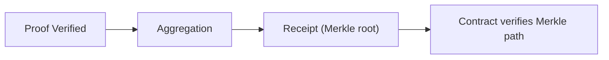

这一节只回答一个问题：**什么时候聚合是必须的？** 你可以把它理解成“合约要不要验收单”的问题。如果消费端在链上，合约需要 receipt 才能验证，你就必须走聚合；如果消费端在应用侧，你可以停在验证事件上。

先说必须的场景：当你的验证结果要进入**另一条链或合约**时，聚合不是优化选项，而是唯一可落地的路径。原因很直白：合约不会直接验证 proof，它只认 receipt（Merkle root）和 Merkle path。没有 receipt，就没有合约可验证的输入。

换个工程类比：聚合是“出具验收单”，合约是“只看验收单的门禁”。你如果不出具验收单，门禁不会放行。



再说不必须的场景：当验证结果只在 Web2 或系统内部消费时，verify‑only 已经足够。你只需要 `ProofVerified` 事件或 `Finalized` 状态作为业务信号，不需要进入 receipt 发布流程。

这里容易误解的一点是“验证通过就等于可以链上用”。实际上验证通过只是第一步，链上消费必须走聚合。你如果把 verify‑only 当成链上可用结果，就会在合约侧一直失败。

下面给一个最小判定清单，帮助你决定是否必须聚合：

```text
if consumer_is_contract or cross_chain:
  aggregation_required = true
else:
  aggregation_required = false
```

> ⚠️ Warning: 不要把“验证通过”当成“链上可用”。合约只接受 receipt + Merkle path。

> 💡 Tip: 如果你不确定消费端是否会上链，先按 verify‑only 设计；一旦确定要链上消费，再切入聚合路径。

最后用一句话收住：**聚合是链上消费的门票，不是性能优化的小工具。** 下一章会进入常见问题与故障排查，帮你处理实际接入中遇到的异常情况。
