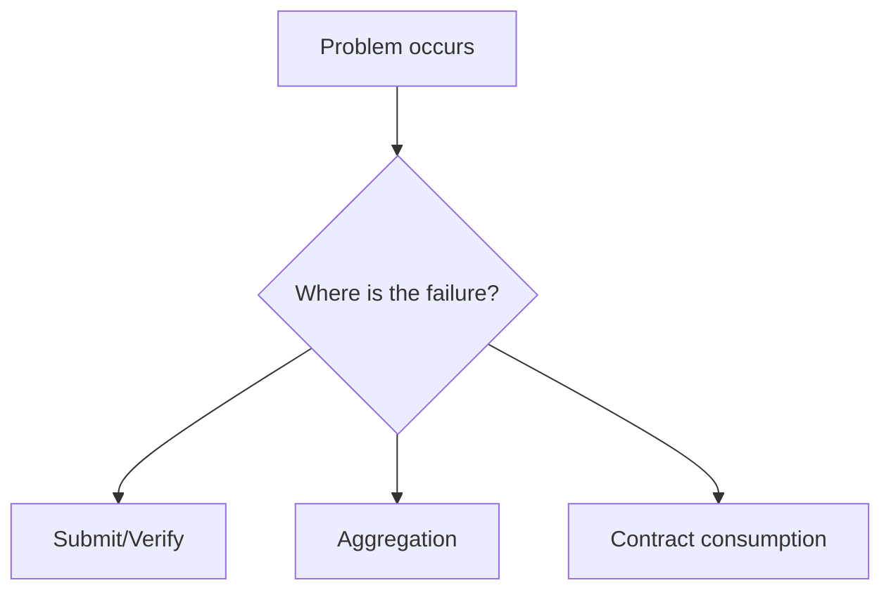

这一章不是学习路径，而是**排错入口**。你来这里通常是因为流程卡住了：验证事件没出现、聚合没有 receipt、合约验证失败、或者状态一直停在 `Submitted`。这章的写法不会按“概念讲解”展开，而是尽量按“症状 → 原因 → 处理方式”组织。

把这章当作“值班手册”。你不需要从头读完，只需要看到与你问题匹配的标题，然后快速定位问题所在的步骤。你会在这里看到事件名、状态名、常见错误原因，以及这些问题会在哪一层出现。

一个实用的读法是先问自己三个问题：

1) 我卡在提交之前、验证之后、还是聚合之后？
2) 我有没有拿到 `ProofVerified` 或 `NewAggregationReceipt` 事件？
3) 我是在 Web2 侧消费，还是合约侧消费？

如果你能回答这三个问题，定位会快很多。很多“看起来很复杂的问题”其实只是卡在流程的某一步，比如没有记录 block hash、domain 无法聚合、或 chainId 没带导致状态不更新。

这章还会单独回答一些高频问题，例如“什么时候需要 domain”“为什么教程里不提 domain”“为什么合约验证失败但 proof 已通过”。这些问题常见的原因并不在 zkVerify 本身，而在使用方式。

如果你在这个章节里找不到答案，优先补齐你的日志和事件记录。很多问题不是系统错误，而是缺少关键上下文，比如 statement 值、aggregationId、或 receipt 的 block hash。没有这些字段，你很难判断问题发生在哪一层。

> 💡 Tip: 排错时先确认你监听的事件是否正确。监听错事件是最常见的“伪故障”。

> ⚠️ Warning: 不要把验证失败和聚合失败混为一谈。验证失败是 proof 本身不通过；聚合失败通常是 domain 或权限问题。

这一章的目标是让你在问题出现时能快速把它归类，而不是让你重新学习概念。下一节会先从“Troubleshooting”开始，给出最常见的错误模式与对应处理方式。
