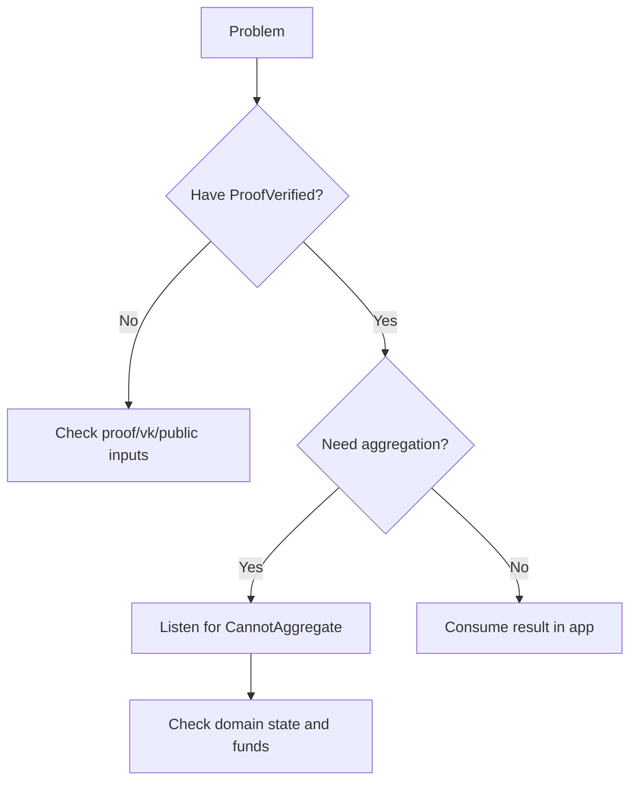

这一页是“查错指南”，不是概念复习。你可以把它当成一个排错流程：先定位错误发生在哪一层，再看对应的原因和处理方式。大部分问题都不是“证明算法错了”，而是事件监听、domain 状态、或输入版本错位。

为了方便定位，先把问题分成三类：

1) **验证失败**：proof 不通过。
2) **聚合失败**：proof 通过，但没有进入聚合或拿不到 receipt。
3) **链上交互失败**：交易上链、事件监听、RPC 调用出现问题。

下面按“症状 → 原因 → 处理方式”给出最常见的问题清单。

---

## 1) 验证失败：ProofVerified 没出现

**症状**：提交 proof 后没有 `ProofVerified`，或者链上报错。交易仍然被打包进区块，但结果是失败。

**原因**：proof 本身不通过或输入错位。失败交易仍然会上链并收费，这是为了防止 DoS。你如果无限重试，会反复付费。

**处理方式**：

- 回到 proof 生成侧，确认 vk 与 proof 是否来自同一套编译产物。
- 检查 public inputs 的编码和顺序是否与电路一致。
- 如果使用 Kurier，确认 proofType 与 vk 类型匹配。

> ⚠️ Warning: 验证失败不会自动回滚费用，失败也会收费。不要用“盲重试”代替排错。

---

## 2) 聚合失败：有验证，但没有 receipt

**症状**：`ProofVerified` 出现了，但没有 `NewAggregationReceipt`，也拿不到 Merkle path。

**原因**：聚合依赖 domain，且 domain 可能被拒绝或处于不可用状态。常见的拒绝原因是 `CannotAggregate` 事件。

**处理方式**：

- 监听 `CannotAggregate` 事件，查看具体原因。
- 检查 domainId 是否存在，domain 是否处于 Ready。
- 检查 domain 队列是否已满、提交者是否有足够余额、是否在 allow-list。

**常见拒绝原因**：

- `DomainNotRegistered{domainId}`
- `InvalidDomainState{domainId, state}`
- `DomainStorageFull{domainId}`
- `InsufficientFunds`
- `UnauthorizedUser`

> 💡 Tip: 聚合失败不是验证失败。你必须区分这两类问题，否则会把问题修错方向。

---

## 3) 领取 Merkle path 失败

**症状**：`NewAggregationReceipt` 已出现，但 `aggregate_statementPath` 调用失败或返回空。

**原因**：Published storage 只存在一个区块高度。你必须使用 receipt 事件所在 block hash，否则路径计算会失败。

**处理方式**：

- 确保记录 `NewAggregationReceipt` 事件的 block hash。
- 用 block hash + domainId + aggregationId + statement 调用 `aggregate_statementPath`。

---

## 4) Kurier 状态卡住

**症状**：job‑status 一直停在 `Queued` 或没有状态推进。

**原因**：提交时没有带 `chainId`，导致状态流不会生成。

**处理方式**：

- 确保 `submit-proof` 请求包含 `chainId`。
- 确认 API Key 与网络环境匹配（mainnet/testnet）。

---

## 5) Domain 操作失败

**症状**：注册 domain 或修改 domain 状态失败。

**原因**：权限或押金不足。普通用户只能注册 `Destination::None` 的 domain，且需要支付 storage deposit。

**处理方式**：

- 确保账户余额足够支付 domain 存储押金。
- 如果需要带目标链的 domain，确认你是否具备 Manager 权限。

---

## 一个最小排错流程

> 💡 Tip: 排错时先定位“验证失败”还是“聚合失败”。这一步能减少 80% 的无效调试。

这一页的目标是让你在出现问题时能快速归类。下一节会讲“验证通过后怎么用结果”，把排错场景接到实际业务逻辑里。
