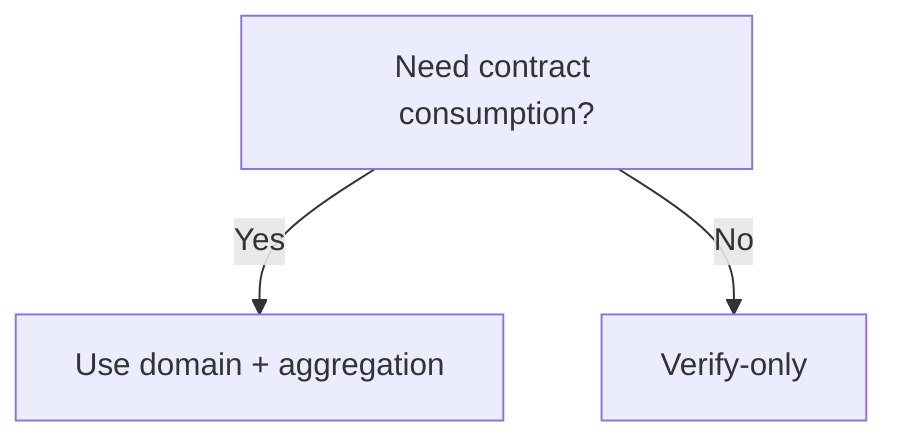

这一页只回答最常被问的四个问题。它不是百科，而是“让你少走弯路”的工程答案。每个问题都按“场景 → 选择 → 后果”展开，避免你在细节里迷路。

---

## 1) 什么时候需要 domain？什么时候用 mainchain API？

**场景判断**：domain 出现在“是否进入聚合”的分界点。你要链上消费，就必须走聚合，也就必须带 domainId。你只在应用侧消费验证结果，就可以不带 domain。

**选择建议**：

- **verify‑only**：无需 domain，Kurier 走起来最快。
- **verify + aggregate**：需要 domain，建议直接用主链接口或确保 Kurier 带 domainId。

**后果**：不带 domain 就不会进入聚合队列，也不会产出 receipt。你如果后续要链上消费，必须补上这一层。

---

## 2) 谁能创建 domain？谁来发布聚合结果？

**创建权限**：普通用户只能注册 `Destination::None` 的 domain，带目的地的 domain 需要 Manager 权限，而且需要支付 storage deposit。

**发布角色**：聚合是 permissionless 的，任意用户都可以调用 `aggregate(domainId, aggregationId)` 生成 receipt 并领取相应费用。这意味着“聚合发布者”不是固定角色，而是可能由任何参与者承担。

**后果**：如果你以为“系统会自动发布”，你可能会等不到 receipt。要么自己发布，要么确保有人在发布。

---

## 3) 为什么有些教程不提 domain？

**原因**：这些教程多半是 verify‑only 路线，目标是最短路径验证闭环。verify‑only 不需要 domain，所以教程会刻意省略。

**后果**：当你把这些教程直接搬到“链上消费”场景，就会发现没有 receipt。不是教程错，而是场景变了。

---

## 4) 合约消费结果一定需要聚合吗？

**结论**：是。合约侧验证的是 receipt（Merkle root）和 Merkle path，而不是 proof 本身。没有聚合就没有 receipt，合约无法验证。

**后果**：如果你跳过聚合，只会得到 `ProofVerified`，这对合约没有直接意义。

---

> 💡 Tip: 如果你从 verify‑only 迁移到链上消费，先把 domain 和 receipt 流程跑通，再改业务逻辑。顺序反了会让你反复返工。

> ⚠️ Warning: 把 `CannotAggregate` 当成验证失败是最常见的误判。它只是“没进入聚合”，不是 proof 不通过。

这一页的目的不是给你“完整答案”，而是让你在遇到问题时能快速做出工程判断。下一章是 Reference，你可以在需要查接口时快速定位。
