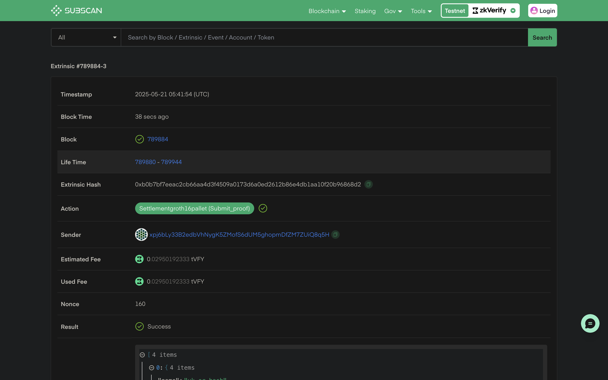

:::info
教程中使用的代码可在[此处](https://github.com/zkVerify/explorations/tree/main/zkEmail)查看
:::

本指南演示如何使用 zkVerify 验证 zkEmail 证明。我们会用 [zkEmail SDK](https://docs.zk.email/zk-email-sdk/setup) 生成远程证明，再用 [zkVerifyJS](../04-zkverifyjs.md) 验证 zkEmail（Groth16）证明。

先新建目录、初始化 npm，并安装所需包（@zk-email/sdk 与 zkVerifyJS）：
```bash
# This will create a new directory for our project
mkdir zkEmail-zkVerify

# Moving inside our directory
cd zkEmail-zkVerify

# Initializing our project
npm init -y && npm pkg set type=module

# Installing required packages
npm i @zk-email/sdk zkverifyjs
```

安装完成后，创建 ``index.js``，先引入所需包：

```js
import { zkVerifySession, Library, CurveType, ZkVerifyEvents } from "zkverifyjs";
import zkeSDK, { Proof } from "@zk-email/sdk";
import fs from "fs/promises";
```

接下来在 [ZKEmail registry](https://registry.zk.email/) 选择 blueprint，为支持的邮件生成 ZK 证明。使用 zkeSDK() 导入 blueprint 时顺便取回 verification key，后续验证会用到。

```js
// Initialize the SDK
const sdk = zkeSDK();
  
// Get blueprint from the registry
const blueprint = await sdk.getBlueprint("Bisht13/SuccinctZKResidencyInvite@v3");

// Download the vkey
const vkey = await blueprint.getVkey();
const prover = blueprint.createProver();
```

然后需要一封兼容的邮件文件生成 ZK 证明。示例使用 ZKEmail 提供的样例邮件，可从[这里](https://docs.zk.email/files/residency.eml)下载。调用 ``generateProof`` 在 zkEmail 服务器远程生成证明以加速。

```js
// Read email file
const eml = await fs.readFile("residency.EML", "utf-8");
  
// Generate the proof
const proof = await prover.generateProof(eml);
```

至此已生成 Groth16 zkEmail 证明，下面用 zkVerifyJS 验证。先用助记词创建 ``session``：

```js
const session = await zkVerifySession.start().Volta().withAccount("seed-phrase");
```

创建 session 后可直接调用 ``verify`` 验证 ``groth16`` 证明，并监听交易的 ``IncludedInBlock`` 事件，打印交易详情并关闭会话。

```js
const {events} = await session.verify()
    .groth16({library: Library.snarkjs, curve: CurveType.bn128})
    .execute({proofData: {
        vk: JSON.parse(vkey),
        proof: proof.props.proofData,
        publicSignals: proof.props.publicOutputs
    }});

events.on(ZkVerifyEvents.IncludedInBlock, (eventData) => {
    console.log("Included in block", eventData);
    session.close().then(r => process.exit(0));
})
```

运行 ``node index.js`` 可看到如下输出：

```json
Included in block {
  blockHash: '0x8186277ac5600c2bba79a595f72f4fd5c8b01f957f52161277f5bba02f4a2832',
  status: 'inBlock',
  txHash: '0x973e090cf4df6f7497daf752f5a2ed48137b3218840d38311ef21b2d2ea51c37',
  proofType: 'groth16',
  domainId: undefined,
  aggregationId: undefined,
  statement: '0xc5a8389b231522aad8360d940eb3ce275f0446bba1a9bd188b31d1c7dd37f136',
  extrinsicIndex: 2,
  feeInfo: {
    payer: 'xpj6bLy33B2edbVhNygK5ZMofS6dUM5ghopmDfZM7ZUiQ8q5H',
    actualFee: '28878053310000000',
    tip: '0',
    paysFee: 'Yes'
  },
  weightInfo: { refTime: '5775608971', proofSize: '0' },
  txClass: 'Normal'
}
```

可在 [zkVerify Explorer](https://zkverify-testnet.subscan.io/) 用日志中的 txHash 查看已验证的证明。



### 下一步

可查看更详细的[教程](../02-getting-started/06-zkverify-js.md)，了解如何聚合证明并在以太坊、Arbitrum 等连接链上验证聚合结果。
