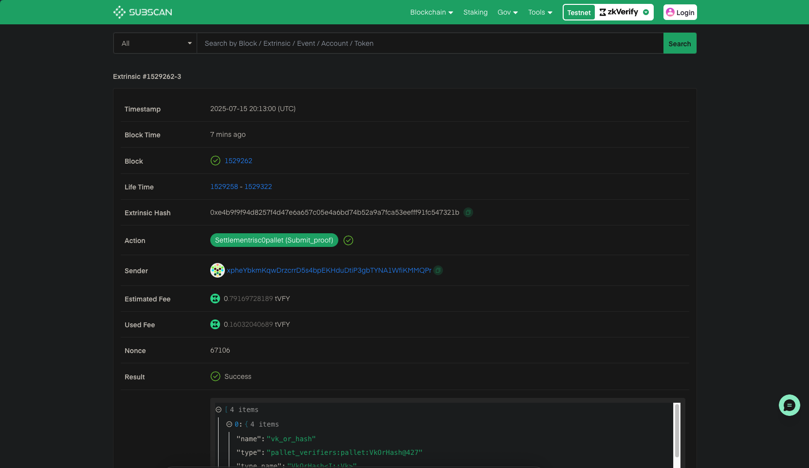

:::info
本教程所用代码可在[此处](https://github.com/zkVerify/explorations/tree/main/tee-r0-verifier)查看
:::

本指南介绍如何通过 [Risc Zero](https://risczero.com/) 包装 TEE 证明并在 zkVerify 上验证。通常 TEE 证明会先包入 zkVM 生成 STARK，再包装成 groth16 以便上链验证；而 zkVerify 原生支持 Risc Zero STARK，无需再包一层 groth16。

首先用下述命令创建新 cargo 项目：

```bash
cargo new zkverify-tee-r0
```

创建项目后，用任意 IDE 打开。我们将引入所需模块，使用 [Automata 的 DCAP CLI](https://github.com/automata-network/automata-dcap-zkvm-cli) 提供的 TEE 验证功能，并用 `risc0-zkvm` 创建客户端，借助 Bonsai 生成证明。

然后打开 `cargo.toml` 替换为以下内容：

```toml
[package]
name = "zkverify-tee-r0"
version = "0.1.0"
edition = "2024"

[dependencies]
reqwest = { version = "0.11", features = ["json", "rustls-tls"] }
tokio = { version = "1", features = ["full"] }
serde = { version = "1", features = ["derive"] }
serde_json = "1"
dotenv = "0.15"
anyhow = "1"
hex = "0.4"
risc0-zkvm = "=2.1.0"
ciborium = "0.2.2"
dcap-rs = { git = "https://github.com/automata-network/dcap-rs.git" }
dcap-bonsai-cli = { git="https://github.com/automata-network/automata-dcap-zkvm-cli", rev="268b4115ad592d46c02f4ef7d49a6bae066d1592" }
```

:::info
Bonsai API Key 可[在此申请](https://docs.google.com/forms/d/e/1FAIpQLSf9mu18V65862GS4PLYd7tFTEKrl90J5GTyzw_d14ASxrruFQ/viewform)。Kurier 的 API key 可在 [kurier.xyz](https://kurier.xyz) 注册账号后于用户面板生成。
:::

添加依赖后，新建 `.env` 存放 Bonsai API 与 [Kurier](../02-getting-started/05-kurier.md) API key，粘贴并填入：

```bash
BONSAI_API_URL="<BONSAI_API_URL>"
BONSAI_API_KEY="<BONSAI_API_KEY>"
RISC0_PROVER="bonsai"
API_KEY="<KURIER_API_KEY>"
```

在 `src` 下新建 `utils.rs`，定义 `verify_proof` 调用 Kurier 验证证明。先引入所需模块，可直接粘贴：

```rust
use std::{env, fs, thread, time::Duration};
use anyhow::{Ok, Result};
use dotenv::dotenv;
use reqwest::Client;
use risc0_zkvm::Receipt;
use serde::Deserialize;
```

接着定义常量 `API_URL`（Kurier API URL）及异步函数 `verify_proof`，入参为 `ZK receipt` 与 `image_id`。从环境读取 `API_KEY`，并把 Risc Zero proof receipt 转成 zkVerify 支持的 hex 格式。

然后构造含证明细节的 `submit_params`，向 `submit-proof` 端点发起 `POST`，返回 `job-id` 与 `optimistic-verification` 状态。若状态为 `success`，则轮询 `job-id` 直至状态为 `Finalized`，表示 ZK 证明已在 zkVerify 链上最终确认。

```rust
pub async fn verify_proof(receipt: Receipt, image_id: String) -> Result<()>{

    dotenv().ok();
    let api_key = env::var("API_KEY")?;

    let mut bin_receipt = Vec::new();
    ciborium::into_writer(&receipt, &mut bin_receipt).unwrap();
    let proof_hex = hex::encode(&bin_receipt);
    let public_inputs_hex = hex::encode(&receipt.journal.bytes);

    let client = Client::new();

    let submit_params = serde_json::json!({
        "proofType": "risc0",
        "vkRegistered": false,
        "chainId": 11155111,
        "proofOptions": {
            "version": "V2_1"
        },
        "proofData": {
            "proof": "0x".to_string() + &proof_hex,
            "publicSignals": "0x".to_string() + &public_inputs_hex,
            "vk": image_id
        }
    });

    let response = client
        .post(format!("{}/submit-proof/{}", API_URL, api_key))
        .json(&submit_params)
        .send()
        .await?;

    let submit_response: serde_json::Value = response.json().await?;
    println!("{:#?}", submit_response);

    if submit_response["optimisticVerify"] != "success" {
        eprintln!("Proof verification failed.");
        return Ok(());
    }

    let job_id = submit_response["jobId"].as_str().unwrap();

    loop {
        let job_status = client
            .get(format!("{}/job-status/{}/{}", API_URL, api_key, job_id))
            .send()
            .await?
            .json::<serde_json::Value>()
            .await?;

        let status = job_status["status"].as_str().unwrap_or("Unknown");

        if status == "Finalized" || status == "Aggregated" || status == "AggregationPending"{
            println!("Job Finalized successfully");
            println!("{:?}", job_status);
            break;
        } else {
            println!("Job status: {}", status);
            println!("Waiting for job to finalized...");
            thread::sleep(Duration::from_secs(5));
        }
    }

    Ok(())
}
```

接下来编写应用的核心逻辑。无需自己写 zkVM 程序，因为 [Automata 的 DCAP CLI](https://github.com/automata-network/automata-dcap-zkvm-cli) 已包含封装 TEE 认证所需的 zkVM 程序。

打开 `main.rs`，引入以下模块：

```rust
use std::{fs::read_to_string, path::PathBuf};
use anyhow::Result;
use dcap_bonsai_cli::chain::{
    pccs::{
        enclave_id::{get_enclave_identity, EnclaveIdType},
        fmspc_tcb::get_tcb_info,
        pcs::{get_certificate_by_id, IPCSDao::CA},
    },
};
use dcap_bonsai_cli::code::DCAP_GUEST_ELF;
use dcap_bonsai_cli::collaterals::Collaterals;
use dcap_bonsai_cli::constants::*;
use dcap_bonsai_cli::parser::get_pck_fmspc_and_issuer;
use dcap_bonsai_cli::remove_prefix_if_found;
use dotenv::dotenv;
use risc0_zkvm::{compute_image_id, default_prover, ExecutorEnv, ProverOpts};
```

再编写一些辅助函数：从文件读取十六进制 quote、序列化 collaterals，并生成 zkVM 输入。可粘贴：

```rust
fn get_quote() -> Result<Vec<u8>> {

    let mut default_path = PathBuf::from(env!("CARGO_MANIFEST_DIR"));
    default_path.push("data/quote.hex");
    let quote_string = read_to_string(default_path).expect("Wrong data !!!");
    let processed = remove_prefix_if_found(&quote_string);
    let quote_hex = hex::decode(processed)?;
    Ok(quote_hex)

}


fn serialize_collaterals(collaterals: &Collaterals, pck_type: CA) -> Vec<u8> {
    // get the total length
    let total_length = 4 * 8
        + collaterals.tcb_info.len()
        + collaterals.qe_identity.len()
        + collaterals.root_ca.len()
        + collaterals.tcb_signing_ca.len()
        + collaterals.root_ca_crl.len()
        + collaterals.pck_crl.len();

    // create the vec and copy the data
    let mut data = Vec::with_capacity(total_length);
    data.extend_from_slice(&(collaterals.tcb_info.len() as u32).to_le_bytes());
    data.extend_from_slice(&(collaterals.qe_identity.len() as u32).to_le_bytes());
    data.extend_from_slice(&(collaterals.root_ca.len() as u32).to_le_bytes());
    data.extend_from_slice(&(collaterals.tcb_signing_ca.len() as u32).to_le_bytes());
    data.extend_from_slice(&(0 as u32).to_le_bytes()); // pck_certchain_len == 0
    data.extend_from_slice(&(collaterals.root_ca_crl.len() as u32).to_le_bytes());

    match pck_type {
        CA::PLATFORM => {
            data.extend_from_slice(&(0 as u32).to_le_bytes());
            data.extend_from_slice(&(collaterals.pck_crl.len() as u32).to_le_bytes());
        }
        CA::PROCESSOR => {
            data.extend_from_slice(&(collaterals.pck_crl.len() as u32).to_le_bytes());
            data.extend_from_slice(&(0 as u32).to_le_bytes());
        }
        _ => unreachable!(),
    }

    // collateral 仅包含一条 PCK CRL

    data.extend_from_slice(&collaterals.tcb_info);
    data.extend_from_slice(&collaterals.qe_identity);
    data.extend_from_slice(&collaterals.root_ca);
    data.extend_from_slice(&collaterals.tcb_signing_ca);
    data.extend_from_slice(&collaterals.root_ca_crl);
    data.extend_from_slice(&collaterals.pck_crl);

    data
}

fn generate_input(quote: &[u8], collaterals: &[u8]) -> Vec<u8> {
    // get current time in seconds since epoch
    let current_time = std::time::SystemTime::now()
        .duration_since(std::time::UNIX_EPOCH)
        .unwrap()
        .as_secs();
    let current_time_bytes = current_time.to_le_bytes();

    let quote_len = quote.len() as u32;
    let intel_collaterals_bytes_len = collaterals.len() as u32;
    let total_len = 8 + 4 + 4 + quote_len + intel_collaterals_bytes_len;

    let mut input = Vec::with_capacity(total_len as usize);
    input.extend_from_slice(&current_time_bytes);
    input.extend_from_slice(&quote_len.to_le_bytes());
    input.extend_from_slice(&intel_collaterals_bytes_len.to_le_bytes());
    input.extend_from_slice(&quote);
    input.extend_from_slice(&collaterals);

    input.to_owned()
}
```

最后创建 `main`，使用上述工具函数为 TEE 认证生成 Risc Zero 证明，并通过 Kurier 在 zkVerify 上验证。该函数为 async，因为会有多次异步 API 调用。

流程：从文件读取 quote，检查并序列化所有 collaterals，生成 zkVM 输入；然后创建 `DefaultProver`，连接 Bonsai 生成 ZK 证明。

将证明类型设为 `&ProverOpts::succinct()`。生成证明后，调用 `verify_proof` 将 Risc Zero 证明送到 zkVerify 验证。可直接复制以下 `main`：

```rust
#[tokio::main]
async fn main() -> Result<()>{
    dotenv().ok();

    let quote = get_quote().expect("Failed to read quote");

    // Step 1: Determine quote version and TEE type
    let quote_version = u16::from_le_bytes([quote[0], quote[1]]);
    let tee_type = u32::from_le_bytes([quote[4], quote[5], quote[6], quote[7]]);

    println!("Quote version: {}", quote_version);
    println!("TEE Type: {}", tee_type);

    if quote_version < 3 || quote_version > 4 {
        panic!("Unsupported quote version");
    }

    if tee_type != SGX_TEE_TYPE && tee_type != TDX_TEE_TYPE {
        panic!("Unsupported tee type");
    }

    // Step 2: Load collaterals
    println!("Quote read successfully. Begin fetching collaterals from the on-chain PCCS");

    let (root_ca, root_ca_crl) = get_certificate_by_id(CA::ROOT).await?;
    if root_ca.is_empty() || root_ca_crl.is_empty() {
        panic!("Intel SGX Root CA is missing");
    } else {
        println!("Fetched Intel SGX RootCA and CRL");
    }

    let (fmspc, pck_type, pck_issuer) =
        get_pck_fmspc_and_issuer(&quote, quote_version, tee_type);

    let tcb_type: u8;
    if tee_type == TDX_TEE_TYPE {
        tcb_type = 1;
    } else {
        tcb_type = 0;
    }
    let tcb_version: u32;
    if quote_version < 4 {
        tcb_version = 2
    } else {
        tcb_version = 3
    }
    let tcb_info = get_tcb_info(tcb_type, fmspc.as_str(), tcb_version).await?;

    println!("Fetched TCBInfo JSON for FMSPC: {}", fmspc);

    let qe_id_type: EnclaveIdType;
    if tee_type == TDX_TEE_TYPE {
        qe_id_type = EnclaveIdType::TDQE
    } else {
        qe_id_type = EnclaveIdType::QE
    }
    let qe_identity = get_enclave_identity(qe_id_type, quote_version as u32).await?;
    println!("Fetched QEIdentity JSON");

    let (signing_ca, _) = get_certificate_by_id(CA::SIGNING).await?;
    if signing_ca.is_empty() {
        panic!("Intel TCB Signing CA is missing");
    } else {
        println!("Fetched Intel TCB Signing CA");
    }

    let (_, pck_crl) = get_certificate_by_id(pck_type).await?;
    if pck_crl.is_empty() {
        panic!("CRL for {} is missing", pck_issuer);
    } else {
        println!("Fetched Intel PCK CRL for {}", pck_issuer);
    }

    let collaterals = Collaterals::new(
        tcb_info,
        qe_identity,
        root_ca,
        signing_ca,
        root_ca_crl,
        pck_crl,
    );
    let serialized_collaterals = serialize_collaterals(&collaterals, pck_type);

    // Step 3: 生成上传到 Bonsai 的输入
    let image_id = compute_image_id(DCAP_GUEST_ELF)?;
    println!("Image ID: {}", image_id.to_string());

    let input = generate_input(&quote, &serialized_collaterals);
    println!("All collaterals found! Begin uploading input to Bonsai...");

    // 向 Bonsai 发送证明请求
    let env = ExecutorEnv::builder().write_slice(&input).build()?;
    let receipt = default_prover()
        .prove_with_opts(env, DCAP_GUEST_ELF, &ProverOpts::succinct())?
        .receipt;
    receipt.verify(image_id)?;

    utils::verify_proof(receipt, "0x".to_string()+&image_id.to_string()).await?;

    Ok(())
}
```

接下来以 release 构建项目：

```bash
cargo build --release
```

生成 ZK 证明时需提供 TEE quote 作为输入。创建 `data` 目录与 `quote.hex` 文件，将此[文件](https://github.com/automata-network/automata-dcap-zkvm-cli/blob/268b4115ad592d46c02f4ef7d49a6bae066d1592/data/quote.hex)内容复制进去。

然后加载 `.env` 并运行项目生成 ZK 证明：

```bash
source .env
```

```bash
./target/release/zkverify-tee-r0
```

运行程序后会看到类似输出：

```bash
Quote version: 4
TEE Type: 129
Quote read successfully. Begin fetching collaterals from the on-chain PCCS
Fetched Intel SGX RootCA and CRL
Fetched TCBInfo JSON for FMSPC: 90c06f000000
Fetched QEIdentity JSON
Fetched Intel TCB Signing CA
Fetched Intel PCK CRL for Intel SGX PCK Platform CA
Image ID: 4cf071b3cc25d73e77f430b65f5700dd53522dacc21c1bfc0862b2e46fda3584
All collaterals found! Begin uploading input to Bonsai...
Object {
    "jobId": String("186823a1-61b8-11f0-8eb5-b2e0eb476089"),
    "optimisticVerify": String("success"),
}
Job status: Submitted
Waiting for job to finalized...
Job status: IncludedInBlock
Waiting for job to finalized...
Job Finalized successfully
Object {"aggregationId": Number(49713), "blockHash": String("0x495ee5f44fa64d39d115c182445c0afe350d0a79be4ec65ddba80a4dcd6d747e"), "chainId": Number(11155111), "createdAt": String("2025-07-15T20:12:56.000Z"), "jobId": String("186823a1-61b8-11f0-8eb5-b2e0eb476089"), "proofType": String("risc0"), "statement": String("0x73c324655562aa1b748cfddff41b172c34d9369cf44f14dc2860d2e5b453c3c1"), "status": String("AggregationPending"), "statusId": Number(5), "txHash": String("0xe4b9f9f94d8257f4d47e6a657c05e4a6bd74b52a9a7fca53eefff91fc547321b"), "updatedAt": String("2025-07-15T20:13:15.000Z")}
```

可用日志中的 txHash 在 [zkVerify Explorer](https://zkverify-testnet.subscan.io/) 查看已验证的证明。


